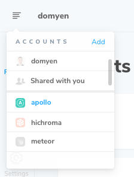

# Access control

Learn how to manage access to your Chromatic account and projects.

## Authentication

Sign in to Chromatic via OAuth, email, or SSO.

#### OAuth

Chromatic supports the cloud versions of GitHub, GitLab, or Bitbucket on our [self-serve plans](https://www.chromatic.com/pricing).

If you use the on-premise or enterprise versions of GitHub, GitLab, or Bitbucket, we can support you via our [enterprise plan](https://www.chromatic.com/pricing). We recommend trialing Chromatic first by following these [instructions](setup#demo-chromatic-unlinked).

    
What OAuth scopes does Chromatic request?

Depending on your Git provider, Chromatic will request a set of OAuth scopes when you first sign in. Chromatic uses these permissions to enumerate your list of repositories, set PR statuses, and retrieve users for assignment to review. Chromatic will never read/write source code.

| Git provider                                                                                                                 | OAuth Scopes                                             |
| ---------------------------------------------------------------------------------------------------------------------------- | -------------------------------------------------------- |
| [GitHub](https://developer.github.com/apps/building-oauth-apps/understanding-scopes-for-oauth-apps/#available-scopes)        | `['user:email', 'read:user', 'read:org', 'repo:status']` |
| [GitLab](https://docs.gitlab.com/ee/user/profile/personal_access_tokens.html#limiting-scopes-of-a-personal-access-token)     | `['api']`                                                |
| [Bitbucket](https://confluence.atlassian.com/bitbucket/oauth-on-bitbucket-cloud-238027431.html#OAuthonBitbucketCloud-Scopes) | `['account', 'repository', 'pullrequest', 'webhook']`    |

    
What permissions does the GitHub App request?

Chromatic's GitHub App enables [UI Review](review) for pull requests. We need additional permissions to access pull request information and add PR checks.

- ✅ Read access to metadata
- ✅ Read and write access to checks and pull requests
- ✅ Read access to organization members (for collaborators)
- 🔒 We do not request access to your code

    
How do I request access from my GitHub organization admin?

Chromatic requests the minimum permissions needed to use the tool. With GitHub, we request permissions for "OAuth" and "GitHub app" respectively. This allows organizations to expand permissions incrementally as they use more features.

If your GitHub organization requires an admin to approve apps, you'll need to request access inside of Chromatic and track their status inside of GitHub (below).

1. **Chromatic OAuth app**: Enables GitHub sign-in. Track your access request [here](https://github.com/settings/connections/applications/495b5c3cb5ae140436a0).
2. **Chromatic.com app**: Enables [UI Review](review). Track your access request [here](https://github.com/apps/chromatic-com).

#### Email

Email and password authentication is available on all accounts. It's a popular authentication method for [external collaborators](collaborators#external-collaborators) like designers, PMs, and other stakeholders.

If you're setting up Chromatic for your team as the account owner or administrator, there are some boundaries to be aware of:

- Email accounts can use Chromatic as normal
- [Collaborators](collaborators) are manually managed
- [Pull request checks](ci#pull-request-checks) are manually setup via your CI system

We recommend signing up with email for projects that **are not** on GitHub, Bitbucket, or GitLab. For example, projects on services like Azure DevOps, AWS, etc. Read the setup instructions for these types of projects [here](setup#demo-chromatic-unlinked).

#### Single Sign-On (SSO)

Single Sign-On (SSO) is available to enterprise customers. To sign in, make sure to navigate to your team's custom Chromatic URL, for example, `mycompany.chromatic.com`.

If you don't know the Chromatic URL for your team, you may need to ask the account or project owner.

## Organizations

A Chromatic organization mirrors its counterpart GitHub Organization, Bitbucket Group, or GitLab Team. Open the account menu to swap between organizations or add a new organization.

## Projects

There are two types of Chromatic projects: linked and unlinked.

#### Linked projects

Linked projects are associated with a repository on GitHub, Bitbucket, or GitLab. That allows Chromatic to [sync collaborators](collaborators#project-collaborators), badge pull requests, get pull request metadata for [UI Review](review), and keep track of [UI Test](test) baselines.

By creating a linked project in Chromatic, you automatically have at your disposal:

- [Collaborators](collaborators) synched automatically based on your Git provider.

- UI test notifications are enabled via automated webhooks for third-party integrations.

- Automated PR badging is configured automatically via [OAuth permissions](#what-permissions-does-the-github-app-request) granted by the Git provider.

- Chromatic's GitHub App provides a faster UI review process and PR metadata retrieval.

- Improved handling of [rebasing](branching-and-baselines) and squash & merge commit strategies enabled with Chromatic's GitHub App.

You can link a project during the project creation process or afterward on the project's Manage page within the Collaborators tab.

#### Unlinked projects

An unlinked project is perfect for teams that self-host Git or have enterprise Git providers (that aren't on Chromatic's enterprise plan). Unlinked projects are not linked to a repository on GitHub, Bitbucket, or GitLab. They do not automatically [sync collaborators](collaborators#project-collaborators) or badge pull requests.

The characteristics of an unlinked project include:

- You're using an email/password account OR a personal OAuth account.
- Chromatic runs as a [CI-only](ci) job.
- Collaborators are [manually managed](collaborators#external-collaborators) via an invite list.
- PR badging is manually configured in your CI provider.
- Notifications are manually setup via Chromatic's [custom webhooks](integrations#custom-webhooks).

Learn how to create an unlinked project [here](setup#demo-chromatic-unlinked).

---

### Troubleshooting

How do I create an unlinked project on my existing GitHub, Bitbucket, or GitLab account?

- ❌ You can't create unlinked projects on GitHub org, Bitbucket workspace, or GitLab group connected accounts.
- ✅ You can create unlinked projects on personal GitHub, Bitbucket, or GitLab accounts.
- ✅ You can create unlinked projects on email/password accounts.

If your account is currently connected to a GitHub org, Bitbucket workspace, or GitLab group, you'll need to create a new email/password account to set up an unlinked project. Your teammates can access this account by sharing credentials (for example, with a password manager).

To share billing between an existing connected account and an email/password account, message us via in-app chat.

How do I link a project to a Git provider using my email/password account?

Email accounts are not connected to a Git provider by default. This means you can only create [unlinked projects](access#unlinked-projects).

Follow these instructions to link your project to a Git provider:

1. Go to your profile (`/profile`) and connect to your Git provider.
2. Go to the project's Manage page » Collaborate tab.
3. Click to "sync collaborators with a Git repository".

This connects your Chromatic email/password account with your Git provider account, allowing you to set up a [linked project](access#linked-projects).

Note: Your personal account must have access to the repository in order to connect in Chromatic. You may need to ask an administrator to grant you additional permissions.

