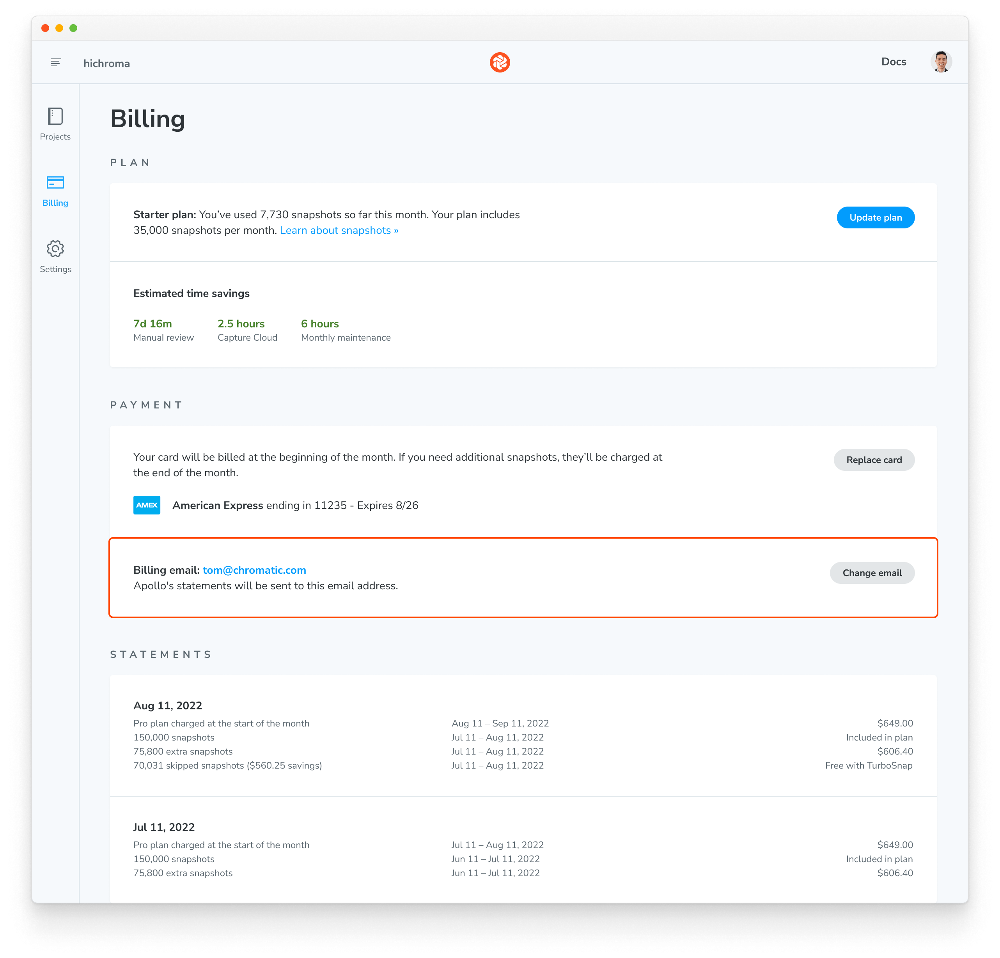

# How to change the billing address in Chromatic

When you first sign up to a paid plan, Chromatic sets the account's billing email address to the email address of the person who signed up to the plan.

Chromatic will send all billing and account related emails to this address whilst continuing to send in-app notifications to the relevant person's email address.

At anytime you can change the billing email associated to the account by following these steps.

Start by logging into [Chromatic](https://www.chromatic.com/) and click the `Billing` icon in the sidebar.

Scroll down and locate `Payment`.

Click the `Change email` button and fill in the new email you want to use.

Enter the new email address and click `Done` and your email is changed and will be used in the future.
