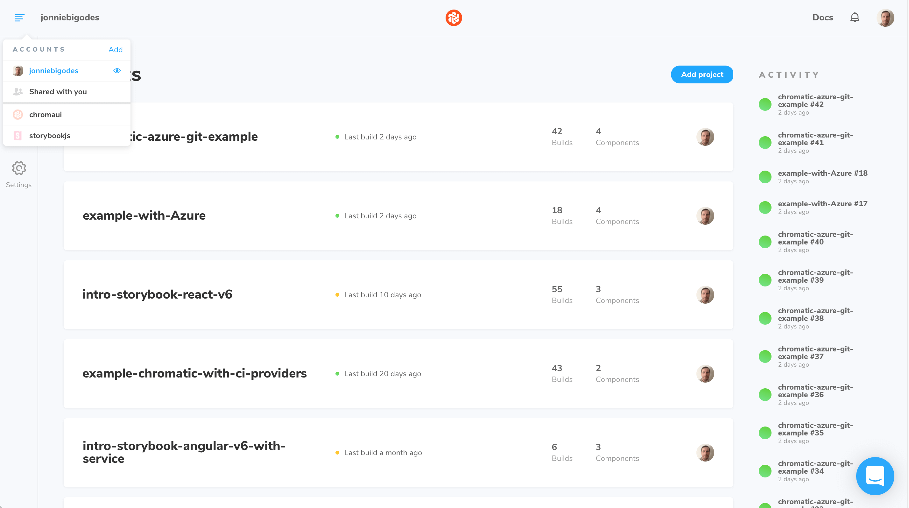
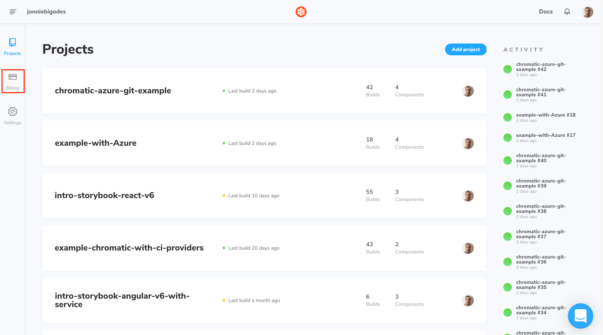
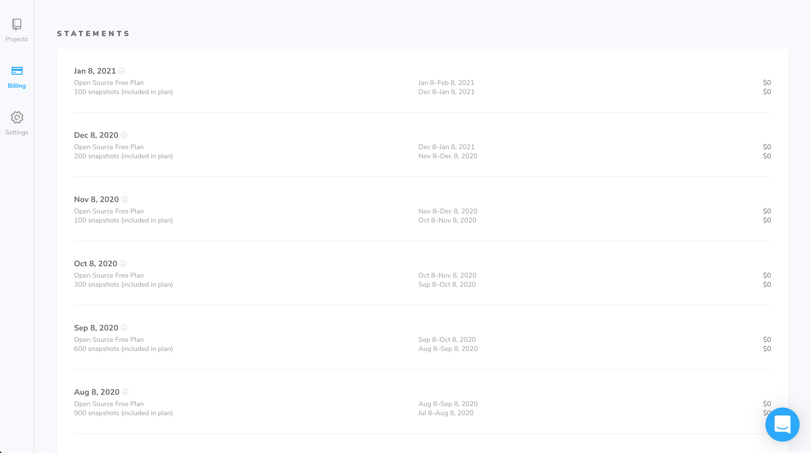

# How to view an invoice

All Chromatic invoices associated to your account can be accessed with relative ease by following these steps.

Start by logging into [Chromatic](https://www.chromatic.com/) and select the account you want to check the invoice.

Click the `Billing` icon in the sidebar.

There you'll see a list of your past and current invoices.

Click the title for the invoice you'd like to see.

You'll see the invoice in pdf format with all the detailed information.
