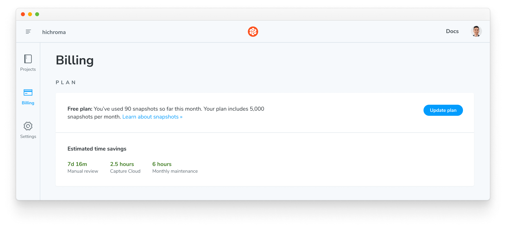
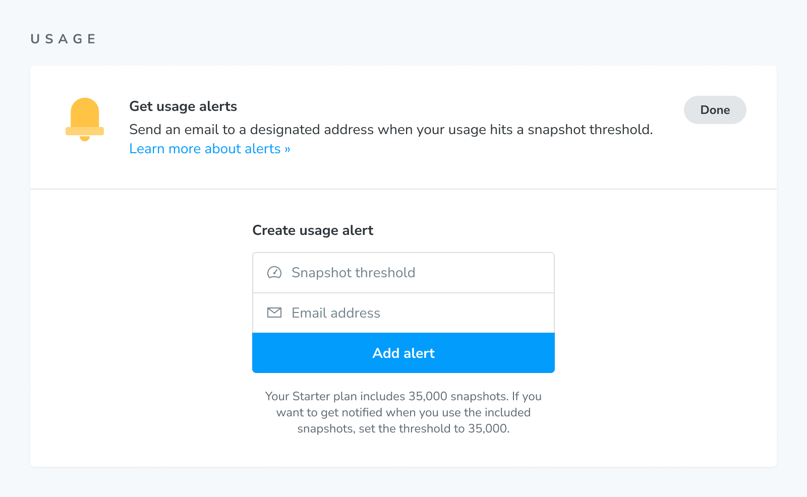

# Billing and invoices

Chromatic bills subscribers on a monthly basis. At the beginning of each month you're charged for your plan. If there are overages, you'll be charged at the end of the month.

## Snapshots

Chromatic charges based on [snapshots](snapshots) and browser coverage respectively. Snapshots power [UI Tests](tests) and [UI Review](review). They are only taken when you enable “UI Review” or “UI Tests” for your project.

Everytime you run a build, we take one snapshot for each story. If you have 50 stories, Chromatic will take 50 snapshots. In addition, testing multiple viewports and browsers are also considered snapshots.

For example, see how many snapshots are taken in different scenarios below.

| Story count | Builds    | Browsers   | Viewports   | Snapshots taken |
| ----------- | --------- | ---------- | ----------- | --------------- |
| 1 story     | 10 builds | 1 browser  | 1 viewport  | 10 snapshots    |
| 1 story     | 10 builds | 2 browsers | 1 viewport  | 20 snapshots    |
| 2 stories   | 10 builds | 1 browser  | 1 viewport  | 20 snapshots    |
| 2 stories   | 10 builds | 2 browsers | 1 viewport  | 40 snapshots    |
| 2 stories   | 10 builds | 2 browsers | 2 viewports | 80 snapshots    |

If you use our free [Publish Storybook](setup) service only you will not be billed for snapshots.

### How we count snapshots

Snapshots are counted at the account level. If your account has multiple projects we sum the number of snapshots used by each project to get your total usage. Chromatic doesn't breakdown billing per project.

### View current months usage

Find the current months usage in the Plan section of the Billing page.

### Overages

If you exceed the number of snapshots in your plan you’ll be billed for extra snapshots at the end of the month. Consider upgrading to a enterprise plan for more snapshots. Contact us via in-app chat or <a href="mailto:support@chromatic.com?Subject=Custom%20plan">email</a>
to learn more.

### Usage alerts

Keep track of your account's snapshot usage by setting up a usage alert. When you hit a certain snapshot threshold in a billing period we'll send a notificaton to a designated email address.

For example, if you want to be notified when you use 90% of the 35,000 snapshots in the Starter plan, you'd set the snapshot alert threshold to 31,500.

## Change plans

Change your plan in account settings. All changes are prorated to the day. That means you can change your plan at any time in the month without getting charged unneccessarily for unused snapshots.

## Invoices

Invoices are generated each month on your account's Billing page. Click to see a PDF of the amount owed and a breakdown of snapshot usage.

### Email invoices to your billing or finance manager

By default, Chromatic sets the account's billing email to the email address of the person who signed up to the plan. We send all billing and account related emails to this address.

Go to the Payment section on the Billing page to change the billing email associated with your account. Click "Change email".

### Refunds

If you aren’t happy with Chromatic we’ll refund your money. We want customers to ship consistent UIs, save time, and build bulletproof component libraries.

If it’s not working out for you, contact us via our in-app chat or [email](mailto:support@chromatic.com) to get a refund for your current months usage.

Subsequent refunds will be credited to your account for use in future invoices.
