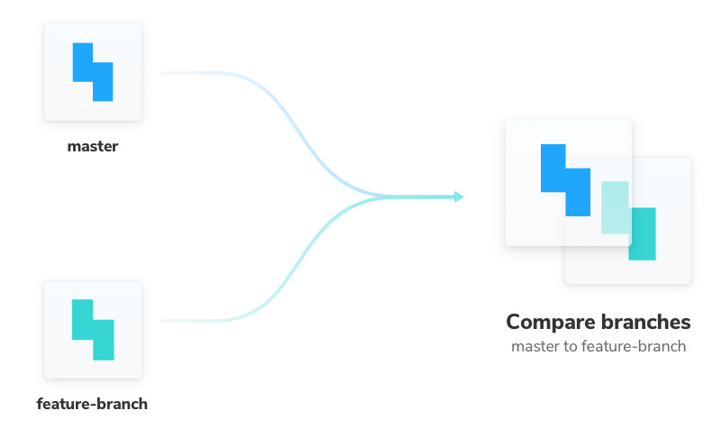
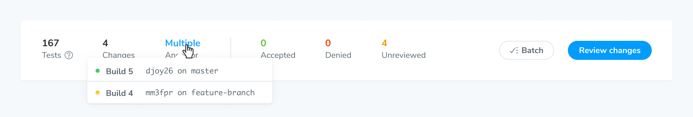

# Branches and baselines

Chromatic understands Git. Once a snapshot is accepted in Chromatic, it won’t need to be re-accepted until it changes, even through git branches, and merges.

Baselines are intelligently choosen based on your git history in the way you would expect. No configuration necessary.


---

## Baselines

Chromatic tests compare snapshots to a baseline: the last known “good” state of the story.

Each story has its own baseline that is tracked independently on each branch. When you approve a snapshot you also update the baseline for that story, for the purposes of the branch it is one. When you merge that branch into another (for instance back into `master`), the baseline comes with it.

The way the baseline calculation works is nuanced. See the section [below](#calculating-baselines) for more information.

---

## Branches



Chromatic uses the branch that is checked out when you run a build to mark builds in our system. This means it is easy to see which builds belong to which branch of development, which components exist and are tested in which branch, and how a component has changed over the history of a branch.

### Multiple branches

When you are developing in a branch, it is natural that the baseline image should be chosen from previous commits on the branch. This means if your team is developing on multiple branches in parallel, changes to the approved component screenshots on one branch will not affect the others.

### Merging

When you merge two branches together, Chromatic can sometimes have two (or more) potential screenshots to use as the baseline (one from each branch). In such situations, Chromatic will choose the _most recent approved change_ as the baseline.

<div class="aside">
<b>Note:</b> In the future, we plan to implement a feature to allow you to compare your new screenshot to <i>all</i> relevant previous screenshots. If this is a feature that you are missing, <a href="mailto:support@hichroma.com">let us know</a>.
</div>

### Rebasing

If you rebase a branch (say updating to branch off the latest commit off `master`), then you create a new commit that isn't a git descendent of the previous (pre-rebase) commit on that branch. Conceptually, that might mean that Chromatic should throw away any approvals that were made for builds on the branch, however this is probably not what you want.

For this reason, we _always_ include approvals from the latest build on the current branch, regardless of git history. You can bypass this with the `--ignore-last-build-on-branch=<branch-name>` flag of `chromatic`.

---

## Calculating baselines

As stated above, Chromatic maintains an individual baseline for each _story_, at each _viewport_, for each _commit_. That means as you make changes to your components, either by committing new code, merging other branches or otherwise, your baselines will follow your stories.

The only way that baselines change is when you or someone in your team approves a change. Usually what this means is that the baselines are simply what you’d expect as you work through a feature.

However, sometimes the choice of baseline can be confusing. Let’s dig in a little further on how it works.

### Calculating the ancestor build(s)

In Chromatic, a build contains of a set of snapshots, each of which is a screenshot of a single story at a single viewport.

> If you are using multiple browsers, there may be more than one screenshot within a single snapshot, however as baselines are calcuated above the level of the browser (all browsers share the same approval), we can ignore multiple browsers when thinking about baselines.

When you create a new build for a new commit, Chromatic will calculate a baseline for each snapshot in the build (unless the snapshot is for a new story). The first step to do that is to calculate the ancestor(s) for the build itself.

The ancestor build is conceptually very simple -- it is the most recent ancestor (commit) in the git history that has had Chromatic run against it. In the simplest case it is just the previous commit:

```
x - Build N
|
y - Build N+1
```

If you don’t run CI on every commit (which is common if you don’t push every single time you commit), there may be a gap:

```
x - Build N
|
y
|
z - Build N+1
```

Also, it is possible there is more than one most recent ancestor, in particular if the commit we are looking at is a merge commit:

```
x - Build N
|
|    p - Build N+1
|  /
y - Build N+2
```

In this case, Build N+2 will have two ancestor builds (N, and N+1).
Things can get a little more complicated (see some exceptions below) but that’s the basic idea.
You can see the ancestor builds listed on the build page:



### Calculating a snapshot baseline from the ancestor build(s)

Once we’ve got the ancestor builds for a build, the algorithm to calculate the baseline for any given snapshot goes like this:

If there is just one ancestor build, find if there is a snapshot for the same story & viewport combination.

If there is, check the status of that snapshot:

- If it was _changed and those changes accepted_ (ie the snapshot was new or changed but has been accepted by your team), then use it as the baseline.
- If it was _unchanged_ (ie it was visually identically to its own baseline), then use it as the baseline.
- If it was _changed but denied or not yet accepted_, then we need to ignore it, and use _its baseline_ as the baseline for the new snapshot..

The last case bears thinking about a bit. Consider this scenario:

```
x - Build N
|
y - Build N+1
|
z - Build N+2
```

Suppose then in commit y, we changed the color of our submit buttons to be orange rather than green. However, we realised this was a mistake and denied the change. Then in commit z we changed the colour back to green.
Then in Build N+2, we should compare the “new” green buttons to the original green buttons (from Build N). If they are back to the way they were before, the build should pass without you needing to intervene. If the green color is a different shade, Chromatic should show you a diff and you can decide if that’s what you wanted.

#### Multiple ancestor builds

In the case that there are multiple ancestor builds, the algorithm to calculate the baseline is more or less the same, we simply (potentially) end up with more than one baseline snapshot to use. To break ties, we simply assume that the most recently approved snapshot is the one you want to compare to.

### Visualizing baseline snapshots

On the snapshot page, we list a historical set of baselines that correspond to the algorithm above:


In the above screenshot, the snapshot marked "Most recent build...." was the snapshot we found on the ancestor build that we checked the status for. As it wasn’t approved, we went to its baseline.

The next snapshot, marked “Identical to build...”, was determined to be a baseline on the previous build and used as it hadn’t changed compared to its own baseline.

The next listed snapshot, marked “Accepted by Tom Coleman”, was the original version of that snapshot, at the point it changed and was accepted by Tom as the previous baseline.

The next listed snapshot was the previous time this component changed, from the perspective of this commit, etc.
