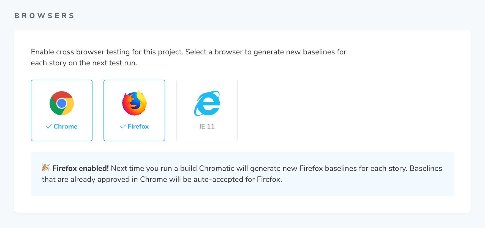
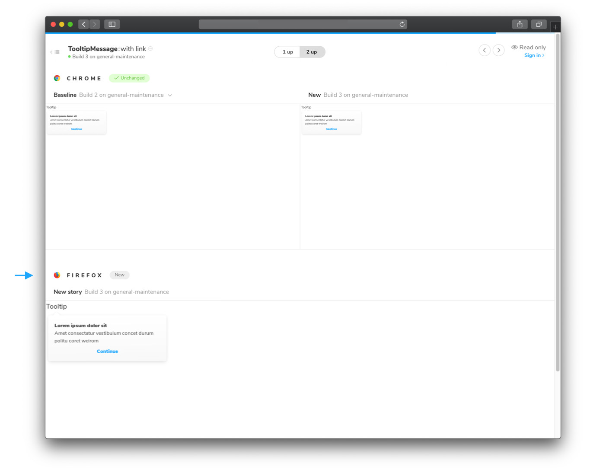
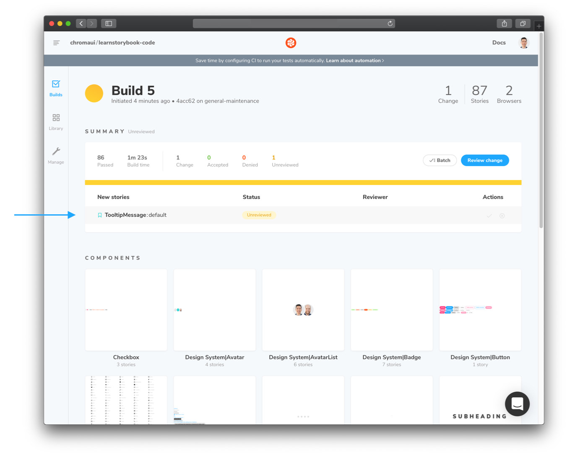
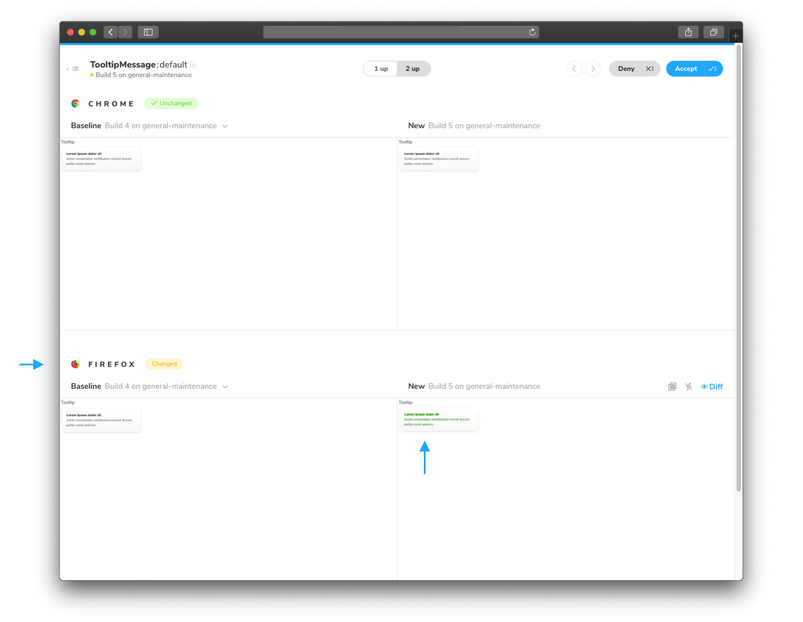

# Browser support

UIs might look perfect in one browser but be broken in another. Chromatic helps you extend your test coverage to Chrome, Firefox, and IE11 in one click.

---

## Enabling new browsers

Go to the "Manage" screen and click to enable another browser. Chrome is enabled by default.

On the next test run, Chromatic will create baselines for the newly enabled browser. Previously accepted stories in Chrome will be auto-accepted as baselines in the new browser. You'll want to make sure your builds pass before enabling a new browser.

<video autoPlay muted playsInline loop width="560px" class="center">
  <source src="/img/browser-buildscreen-multiple-browsers-inprogress.mp4" type="video/mp4" />
</video>

The new browser's snapshots will be marked as "New" on the Build page and you will now be able to view it during review.

Your team can also see how a story renders in a given browser across different builds and branches on the component screen.

<video autoPlay muted playsInline loop width="560px" class="center">
  <source src="/img/browser-componentscreen-toggle-snapshots.mp4" type="video/mp4" />
</video>

Congratulations you enabled a new browser! From now on our Capture Cloud will spin up as many Chrome, Firefox, or IE11 machines as you need to test your Storybook in the least amount of time.

---

## Review test changes in multiple browsers

When Chromatic tests detect a visual change to a story in any enabled browser you'll get notified. For instance, if you have a `TooltipMessage:default` story that is tested in Chrome and Firefox, you'll be notified when changes happen in either Chrome or Firefox.

You can see changes for the browser's snapshot in the review workflow.

Once you accept changes to the story, its baselines are updated. Each story has one baseline for Chrome, it can also have baselines for Firefox and IE11.

Note: If you test responsiveness with the viewport parameters, baselines are associated with each viewport, and those can have a Chrome, Firefox, or IE11 baseline.

---

### FAQ

#### Does enabling more browsers add time to my tests?

Yes it can. We do our best to provide the fastest test speeds but there are limits to browser performance (IE11) even when scaled across hundreds and thousands of machines.

#### How do browsers affect my snapshot count?

Each browser adds another snapshot for each of your stories. For example, if you have a story that is tested in Chrome and IE11 that counts as two snapshots.

If you also test your story with different viewports, those count as snapshots as well. For example, you want to test a story at `320px`, `1280px`, `Chrome`, and `IE11`. This would count as 4 snapshots.

#### What about every other browser and version?

Chromatic covers the major rendering engines (Blink, Gecko and Trident) at all viewports. This eliminates almost all browser regressions your users are likely to see with minimal effort, configuration, or additional time to your workflow.

Supporting more browser/device combinations ends up having diminishing returns that adds noise to the visual review process.

#### Does Chromatic tell me when snapshots are different between browsers?

This has significant trade offs. Teams that try to verify consistency between browsers end up encountering false positives due to inherent browser/device/OS differences like anti-aliasing and font rendering. Or they require workarounds like loosening diff thresholds which result in false negatives.

Chromatic does not programmatically compare snapshots from different browsers against each other. Instead, we compare the snapshots for each browser against the baseline for that browser.

#### Can I select which browser generates comparisons for UI review?

No. At the moment, Chrome is fixed as the browser used for UI review.

#### Can I disable visual testing in Chrome?

All plans use Chrome by default because it offers the greatest test coverage for most people. It cannot be disabled.
