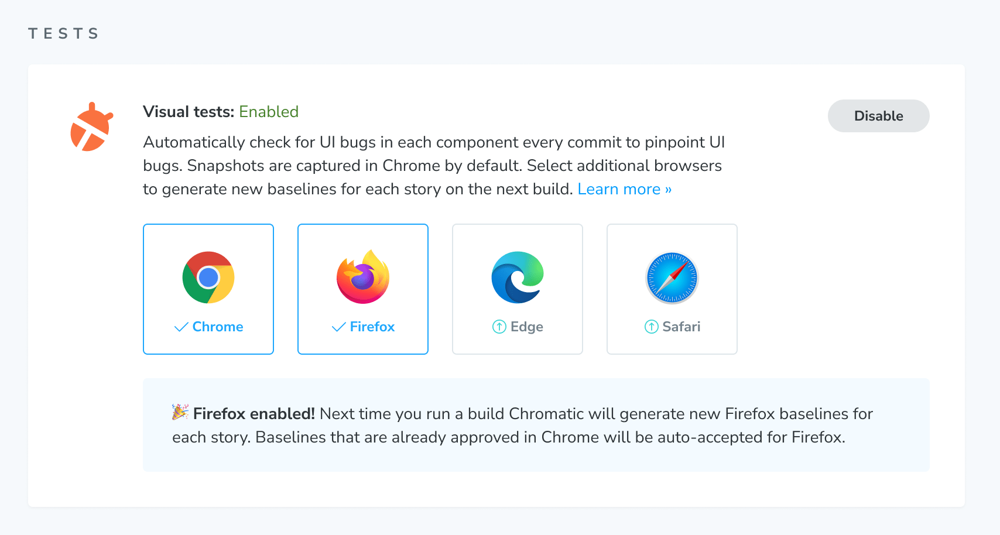

# Browser support

UIs might look perfect in one browser but be broken in another. Chromatic helps you extend your test coverage to Chrome, Firefox, and IE11 in one click.

## Enable new browsers

Go to the "Manage" screen and click to enable another browser. Chrome is enabled by default.

On the next test run, Chromatic will create baselines for the newly enabled browser. Previously accepted stories in Chrome will be auto-accepted as baselines in the new browser. You'll want to make sure your builds pass before enabling a new browser.

<video autoPlay muted playsInline loop width="560px" class="center">
  <source src="img/browser-buildscreen-multiple-browsers-inprogress.mp4" type="video/mp4" />
</video>

The new browser's snapshots will be marked as "New" on the Build page and you will now be able to view it during review.

Your team can also see how a story renders in a given browser across different builds and branches on the component screen.

<video autoPlay muted playsInline loop width="560px" class="center">
  <source src="img/browser-componentscreen-toggle-snapshots.mp4" type="video/mp4" />
</video>

Congratulations you enabled a new browser! From now on our Capture Cloud will spin up as many Chrome, Firefox, or IE11 machines as you need to test your Storybook in the least amount of time.

## Verify UI changes across browsers

When Chromatic tests detect a visual change to a story in any enabled browser you'll get notified. For instance, if you have a `TooltipMessage:default` story that is tested in Chrome and Firefox, you'll be notified when changes happen in either Chrome or Firefox.

You can see changes for the browser's snapshot in the review workflow.

Once you accept changes to the story, its baselines are updated. Each story has one baseline for Chrome, it can also have baselines for Firefox and IE11.

If you test responsiveness with the viewport parameters, baselines are associated with each viewport, and those can have a Chrome, Firefox, or IE11 baseline.

## Browser upgrades

Chromatic's infrastructure is periodically updated to use the the latest **stable** browser version (can be behind the latest version). When an infrastructure upgrade is available you're notified in the app.

Upgrades can cause subtle changes in story appearance due to the underlying rendering engine changes. We try to make upgrades as easy as possible by auto-migrating your test baselines. Learn more about [infrastructure upgrades](infrastructure-upgrades) and view [browser versions](infrastructure-release-notes).

---

### Frequently asked questions

Does Chromatic tell me when snapshots are different between browsers?

This has significant trade offs. Teams that try to verify consistency between browsers end up encountering false positives due to inherent browser/device/OS differences like anti-aliasing and font rendering. Or they require workarounds like loosening diff thresholds which result in false negatives.

Chromatic does not programmatically compare snapshots from different browsers against each other. Instead, we compare the snapshots for each browser against the baseline for that browser.

Does Chromatic support specific browser versions?

Chromatic does not support running tests on specific browser versions. During the course of building Chromatic's capture cloud, we found that not all browser versions are created equal. Some contain bugs that lead to rendering inconsistencies. Our aim at Chromatic is to take care of these messy details so that you don't have to and get consisntently flake free tests. 
  
We extensively test new browser versions and modify our infrastructure to handle quirks between them. Our goal is to provide you with the latest stable version of each of our supported browsers on a timely schedule with a painless upgrade experience between versions.

We don't maintain support for old browser versions in Chromatic since most users are upgraded to the lastest versions automatically and this simplifies our infrastructure and customer support.

