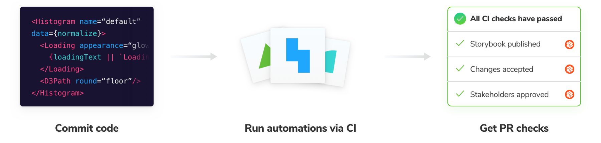

# Automate with continuous integration

Configure CI to publish your Storybook and run Chromatic's automation whenever you push code. Badge your PRs to get notified about test and review results.



## Configure CI

Before we begin, make sure you set the `CHROMATIC_APP_CODE` environment variable when you run CI builds in your CI service's configuration.

Integrate with popular CI tools like you would any other job. Run `npm run chromatic` to publish your Storybook. If [UI Test](test) or [Review](review) are enabled, it will return a non-zero exit code when there are changes. For example:

```yml
- run:
    command: npm install # install dependencies
- run:
    command: npm test # run your unit tests
- run:
    command: npm run chromatic # publish Storybook and run visual tests
```

Here's how we recommend configuring Chromatic for popular CI services.

<details>
<summary id="github-actions"><h4>GitHub Actions</h4></summary>

Chromatic has a [GitHub Action](https://github.com/chromaui/action). Add it to a workflow like so:

```yml
- uses: chromaui/action@v1
  with:
    token: ${{ secrets.GITHUB_TOKEN }}
    appCode: ${{ secrets.CHROMATIC_APP_CODE }}
```

You'll need to configure secrets in the settings tab at `https://github.com/{YOUR_ORGANSATION}/{YOUR_REPOSITORY}/settings/secrets`

GitHub Actions can run based on any GitHub event, but we recommend to run the workflow containing the Chromatic step on `push` event. The action will work on `pull-request` events too, although [it comes with some caveats](https://docs.chromatic.com/ci#pull-request-builds). All other events will not work.

For external PRs (PRs from forks of your repo) to receive the Chromatic appCode, you'll have to make the appCode public by placing it in your `package.json`. Alternatively, you could disable Chromatic on external PRs or duplicate external PRs inside your repository.

</details>

<details>
<summary id="circleci"><h4>CircleCI</h4></summary>

In your `.circleci/config.yml` add the Chromatic command to you steps.

```yml
version: 2
jobs:
  build:
    # ... your existing setup

    steps:
      - checkout
      - run: npm install
      - run: npm test
      - run: npm chromatic -a <app-code> --exit-zero-on-changes
```

For more workflow inspiriation, checkout this [Chromatic CircleCI Orb](https://circleci.com/orbs/registry/orb/wave/chromatic) that was made by a customer.

</details>

<details>
<summary id="travis"><h4>Travis CI</h4></summary>

Travis offers two type of builds for commits on pull requests: so called `pr` and `push` builds. It only makes sense to run Chromatic once per PR, so we suggest disabling Chromatic on `pr` builds for internal PRs (i.e. PRs that aren't from forks). You should make sure that you have `push` builds turned on, and add the following code:

```bash
if [[ $TRAVIS_EVENT_TYPE != 'pull_request' ||  $TRAVIS_PULL_REQUEST_SLUG != $TRAVIS_REPO_SLUG ]];
then
  npm run chromatic
fi
```

For external PRs (PRs from forks of your repo), the above code will ensure Chromatic does run on the `pr` build, because Travis does not trigger `push` builds in such cases.

<div class="aside">
<p><b>Note:</b> We recommend running Chromatic on <code>push</code> builds as <code>pr</code> builds can't always run and fall out of the normal git ancestry. For instance, if you change the base branch of a PR, you may find that you need to re-approve changes as some history may be lost.</p>

<p>Chromatic does work with Travis <code>pr</code> builds however!</p>
</div>

</details>

<details>
<summary id="jenkins"><h4>Jenkins</h4></summary>

Instructions for Jenkins

For Jenkins' GitHub PR plugin, choose the [`ghprbPullId` specifier](https://github.com/jenkinsci/ghprb-plugin/blob/master/README.md).

</details>

## UI Test and UI Review

#### Command exit code for "required" checks

If you are using pull request statuses to as required checks before merging, you may not want your CI job to fail if test snapshots render without errors (but with changes). To achieve this, pass the flag `--exit-zero-on-changes` to the `chromatic` command, and your CI job will continue in such cases.

XXX why does this differ from the above? Depending on your policy, you may not want to block the rest of your CI script on the acceptance of visual changes, and simply rely on the above status, in which case you would write `npm run chromatic || true` in your CI build to ensure that CI completes.

#### Re-run failed builds after verifying UI test results

Builds that contain visual changes need to be [reviewed](/builds)--if you are not using `--exit-zero-on-changes` they will fail. Once you accept all the changes, re-run the build using your CI tool and the `chromatic` job will pass.

If you deny any change, you will need to make the necessary code changes to fix the test (and thus start a new CI build) to get Chromatic to pass again.

#### Maintain a clean "master" branch

A clean `master` branch is a development **best practice** and **highly recommended** for Chromatic. In practice, this means ensuring that test builds in your `master` branch are passing.

If the builds are a result of direct commits to `master`, you will need to accept changes to keep master clean. If they're merged from `feature-branches`, you will need to make sure those branches are passing _before_ you merge into `master`.

**Note:** If you use GitHub's squash/rebase merge functionality, add the `--auto-accept-changes` flag to `chromatic`. This means you won't need to re-review snapshots on `master` if you're already accepted them elsewhere. For example:

```bash
if [ "${CIRCLE_BRANCH}" != "master" ];
then
  yarn chromatic
else
  # We know any changes that make it to master *must* have been approved
  yarn chromatic --auto-accept-changes
fi
```

#### GitHub's squash/rebase merge

GitHub's squash/rebase merge functionality creates new commits that have no association to branch being merged, so it is difficult for Chromatic to know that changes accepted on that branch should now be baselines on `master`.

To resolve this situation we suggest you maintain a clean `master` branch and use `--auto-accept-changes` as [mentioned here](/ci#maintain-a-clean-master-branch)

## Pull request checks

When a build runs it will automatically add a PR check to the current pull request or branch indicating the state of the build. By default, you'll see Storybook Publish. If you enabled UI Tests or UI Review you'll also see their respective checks.

GitHub, Bitbucket, or GitLab projects that are [linked to a repository](/access) get this feature out of the box. If you use other version control services to host your code, you can write a custom CI script to add a check for Chromatic (via your CI provider).


---

## Next: See the recommended Chromatic workflow

How tools work together affects your development speed. Learn the recommended Chromatic workflow that automates away the manual work for UI developers.

<a class="btn primary round" href="/workflow">Read next chapter</a>

---

### Frequently asked questions

<details>
  <summary id="pull-request-builds">Should I run Chromatic on "<code>push</code>" or "<code>pr</code>/<code>merge</code>" commits in my CI?</summary>

Several CI systems offer the option of running build on either the commit that was pushed to a branch for a PR, or on a "merge" commit between that branch and the base branch (typically `master`).

Merge commits don't persist in the history of your git repository, that can cause Chromatic's baselines to be lost in certain situations. We advise not running Chromatic tests on merge commits and instead running them on the regular "push" commits. How to do this differs depending on your CI provider:

- For Travis, ensure you run Chromatic on `push` builds. Read more [below](#travis).

- For GitHub Actions, choose the [`push` event](https://help.github.com/en/articles/events-that-trigger-workflows#webhook-events).

- For Jenkins' GitHub PR plugin, choose the [`ghprbPullId` specifier](https://github.com/jenkinsci/ghprb-plugin/blob/master/README.md).

</details>

<details>
<summary>Hide the CI messages in the web app</summary>

Chromatic detects CI test runs for most services. But it's not possible for every system, which results in users seeing persistent "Setup CI / Automation" messages in the UI.

If this is happening to you, prepend `CI=true` to your test command like so `CI=true yarn chromatic...` to hide the "Setup CI" messages in Chromatic. [Learn more](/test#available-options)

</details>
