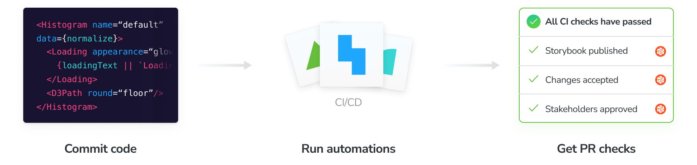

# Automate with continuous integration

Configure CI to publish your Storybook and run Chromatic's automation whenever you push code. Badge your PRs to get notified about test and review results.



## Configure CI

Before we begin, make sure you set the `CHROMATIC_PROJECT_TOKEN` environment variable when you run CI builds in your CI service's configuration. And add a chromatic script to your `package.json`.

```json
"scripts": {
  "chromatic": "chromatic --project-token CHROMATIC_PROJECT_TOKEN --exit-zero-on-changes"
}
```

Integrate with popular CI tools like you would any other job. Run `npm run chromatic` to publish your Storybook. If [UI Test](test) or [UI Review](review) are enabled, it will return a non-zero exit code when there are changes. For example:

```yml
- run:
    command: npm install # install dependencies
- run:
    command: npm test # run your unit tests
- run:
    command: npm run chromatic # publish Storybook and run visual tests
```

Here's how we recommend configuring Chromatic for popular CI services.

<details>
<summary><h4 class="no-anchor">GitHub Actions</h4></summary>

Chromatic has a [GitHub Action](https://github.com/chromaui/action). Add it to a workflow like so:

```yml
- uses: actions/checkout@v2
  with:
    fetch-depth: 0 # Required to retrieve git history
- uses: chromaui/action@v1
  with:
    token: ${{ secrets.GITHUB_TOKEN }}
    projectToken: ${{ secrets.CHROMATIC_PROJECT_TOKEN }}
```

You'll need to configure secrets in the settings tab at `https://github.com/{YOUR_ORGANSATION}/{YOUR_REPOSITORY}/settings/secrets`

GitHub Actions can run based on any GitHub event, but we recommend to run the workflow containing the Chromatic step on `push` event. The action will work on `pull-request` events too, although [it comes with some caveats](ci#pull-request-builds). All other events will not work.

For external PRs (PRs from forks of your repo) to receive the Chromatic projectToken, you'll have to make the projectToken public by placing it in your `package.json`. Alternatively, you could disable Chromatic on external PRs or duplicate external PRs inside your repository.

In [`actions/checkout@v2`](https://github.com/actions/checkout#usage), there's no git history. Chromatic needs the git history in order to find the base build for baseline association. Add `fetch-depth: 0`.

</details>

<details>
<summary><h4 class="no-anchor">CircleCI</h4></summary>

In your `.circleci/config.yml` add the Chromatic command to your steps.

```yml
version: 2
jobs:
  build:
    # ... your existing setup

    steps:
      - checkout
      - run: npm install
      - run: npm test
      - run: npm run chromatic
```

If you run jobs on external PRs, view [CircleCI docs](https://circleci.com/blog/triggering-trusted-ci-jobs-on-untrusted-forks/) for a configuration guide.
For more workflow inspiration, checkout this [Chromatic CircleCI Orb](https://circleci.com/orbs/registry/orb/wave/chromatic) that was made by a customer.

</details>

<details>
<summary><h4 class="no-anchor">Travis CI</h4></summary>

Travis offers two type of builds for commits on pull requests: so called `pr` and `push` builds. It only makes sense to run Chromatic once per PR, so we suggest disabling Chromatic on `pr` builds for internal PRs (i.e. PRs that aren't from forks). You should make sure that you have `push` builds turned on, and add the following code to your `.travis.yml`:

```bash
- if [[ $TRAVIS_EVENT_TYPE != 'pull_request' ||  $TRAVIS_PULL_REQUEST_SLUG != $TRAVIS_REPO_SLUG ]]; then npm run chromatic; fi
```

For external PRs (PRs from forks of your repo), the above code will ensure Chromatic does run on the `pr` build, because Travis does not trigger `push` builds in such cases.

<div class="aside">
<p><b>Note:</b> We recommend running Chromatic on <code>push</code> builds as <code>pr</code> builds can't always run and fall out of the normal git ancestry. For instance, if you change the base branch of a PR, you may find that you need to re-approve changes as some history may be lost.</p>

<p>Chromatic does work with Travis <code>pr</code> builds however!</p>
</div>

</details>

<details>
<summary><h4 class="no-anchor">Jenkins</h4></summary>

Add the following command to the `steps` section of your `Jenkinsfile`:

```
sh 'npm run chromatic'
```

If you're using Jenkins' [GitHub PR plugin](https://github.com/jenkinsci/ghprb-plugin/blob/master/README.md), choose the `ghprbPullId` specifier for the `refspec`, and ensure you've set the Branch Specifier to `${ghprbActualCommit}`.

</details>

<details>
<summary><h4 class="no-anchor">Bitbucket Pipelines</h4></summary>

In your `bitbucket-pipelines.yml` add the Chromatic command to the step of your choice.

```yml
image: node:10.15.0

pipelines:
  default:
    - step:
        name: Build and test
        script:
          - npm install
          - npm test
          - npm run chromatic

# ... your existing setup
```

The default pipeline runs on every push to the repository. You can also define a branch specific pipeline or a pull-requests pipeline that only runs on pull requests initiated from within your repo. Checkout the [Bitbucket Pipelines docs](https://support.atlassian.com/bitbucket-cloud/docs/configure-bitbucket-pipelinesyml/) for a configuration guide.
</details>

## UI Test and UI Review

[UI Tests](tests) and [UI Review](review) rely on [branch and baseline](branching-and-baselines) detection to keep track of [snapshots](snapshots). We recommend this CI configuration.

#### Command exit code for "required" checks

If you are using pull request statuses as required checks before merging, you may not want your CI job to fail if test snapshots render without errors (but with changes). To achieve this, pass the flag `--exit-zero-on-changes` to the `chromatic` command, and your CI job will continue in such cases.

When using `--exit-zero-on-changes` your CI job will still stop and fail if your Storybook contains stories that error. If you'd prefer Chromatic _never_ to block your CI job, you can use `npm run chromatic || true`.

#### Re-run failed builds after verifying UI test results

Builds that contain visual changes need to be [verified](test#verify-ui-changes). They will fail if you are not using `--exit-zero-on-changes`. Once you accept all the changes, re-run the build using your CI tool and the `chromatic` job will pass.

If you deny any change, you will need to make the necessary code changes to fix the test (and thus start a new CI build) to get Chromatic to pass again.

#### Maintain a clean "master" branch

A clean `master` branch is a development **best practice** and **highly recommended** for Chromatic. In practice, this means ensuring that test builds in your `master` branch are passing.

If the builds are a result of direct commits to `master`, you will need to accept changes to keep master clean. If they're merged from `feature-branches`, you will need to make sure those branches are passing _before_ you merge into `master`.

<details>
<summary><h4 class="no-anchor">GitHub squash/rebase merge and the "master" branch</h4></summary>

GitHub's squash/rebase merge functionality creates new commits that have no association to the branch being merged. If you've enabled our GitHub application in the [UI Review](review) workflow, then we will automatically detect this situation and bring baselines over (see [Branching and Baselines](branching-and-baselines#squash-and-rebase-merging) for more details).

Otherwise, Chromatic will not know which changes accepted on that branch should be baselines on `master`. What's more, you'll have to re-review snapshots on `master` even if you already accepted them elsewhere.

To resolve this, we recommend you maintain a clean `master` branch and use `--auto-accept-changes` as [mentioned here](ci#maintain-a-clean-master-branch). For example:

```bash
if [ "${CIRCLE_BRANCH}" != "master" ];
then
  yarn chromatic
else
  # We know any changes that make it to master *must* have been accepted
  yarn chromatic --auto-accept-changes
fi
```

</details>

<details>
<summary><h4 class="no-anchor">Run Chromatic on external forks of open source projects</h4></summary>

You can enable PR checks for external forks by sharing your `project-token` where you configured the Chromatic command (often in `package.json` or your CI config).

There are tradeoffs. Sharing `project-token`'s allows _contributors_ and others to run Chromatic. They'll be able to use your snapshots. They will not be able to get access to your account, settings, or accept baselines. This can be an acceptable tradeoff for open source projects who value community contributions.

</details>

#### Skipping builds for certain branches

Sometimes you might want to skip running a build for a certain branch, but still have Chromatic mark the latest commit on that branch as "passed". Otherwise pull requests could be blocked due to required checks that remain pending. To avoid this issue, you can run `chromatic` with the `--skip` flag. This flag accepts a branch name or glob pattern.

One use case for this feature is skipping builds for branches created by a bot. For instance, Dependabot automatically updates a projects dependencies. Although some dependencies can result in UI changes, you might not find it worthwhile to run Chromatic for every single dependency update. Instead, you could rely on Chromatic running against the `master` or `develop` branch.

To skip builds for `dependabot` branches, use the following:

```
chromatic --skip 'dependabot/**'
```

To apply this to multiple branches, use an "extended glob". See [picomatch] for details.

```
chromatic --skip '@(renovate/**|dependabot/**)'
```

[picomatch]: https://www.npmjs.com/package/picomatch#globbing-features

## Pull request checks

When a build runs it will automatically add a PR status check to the current pull request indicating the state of the build. By default, you'll see Storybook Publish. If you enabled UI Tests or UI Review you'll also see their respective checks.

GitHub, Bitbucket, or GitLab projects that are [linked to a repository](access) get this feature out of the box. If you use other version control services to host your code, you can write a custom CI script to add a check for Chromatic (via your CI provider).

Require checks in [GitHub](https://help.github.com/en/github/administering-a-repository/enabling-required-status-checks), [GitLab](https://docs.gitlab.com/ee/api/commits.html#post-the-build-status-to-a-commit), or [Bitbucket](https://confluence.atlassian.com/bitbucket/suggest-or-require-checks-before-a-merge-856691474.html) to ensure they are completed before merging.


---

## Next: See the recommended Chromatic workflow

How tools work together affects your development speed. Learn the recommended Chromatic workflow.

<a class="btn primary round" href="workflow">Read next chapter</a>

---

### Frequently asked questions

<details>
  <summary id="pull-request-builds">Should I run Chromatic on "<code>push</code>" or "<code>pr</code>/<code>merge</code>" commits in my CI?</summary>

Several CI systems offer the option of running build on either the commit that was pushed to a branch for a PR, or on a "merge" commit between that branch and the base branch (typically `master`).

Merge commits don't persist in the history of your git repository, that can cause Chromatic's baselines to be lost in certain situations. We advise not running Chromatic tests on merge commits and instead running them on the regular "push" commits. How to do this differs depending on your CI provider:

- For Travis, ensure you run Chromatic on `push` builds. Read more [below](#travis).

- For GitHub Actions, choose the [`push` event](https://help.github.com/en/articles/events-that-trigger-workflows#webhook-events).

- For Jenkins' GitHub PR plugin, choose the [`ghprbPullId` specifier](https://github.com/jenkinsci/ghprb-plugin/blob/master/README.md).

</details>

<details>
<summary>Hide the CI messages in the web app</summary>

Chromatic detects CI test runs for most services. But it's not possible for every system, which results in users seeing persistent "Setup CI / Automation" messages in the UI.

If this is happening to you, prepend `CI=true` to your test command like so `CI=true yarn chromatic...` to hide the "Setup CI" messages in Chromatic. [Learn more](test#available-options)

</details>
