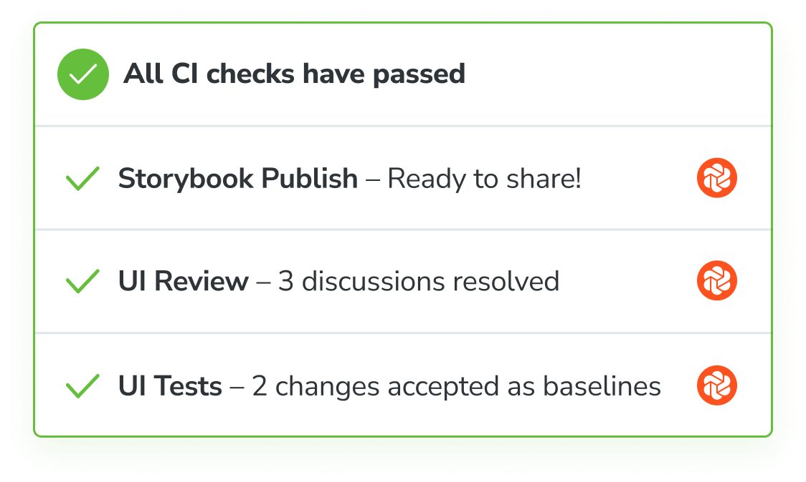

# Automate with continuous integration

Configure CI to publish your Storybook and run Chromatic's automation whenever you push code. Badge your PRs to get notified about test and review results.


## Configure CI

Before we begin, make sure you set the `CHROMATIC_PROJECT_TOKEN` environment variable when you run CI builds in your CI service's configuration. And add a chromatic script to your `package.json`.

```json
"scripts": {
  "chromatic": "chromatic --project-token CHROMATIC_PROJECT_TOKEN --exit-zero-on-changes"
}
```

Integrate with popular CI tools like you would any other job. Run `npm run chromatic` to publish your Storybook. If [UI Test](test) or [UI Review](review) are enabled, it will return a non-zero exit code when there are changes. For example:

```yml
- run:
    command: npm install # install dependencies
- run:
    command: npm test # run your unit tests
- run:
    command: npm run chromatic # publish Storybook and run visual tests
```

Here's how we recommend configuring Chromatic for popular CI services.

- [GitHub Actions](github-actions)
- [GitLab Pipelines](gitlab)
- [Bitbucket Pipelines](bitbucket-pipelines)
- [CircleCI](circleci)
- [Travis CI](travisci)
- [Jenkins](jenkins)
- [Other CI providers](custom-ci-provider)


## Pull request checks

When a build runs it will automatically add a PR status check to the current pull request indicating the state of the build. By default, you'll see Storybook Publish. If you enabled UI Tests or UI Review you'll also see their respective checks.

GitHub, Bitbucket, or GitLab projects that are [linked to a repository](access) get this feature out of the box. If you use other version control services to host your code, you can write a custom CI script to add a check for Chromatic (via your CI provider).

Require checks in [GitHub](https://help.github.com/en/github/administering-a-repository/enabling-required-status-checks), [GitLab](https://docs.gitlab.com/ee/api/commits.html#post-the-build-status-to-a-commit), or [Bitbucket](https://confluence.atlassian.com/bitbucket/suggest-or-require-checks-before-a-merge-856691474.html) to ensure they are completed before merging.



---

## Next: See the recommended Chromatic workflow

How tools work together affects your development speed. Learn the recommended Chromatic workflow.

<a class="btn primary round" href="workflow">Read next chapter</a>

---

### Frequently asked questions

<details>
<summary>Hide the CI messages in the web app</summary>

Chromatic detects CI test runs for most services. But it's not possible for every system, which results in users seeing persistent "Setup CI / Automation" messages in the UI.

If this is happening to you, prepend `CI=true` to your test command like so `CI=true yarn chromatic...` to hide the "Setup CI" messages in Chromatic. [Learn more](test#available-options)

</details>
