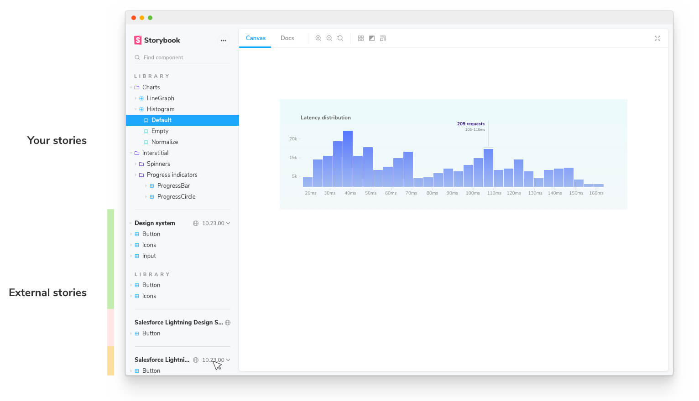

# Storybook Composition

Chromatic publishes your Storybook to a secure CDN. That means you can combine published Storybooks with your local Storybook using [Composition](https://storybook.js.org/docs/react/workflows/storybook-composition).

## Compose published Storybooks

Chromatic generates a [permalink](permalinks) for published Storybooks to use with Composition that includes:

- Versioned endpoints, URLs that resolve to different published Storybooks depending on a version=x.y.z query parameter (where x.y.z is the released version of the package).
- Support for /stories.json
- Support for /metadata.json and the releases field.

### Setup

In your local Storybook, add a `refs` key to [`.storybook/main.js`](https://storybook.js.org/docs/react/configure/overview#configure-story-rendering). Paste the permalink in the `url` field.

```js
// .storybook/main.js

module.exports = {
  stories: ["../src/**/*.stories.@(js|jsx|ts|tsx)"],
  refs: {
    "chromatic-published-Storybook": {
      // The title of your Storybook
      title: "Design System",
      // The url provided by Chromatic when it was published
      url: "https://your-published-url.chromatic.com",
    },
  },
};
```

When your local Storybook starts, it will auto detect the `refs` and compose your published Storybook. You'll see both sets of stories side-by-side.



### Compose Storybook by branch or commit

Depending on your use case, you may want to compose Storybook using a [permalink](permalinks) to a branch or a commit.

#### Branch: `https://<branch>--<appid>.chromatic.com`

If you want your local Storybook to compose the latest Storybook on `master`, use the branch permalink. This is useful for folks who work on multiple Storybooks simultaneously.

- Building a component library in React and Vue at the same time
- Monorepos with multiple inter-connected Storybook projects

#### Commit: `https://<commithash>--<appid>.chromatic.com`

If you want your local Storybook to compose a specific version of Storybook, use the commit permalink. This is useful for folks who depend on a fixed version of a component library package.

### Access control

Published Storybooks follow the [access rules](access) of your project. If you have a private project, you'll need sign in to Chromatic (via Storybook's UI) to load the private Storybook.

---

## Package Composition

Design system and component library authors can automatically compose their Storybook inside their consumer’s Storybooks.

Add a `storybook` property in the `package.json`. Use the [permalink to a commit](#compose-storybook-by-branch-or-commit) in the `url` field

```json
{
  "storybook": {
    "url": "https://your-published-url.chromatic.com"
  }
}
```

When Storybook starts, it scans for external Storybooks referenced by your packages and loads them into the UI.

### Versioning

Chromatic supports automatic versioning for the following Git providers.

| Git provider                                  | Support                                  |
| --------------------------------------------- | ---------------------------------------- |
| GitHub                                        | Public projects only via GitHub Releases |
| GitLab                                        | Public and private projects              |
| Bitbucket                                     | Not supported                            |
| [Unlinked projects](access#unlinked-projects) | Not supported                            |

If automatic versioning isn't supported for your Git provider, you can still get version information by manually updating your `package.json` with the permalink of the current published Storybook (e.g. `https://<commithash>--<appid>.chromatic.com`).

Use the `/metadata.json` endpoint to get additional information about the deployed Storybook version. It will output a response similar to the example below:

```json
{
  "versions": {
    "v0.1.1": "https://your-published-url.chromatic.com"
  }
}
```

---

### Resources

- [Storybook composition](https://storybook.js.org/docs/react/workflows/storybook-composition)
- [Package composition with Storybook](https://storybook.js.org/docs/react/workflows/package-composition)
