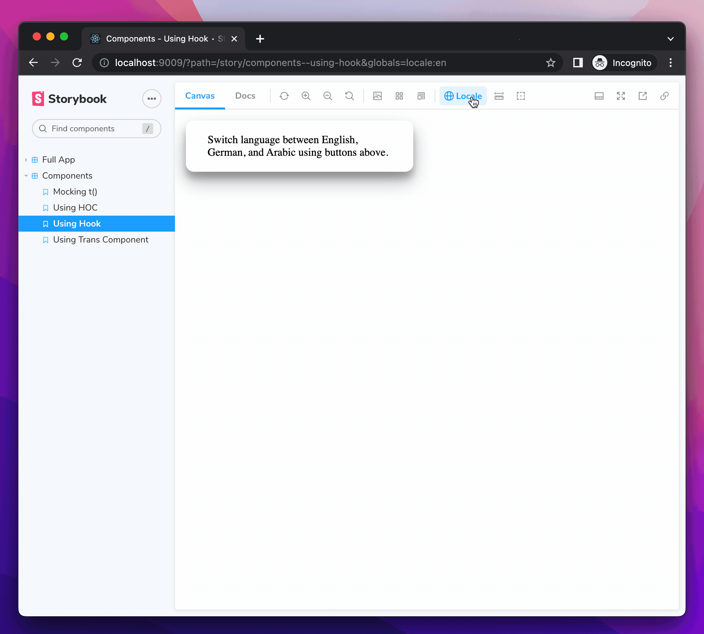

# Custom decorator and globals in modes

<div class="aside" style="margin-bottom: 2rem;">
ℹ️&nbsp;&nbsp;This feature uses the modes API. To learn more, checkout the <a href="/docs/modes#using-modes">getting started guide</a>.
</div>

[Decorators](https://storybook.js.org/docs/react/writing-stories/decorators#page-top) are a Storybook mechanism that allows you to augment stories with extra rendering functionality. They enable you to provide mock context, translations, or any other project-level settings that a component depends on.

By combining decorators with [modes](/docs/modes), you can test a story with various project-level configurations.

## Configure your decorator

Let's consider the following example that uses a decorator & globals to switch locale of a story. It uses the [react-i18next](https://react.i18next.com/) library to provide translations.



The locale values are defined using [global types](https://storybook.js.org/docs/react/essentials/toolbars-and-globals#global-types-and-the-toolbar-annotation). The `withI18next` decorator retrieves the value of the `locale` global and applies it to `I18nextProvider`, enabling us to test stories with different translations.

```jsx
// .storybook/preview.js|ts
import { Preview } from '@storybook/your-renderer';

import React, { Suspense } from 'react';
import { I18nextProvider } from 'react-i18next';
import i18n from '../src/i18n';

// Wrap your stories in the I18nextProvider component
const withI18next = (Story, context) => {
  const { locale } = context.globals;

  // When the locale global changes
  // Set the new locale in i18n
  useEffect(() => {
    i18n.changeLanguage(locale);
  }, [locale]);

  return (
    // This catches the suspense from components not yet ready (still loading translations)
    // Alternative: set useSuspense to false on i18next.options.react when initializing i18next
    <Suspense fallback={<div>loading translations...</div>}>
      <I18nextProvider i18n={i18n}>
        <Story />
      </I18nextProvider>
    </Suspense>
  );
};

const preview: Preview = {
  decorators: [withI18next],
  globalTypes: {
    locale: {
      name: 'Locale',
      description: 'Internationalization locale',
      toolbar: {
        icon: 'globe',
        items: [
          { value: 'en', title: 'English' },
          { value: 'de', title: 'Deutsch' },
          { value: 'ar', title: 'عربي' },
        ],
        showName: true,
      },
    },
  },
};

export default preview;
```

## Define decorator specific modes

Modes are defined in the `.storybook/modes.js|ts` file. If your project doesn't have this file yet, go ahead and create it. Set the value for the global associated with your decorator using the `chromatic[mode_name].[global_name]` parameter. For example:

```jsx
// .storybook/modes.js|ts
export const allModes = {
  english: {
    locale: 'en',
  },
  german: {
    locale: 'de',
  },
  arabic: {
    locale: 'ar',
  },
};
```

## Apply modes to enable your decorator

With the above set of modes, we can apply them as follows:

```jsx
// ArticleCard.stories.js
import { allModes } from '../.storybook/modes';
import { MyComponent } from './MyComponent';

export default {
  component: MyComponent,
  title: 'MyComponent',
  parameters: {
    chromatic: {
      //🔶 Test each story for MyComponent in three modes
      modes: {
        english: allModes['english'],
        german: allModes['german'],
        arabic: allModes['arabic'],
      },
    },
  },
};

export const Base = {
  args: {
    //...
  },
};
```

When Chromatic captures your story, it will create *three* snapshots on your build, with the corresponding global/decorator enabled. Each mode will have an independent baselines and require distinct approval.
