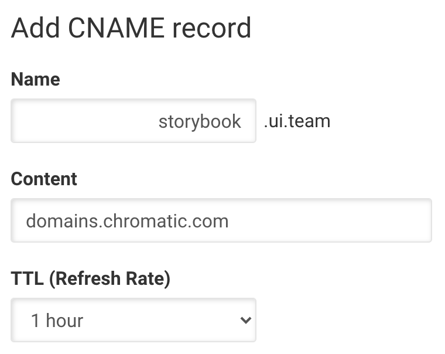

# Custom domains (beta)

> Support for custom domains is in beta. Email [support](mailto:support@chromatic.com) for early access.

Chromatic provides a free CDN for Storybooks. Every time you publish a Storybook, you get a unique URL. These random URLs are not very user friendly. With a custom domain, you can point a custom domain name to your published Storybooks. Most users choose to setup a `storybook` subdomain on their company or project domain name.

#### Prerequisites

- Premium plan subscription
- Ability to add DNS records to the domain name

## Setup

If you want to setup a subdomain such as `storybook.ui.team`, the process is as follows:

1. Head over to DNS management interface provided by your domain registrar or webhosting provider. Most providers have a web interface to do this. A search for "[your domain provider] manage dns records" typically yields what you need.
2. Add a **CNAME** record for `storybook.ui.team` (record name) and point it at `domains.chromatic.com` (record value). The default TTL (typically 1 hour) is fine.
3. Back in Chromatic, head over to your project's Manage page ➔ Collaborate tab. Under "Publish", you'll find the Custom domain setting. Enter the full CNAME record name (e.g. `storybook.ui.team`) as the custom domain.
4. Enter a git branch name for which to host the latest Storybook. Typically this would be `main`, `master` or `next`.
5. Save your settings, then navigate to the custom domain to see if it works. It might take a while for the DNS update to propagate.

### Setup an apex domain

To setup an apex (root) domain such as `ui.team`, do the following:

1. Head over to DNS management interface provided by your domain registrar or webhosting provider. Most providers have a web interface to do this. A search for "[your domain provider] manage dns records" typically yields what you need.
2. Add an **A** record for the root domain (typically, you leave the subdomain field blank) and point it at `34.120.230.5`. The default TTL (typically 1 hour) is fine.
3. Add a **TXT** record for the root domain and set `apex=domains.chromatic.com` as its value. Use the same TTL.
4. Back in Chromatic, head over to your project's Manage page ➔ Collaborate tab. Under "Publish", you'll find the Custom domain setting. Enter the root domain name (e.g. `ui.team`) as the custom domain.
5. Enter a git branch name for which to host the latest Storybook. Typically this would be `main`, `master` or `next`.
6. Save your settings, then navigate to the custom domain to see if it works. It might take a while for the DNS update to propagate.
