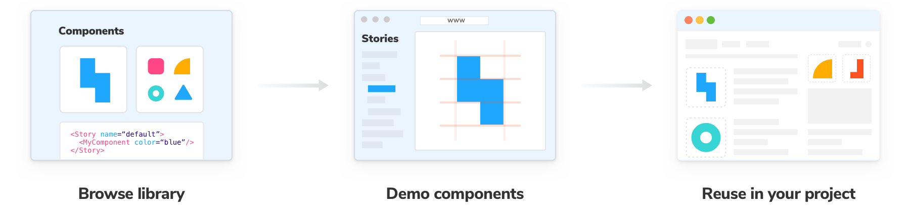
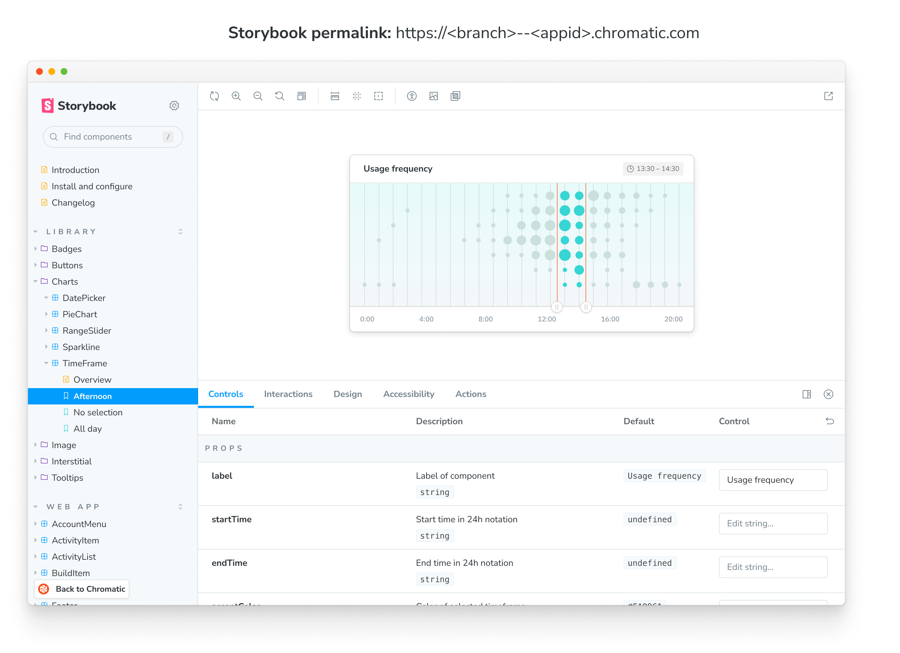

# Document

In addition to publishing your Storybook on every push, Chromatic generates a component library from your Storybook automatically. Every time you push code each component is recorded so you can browse variations of any component across branches and builds. Right from the comfort of your web browser; no `git checkout` or `npm install` required.

## Browse library

The library screen visualizes the latest components on a branch-by-branch basis. Browse existing components to reuse or reference. Use the branch picker to find branch-specific components.

- Get a quick overview of your library in a glance
- Identify changes by comparing historical commits and branches
- Share the library with teammates
- Browse existing components for re-use

## Demo components

Each component and its stories are securely indexed each commit and branch. The component screen is your window into the metadata and variations of the component Chromatic has on file. You'll find image snapshots of each story each commit.

- Visual review components without needing to switch branches, pull code, or Git.
- Easy reproductions by toggling the "Canvas" tab to interact with the real component code
- Leave comments alongside a component
- Get feedback faster by sharing a link to the component with your team
- Compare components historically to check if they look correct

## Direct access to your Storybook

Your Storybook is published on our secure CDN. Collaborators with [access rights](access) will also get access by logging in.

## Link to branches

When you're linking to a library or component on Chromatic, it can be useful to link to the latest version on a `branch` rather than a specific build. To do so, simply add the `branch=foo` query parameter the the url, for example `https://www.chromatic.com/library?appId=59c59bd0183bd100364e1d57&branch=master`.

---

## Next: Setup the workflow

🔄Now that you've learnt about Chromatic's features, let's see how to integrate Chromatic into your workflow. You'll learn how to get notified of changes in your PR and automate testing with CI.

<a class="btn primary round" href="/ci">Read next chapter</a>

---

### Troubleshooting

Canvas tab fails to load

If your stories make use of non-HTTPS content (for instance images), the iframe we deliver live view will fail to load, as modern browsers do not allow mixed content (HTTP content hosted within HTTPS pages).

To fix this, simply ensure all resources used by your stories are hosted via HTTPS.

