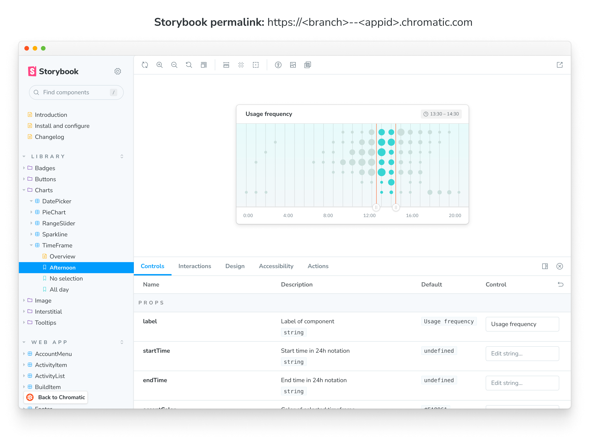

# Document

Chromatic indexes and versions your components in a searchable library. You can browse components and stories across branches and past builds from the web app. That helps teams discover existing work to reuse and reference "prior art".

## Browse library

The library screen visualizes the latest components on a branch-by-branch basis. Browse existing components to reuse or reference. Use the branch picker to find branch-specific components.

- Identify changes by comparing historical commits and branches
- Share the library with teammates
- Browse existing components for re-use

## Demo components

Components and their stories are securely indexed each commit and branch. Use the component screen to demo components without needing to switch branches, pull code, or Git. It's your window into the metadata and variations of the component. You can also share a link to this screen to get feedback.

- **Canvas**: Interact with the real component code to reproduce behavior
- **Snapshot**: Verify the image [snapshots](snapshots) used for cross-browser [UI Tests](test)
- **Docs**: Browse API and usage documentation created by [Storybook Docs](https://storybook.js.org/docs/react/writing-docs/introduction).

## Direct access to your Storybook

Your Storybook is published on our secure CDN. Collaborators with [access rights](access) will also get access by logging in.

Chromatic generates a [permalink](permalinks) for the latest uploaded Storybook on a given branch. That makes it easy to share with your teammates or link to from docs. `https://<branch>--<appid>.chromatic.com`

## Link to specific branches

When you're linking to a library or component on Chromatic, it can be useful to link to the latest version on a `branch` rather than a specific build. To do so, add the `branch=foo` query parameter the the url.

**Example**: `https://www.chromatic.com/library?appId=...&branch=master`.

---

## Next: Automate with CI

Now that you learned how UI components are documented in Chromatic, let's see how to integrate Chromatic into your continuous integration pipeline and get PR status checks.

<a class="btn primary round" href="ci">Read next chapter</a>

---
