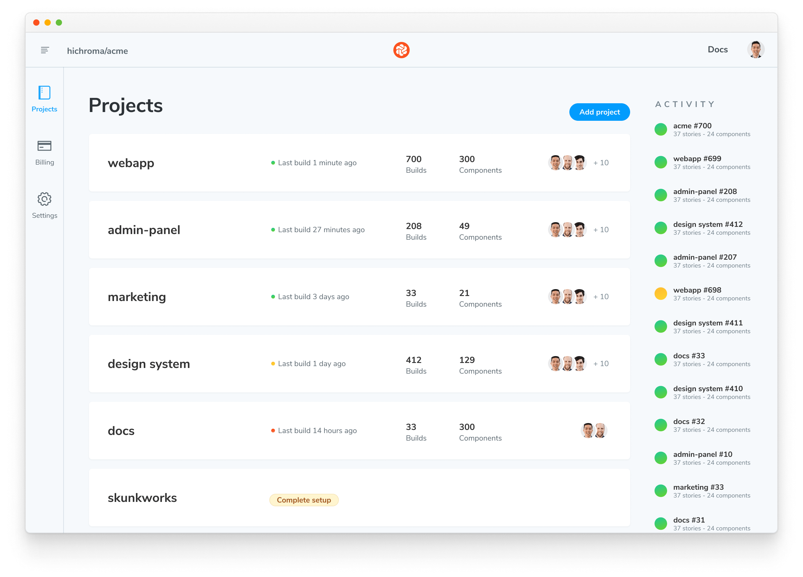

# E2E visual tests

(⚠️ **Experimental**)

Chromatic **E2E (end-to-end) visual tests** capture live [“archives”](#what-are-archives) of pages at the end of [Playwright](https://playwright.dev/) end-to-end tests and, optionally, at any point during tests. The archives you create during each test run can be viewed in a Storybook UI, so you can inspect them in Chromatic (or [locally](#running-the-storybook-locally)) after each build to more closely debug changes and errors.

This means you can the full Chromatic [**UI Tests**](test) and [**UI Review**](review) features _without_ writing any [Storybook stories](https://storybook.js.org/docs/react/get-started/whats-a-story). (Storybook is still used, but automatically configured for you.)

## What are archives?

An **archive** is a self-contained, re-renderable HTML “snapshot” of your page at a certain point in time extracted from the Playwright driven browser’s DOM.

Those archives are then passed to Chromatic’s normal build process, which screenshots those archives in parallel in whichever [cloud browsers](browsers) you like, compares the output, and presents you with the changes to review.

## Requirements

- E2E (end-to-end) visual tests works with end-to-end tests written in [Playwright](https://playwright.dev/) v1.12+.
- ⚠️ **Warning** If your project is already using Storybook, that Storybook will need to be on version 7+ to work alongside the Archive Storybook. If you’re using an older version of Storybook, you can follow this [migration guide](https://storybook.js.org/docs/7.0/react/migration-guide) to upgrade.

## Installation

Get started by installing the Test Archiver package and the Archive Storybook (a specially-configured Storybook instance that can display your [archives](#what-are-archives)):

```shell
yarn add --dev @chromaui/test-archiver @chromaui/archive-storybook
```

## Usage

To create an [archive](#what-are-archives) at the end of a Playwright test, import `test` and `expect` from `@chromaui/test-archiver` instead of `@playwright/test`:

```js
// 👇 Remove this line
// import { test, expect } from '@playwright/test';
// 👇 Add this line
import { test, expect } from "@chromaui/test-archiver";

// Then use as normal
test("...", async ({ page }) => {
  expect(/* things */);
});
```

Once the above is in place, Test Archiver will run in addition to the Playwright test, archiving the final state, irrespective of whether it passes or fails.

[Screenshot of published Storybook, showing archive captured in the prior code snippet]

<!-- TODO  -->

### Manual snapshots

To take manual snapshots at specific points of your tests, you can use the `takeArchive` function inside your test runs:

```js
import { test, expect, takeArchive } from "@chromaui/test-archiver";

// 👇 Add testInfo parameter
test("my test", async ({ page }, testInfo) => {
  await page.goto("https://playwright.dev/");

  // Call takeArchive to take an archive "snapshot" of the page at this point in the test
  // 👇 Pass testInfo to takeArchive
  await takeArchive(page, testInfo);

  await page.getByRole("link", { name: "Get started" }).click();

  // You can call it several times, as necessary
  // To help disambiguate, you can give the archive "snapshot" a name
  await takeArchive(page, "After clicking link", testInfo);
});
```

<div class="aside">

💡 Note that an archive is always taken at the end of every test, in addition to the ones you manually specify.

</div>

[Screenshot of published Storybook, showing archives captured in the prior code snippet]

<!-- TODO  -->

## Setting up a Chromatic project

Whenever you run your Playwright test suite, [archives](#what-are-archives) will be created and stored in `./test-archives/latest` (you can change that location with [settings](#settings)). Those archives will automatically be integrated in the Archive Storybook installed above (which can be [run locally](#running-the-storybook-locally)).

If your project is already tested with Storybook in Chromatic, you can set up a second Chromatic project to test the Archive Storybook using our [monorepo support](monorepos#run-chromatic-for-each-subproject).

### Create a second project

1. Open [your Chromatic app](http://chromatic.com/start), browse to your account, and choose “Add project”:

   

2. Choose your repository a second time:

   <!-- TODO: Local img -->

   

3. Choose a name for your second project, like “End to End Test Archives”:

   <!-- TODO: Local img -->

   

4. Take note of the token for the new project, you’ll need it when you run Chromatic.

### Run Chromatic on the archives manually

Add the scripts for running and building the Archive Storybook to your `package.json`:

```json
"scripts": {
  "archive-storybook": "archive-storybook",
  "build-archive-storybook": "build-archive-storybook"
}
```

Now you can try running Chromatic against the archives with the project you just created manually:

```shell
npx chromatic --build-script-name=build-archive-storybook -t=<TOKEN>
```

### Run Chromatic on the archives in CI

Next, set up your CI service to run Chromatic a second time on each run. The second `chromatic` step should use the project token from the new project you created above, and should use the `--build-script-name=build-archive-storybook` flag:

```yaml
# For instance in our GitHub action:
steps:
  - name: Checkout repository
    uses: actions/checkout@v2
    with:
      fetch-depth: 0
  - name: Install dependencies
    run: yarn

  # 👇 Run Chromatic as normal for your Storybook
  - name: Publish to Chromatic
    uses: chromaui/action@v1
    with:
      projectToken: ${{ secrets.CHROMATIC_PROJECT_TOKEN }}

  # 👇 Run your E2E tests *before* running Chromatic for your E2E test archives
  - name: E2E tests
    run: yarn playwright test

  # 👇 Run Chromatic for your E2E test archives
  - name: Publish E2E Archives to Chromatic
    uses: chromaui/action@v1
    with:
      # 👇 This is the token for the archive project
      projectToken: ${{ secrets.CHROMATIC_ARCHIVE_PROJECT_TOKEN }}
      # 👇 Tell Chromatic to build the Archive Storybook
      buildScriptName: build-archive-storybook
```

Once you’ve set up the above (or similar for your CI provider) and pushed a commit, you should see a build with your archive’s screenshots appear on the new project.

### Sharded Playwright Runs

When running your Playwright tests over multiple shared CI jobs, you’ll need to wait for all jobs to complete, ensure you save the results in `./test-archives` to be accessible by the next job (for instance using an [artifact in GitHub Actions](https://docs.github.com/en/actions/using-workflows/storing-workflow-data-as-artifacts)), and run Chromatic for the Archive Storybook in a job that depends on all of the shards.

For GitHub actions, that might look like:

```yaml
test:
  name: Run Playwright
  needs: install
  strategy:
    matrix:
      shard: [1, 2]
  steps:
    - name: Run Playwright tests
      run: npx playwright test --shard=${{ matrix.shard }}/${{ strategy.job-total }}

    - uses: actions/upload-artifact@v3
      if: always()
      with:
        name: playwright-report-${{ matrix.shard }}_${{ strategy.job-total }}
        path: ./test-archives/latest
        retention-days: 30

chromatic:
  name: Run Chromatic
  needs: test
  steps:
    - name: Download all workflow run artifacts
      uses: actions/download-artifact@v3

    - name: Publish E2E Archives to Chromatic
      uses: chromaui/action@v1
      with:
        projectToken: ${{ secrets.CHROMATIC_ARCHIVE_PROJECT_TOKEN }}
        buildScriptName: build-archive-storybook
```

## Running the Storybook locally

If you want to debug your test [archives](#what-are-archives) locally, you can run the Archive Storybook on your machine.

First run the E2E tests to generate the latest results

```shell
yarn playwright test # or similar
```

<div class="aside">

💡 In addition to running the Archive Storybook locally, you can debug by adding the [`--headed` flag](https://playwright.dev/docs/test-cli#reference) to the `playwright test` command, which will display your tests in the browser as they run.

</div>

Then you can run the Archive Storybook with the `archive-storybook` command, and visit it like any other Storybook:

```shell
yarn archive-storybook
```

## Settings

You can further configure the Test Archiver with these settings:

### `CHROMATIC_ARCHIVE_LOCATION`

To override the [archive](#what-are-archives) location, set the this environment variable, both when running your Playwright tests and when starting the Storybook (or publishing it in on CI).
