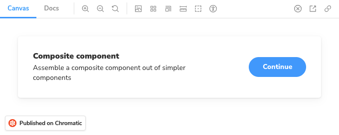

# Embed stories

Chromatic supports the oEmbed standard which means you can embed stories in Medium articles, Notion pages, and countless other platforms. All you need is the URL for a Storybook published on Chromatic.

## Embed a story with the toolbar

Embed a Storybook with a selected story by pasting your Storybook URL (as published on Chromatic). For example this Storybook URL:

```bash
https://<commithash>--<appid>.chromatic.com/?path=/story/shadowboxcta--default
```



## Embed a plain story

It's also possible to use the canvas URL (`iframe.html`) to embed the story without the Storybook toolbar.

Click the "open canvas in new tab" icon in the top-right corner of your Storybook to get the canvas URL:

```bash
https://<commithash>--<appid>.chromatic.com/iframe.html?id=shadowboxcta--default&viewMode=story
```


## Embed a docs page

You can also embed a docs page. Simply open the canvas in a new tab, and replace `viewMode=story` with `viewMode=docs` in the URL:

```bash
https://<commithash>--<appid>.chromatic.com/iframe.html?id=shadowboxcta--default&viewMode=docs
```


---

### Instructions for platforms

<details>

<summary>How to embed stories in Medium</summary>

Paste the Storybook URL into your Medium article then press Enter. The embed will automatically resize to fit the height of your story.

While editing an artcile, Medium renders all embeds non-interactive. Once you publish, the embed will be interactive. [View live demo on Medium »](https://medium.com/@ghengeveld/embedding-storybook-on-medium-ce8a280c03ad)

</details>

<details>

<summary>How to embed stories in Notion</summary>

In your Notion doc type `/embed`, press Enter, then paste the Storybook URL as the embed link. You can manually resize the embed as needed.


</details>
