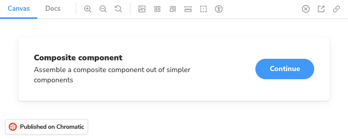
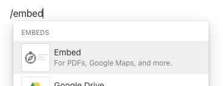
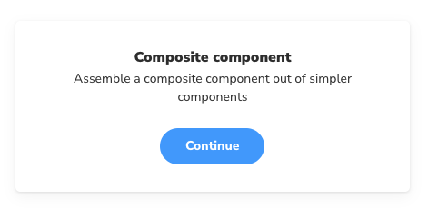
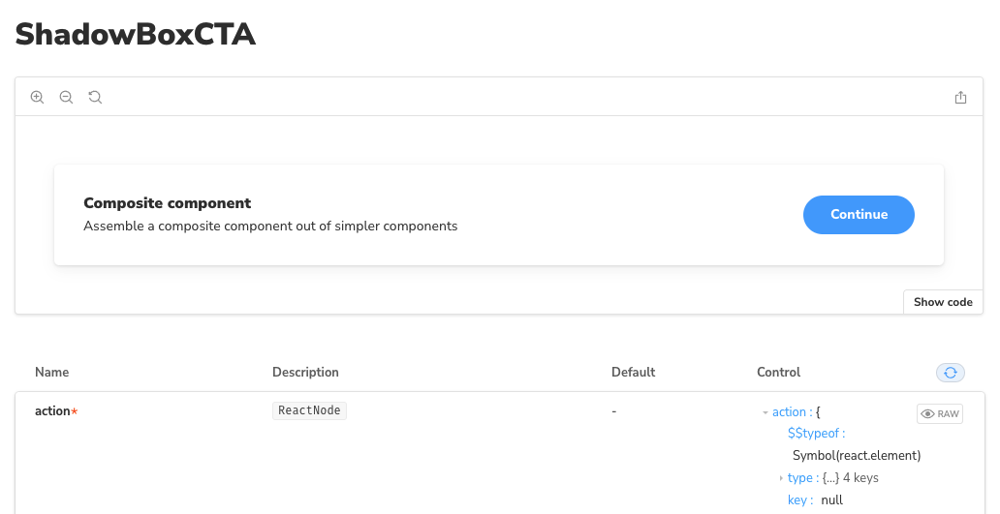

# Embedding

Chromatic integrates with [Embedly](https://embed.ly/) and [Iframely](https://iframely.com/) as an embed provider. That means you can embed Storybook stories in your Medium articles, your Notion pages, and many other platforms that support the oEmbed standard. All you need is a URL for a Storybook published on Chromatic.

<a href="https://medium.com/@ghengeveld/embedding-storybook-on-medium-ce8a280c03ad" rel="noopener noreferrer nofollow" target="_blank">Read this doc on Medium</a> for interactive examples.

## Embedding a Storybook

In most cases, embedding a Storybook with a selected story is as simple as copy/pasting your Storybook URL (as published on Chromatic). Take for example this Storybook URL:

`https://5ccbc373887ca40020446347-bysekhynzd.chromatic.com/?path=/story/shadowboxcta--default`

On Medium, all you need to do is paste the link into your article, press Enter, and wait a few seconds for the embed to load. The embed will automatically resize to fit the height of your story. While editing, Medium will render your embed non-interactive, but it will be interactive in the published article.

In Notion, start by typing `/embed`, press Enter and paste the Storybook URL as the embed link. You can then resize the embed as needed.

## Embedding a plain story

It's also possible to use the direct canvas URL (`iframe.html`) to embed the story without the Storybook UI around it. Simply click the "open canvas in new tab" icon in the top-right corner of your Storybook to get the canvas URL:

`https://5ccbc373887ca40020446347-bysekhynzd.chromatic.com/iframe.html?id=shadowboxcta--default&viewMode=story`

## Embedding a docs page

You can also embed a docs page. Simply open the canvas in a new tab, and replace `viewMode=story` with `viewMode=docs` in the URL:

`https://5ccbc373887ca40020446347-bysekhynzd.chromatic.com/iframe.html?id=shadowboxcta--default&viewMode=docs`

