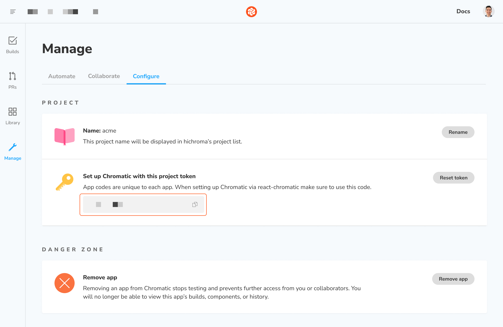

# Frequently asked questions

If you have a question not covered in our documentation, contact us via our in-app chat.

## Comparison with other tools

<details>
<summary>How is this compared to End-to-End testing tools like Selenium and Cypress?</summary>

Chromatic complements your existing End-to-End tests (Selenium or Cypress).

#### Get tests for free

You already write stories as a natural part of building UIs. Chromatic transforms those stories into tests. That gives you expansive yet accurate UI coverage without having to write new tests.

#### No test flake

E2E tests are intended to QA the “happy path”, but are time-consuming to create and brittle to maintain. They tend to be flaky because they rely on the application being in a certain state before running the tests. The tests also have to run in a specific order. Chromatic tests against the static Storybook build. That prevents false positives and negatives.

#### Much faster

Chromatic runs all tests in parallel at no extra cost or configuration. We optimize for the fastest test time by evaluating only the rendered UI. This focus allows Chromatic to run thousands of UI tests in less than a minute. Selenium/Cypress tests can take half an hour or more for an app of meaningful complexity. That said, we recommend you use various testing strategies (visual, unit, E2E) for comprehensive app coverage.

</details>

<details>
<summary>Can I get rid of my BrowserStack or Sauce subscription?</summary>

Our aim isn’t to replace services like Browserstack or Sauce. Cloud browser services are invaluable for verifying interactive behavior (e.g., clicking around the UI) and End-to-End testing but aren’t built or priced for visual testing.

Chromatic gives professional UI engineers a purpose-built service for visual testing which helps you reduce your reliance on cloud browser services. In practice, our customers typically scale back their usage and save a boatload of money while increasing their testing productivity.

</details>

<details>
<summary>How is Chromatic different from visual testing tools like Applitools and Percy?</summary>

Chromatic is a faster, simpler, and cost-effective alternative to Applitools or Percy that is built for UI components and component libraries. Our customers compare us favorably on developer experience and price.

[Get a detailed breakdown »](https://www.chromatic.com/choose/visual-testing)

**Product differentiation**:

- Components are first-class citizens in Chromatic so our workflow is necessarily different

- Deep integration with Storybook (we're core maintainers)

- Track each components baselines through branches and merges

- Generate a living component library online

- Rewind component history

- Review components one at a time, approvals carry over from build to build

**We're proud of our developer experience:**

- "It just works" -- sensible defaults out of the box, no writing webdriver tests or custom integrations

- Lightning fast test runs (modern cloud architecture) with no cap on concurrency

- Automatic PR badging for GitHub, GitLab, and Bitbucket

</details>

<details>
<summary>What if I already publish Storybook using S3, Heroku, Netlify, or Vercel?</summary>

You don't need to do this anymore. Chromatic is a Storybook-optimized cloud service for frontend teams that includes collaboration, access control, versioning, history, and integrations with your existing tools. That said, we're happy customers of those hosting services and recommend them for other situations.

</details>

## Snapshot rendering

<details>
<summary>Where are my images and fonts?</summary>

Image and font rendering can be tricky. Resources that load from unpredictable or flaky sources may not load in time (15s) to capture. Workaround this by:

- Ensure resources load [reliably fast in Chromatic](resource-loading)
- Serve resources as [static files in Storybook](https://storybook.js.org/configurations/serving-static-files/) (this also improves your test speed)
- Using a [placeholder service](https://placeholder.com/).

If your resources are behind a firewall, whitelist our domain so we can load your resources.

</details>

<details>
<summary>Why do my emojis look different in the snapshot versus on my machine?</summary>

Emojis are handled by your operating system's emoji font. Most OSs have a different emoji font and those fonts tend to change over time. For example, if you view a story on a Mac you'll get Apple’s set of emojis.

Chromatic captures Chrome and Firefox snapshots in a Linux environment. It includes a common set of emojis used by most systems. Those emojis will likely look different from emojis on a consumer OS like Mac or Windows. Unfortunately, there's no workaround available at this time.

</details>

<details>
<summary>Why am I getting cross-origin errors with my stories?</summary>

Most likely you are calling into `window.parent` somewhere in your code. As we serve your Storybook preview iframe inside our www.chromatic.com domain this leads to a x-origin error as your code doesn't have access to our frame (with good reason!).

Generally speaking it is a good idea to wrap calls like that in a `try { } catch` in case the code is running in a context where that's not possible (e.g Chromatic).

</details>

<details>
<summary>Why is my content being cut off vertically in my snapshots?</summary>

Make sure there are no elements inadvertently cutting off content through the use of overflow or height styles.

For elements that have relative height styles based on the size of the viewport (such as `height: 100vh`), all content nested under that element will show up in a screenshot unless either `overflow: hidden` or `overflow: scroll` is used to hide what is outside of that element (and therefore outside of the viewport).

When Chromatic takes a screenshot for an element that has a viewport-relative height as well as styling to hide/scroll the overflow, a default viewport height of `900px` will be used. This default is only used when we can't detect a "natural" height for the outermost DOM element (root ancestor), for instance, in the case of scrollable divs.

To set the height, you can add a decorator for stories that wraps them in a container with a fixed height:

```js
// MyComponent.stories.js|jsx

import { MyComponent } from './MyComponent';

export default {
  component: MyComponent,
  decorators:  [(Story) => <div style={{ margin: '3em' }}><Story/></div>],
  title: 'Example Story',
};
```

</details>

<details>
<summary>Why are components that render in a portal (tooltip, modal, menu) getting cut off?</summary>

Portals allow components to render arbitrary elements outside of the parent component's initial DOM hierarchy. For example, tooltips, modals, and menus can be triggered by a nested button, but render close to the top of the DOM hierarchy using portals.

Chromatic uses the "natural" height for your component's outermost DOM element (using Storybook's `#root` element) to determine snapshot dimensions. But portals render outside of the Storybook `#root` element. This means that Chromatic can't auto-detect their dimensions when capturing the snapshot. This can result in your snapshot looking "cut off".

Snapshot portaled elements by adding a [decorator](https://storybook.js.org/docs/react/writing-stories/decorators#component-decorators) that wraps stories in a fixed height container. Adjust the height to account for the total dimensions of your component and portal.

```js
// MyComponent.stories.js|jsx

import { MyComponent } from './MyComponent';

export default {
  component: MyComponent,
  decorators:  [(Story) => <div style={{ height: '300px' }}><Story/></div>],
  title: 'Example Story',
};
```

</details>

<details>
<summary>How do I capture content inside scrollable <code>divs</code>?</summary>

Scrollable divs constrain the height of their children. Change the height of the scrollable div to ensure all content fits. It's not possible for Chromatic to infer how tall scrollable divs are intended to be.

</details>

<details>
<summary>Why isn’t my modal or dialog captured?</summary>

If you use an “animateIn” effect set [delay](delay) to ensure we snapshot when the animation completes.

If your component infers its dimensions from the layout of the surrounding DOM elements (e.g., it's a modal that uses `position:fixed`), you'll need to set the height of that component's stories using a decorator.

```js
// MyComponent.stories.js|jsx

import { MyComponent } from './MyComponent';

export default {
  component: MyComponent,
  decorators: [
    storyFn => (
      <div style={{ width: '1200px', height: '800px' }}>
        This is a decorator for modals and such {storyFn()}
      </div>
    ),
  ],
  title: 'Example Story',
};

export const StoryWithDimensions = () => <MyComponent/>
```

</details>

<details>
<summary>What if I have a modal component that doesn't define a width or height?</summary>

If your component infers its dimensions from the layout of the surrounding DOM elements (e.g., it's a modal that uses `position:fixed`), you can set the height of that component's stories using a <a href="https://storybook.js.org/docs/react/writing-stories/decorators#component-decorators">decorator</a>.

```js
// MyComponent.stories.js|jsx

import { MyComponent } from './MyComponent';

export default {
  component: MyComponent,
  decorators: [
    storyFn => (
      <div style={{ width: '1200px', height: '800px' }}>
        This is a decorator for modals and such {storyFn()}
      </div>
    ),
  ],
  title: 'Example Story',
};

const Template = (args) => <MyComponent/>;

export const StoryWithDimensions = Template.bind({});
StoryWithDimensions.args = {};
```

</details>

<details>
<summary>Do you support taking snapshots of a component with multiple themes?</summary>

We recommend you render stories multiple times, one for each theme. Here's [a code snippet](https://github.com/storybookjs/storybook/blob/next/examples/official-storybook/preview.js#L90-L141) of how to configure Storybook to show the same story in multiple themes. This is how the snapshots will [appear in Chromatic](https://www.chromatic.com/library?appId=5a375b97f4b14f0020b0cda3&branch=next).

If you'd only like to see multiple themes side-by-side in Chromatic and not in your local Storybook, use [isChromatic()](isChromatic).

</details>

<details>
<summary>Why am I seeing a blank snapshot?</summary>

Blank snapshots are often caused by:

- **An "animateIn" effect**—If your component use an “animateIn” effect [set delay](/docs/delay) to ensure we snapshot when the animation completes.

- **Position:fixed**—Fixed position elements may depend on viewport size but do not have dimensions themselves. Wrap your component in an element whose height and width are defined.

Learn more about [debugging snapshots](/docs/snapshots#troubleshooting).

</details>

<details>
<summary>Why am I getting inconsistent or incorrect snapshots?</summary>

Checkout common reasons why snapshots render inconsistently and solutions [**here**](/docs/test#false-positives).

</details>

<details>
<summary>Why am I getting a failing build when ignoring an element?</summary>

By default, Chromatic's diffing algorithm skips the DOM elements marked with either a `.chromatic-ignore` CSS class or `data-chromatic="ignore"` attribute.

However, if you're using this functionality but notice the incoming changes are still being captured. In that case, you'll need to ensure that both the [baseline](/docs/branching-and-baselines) and new snapshots retain the same dimensions (e.g., width, height, and relative positioning).

</details>

## Usage

<details>
<summary>How is UI Review different from UI Tests? How do I get the best functionality out of both?</summary>

In a nutshell, [**UI Tests**](test) prevent regressions (bugs), while [**UI Review**](review) is for gathering qualitative feedback from your team.

The modern development process moves quickly, and developers often fill in gaps according to their best guess. UI review is an opportunity for developers to sync with other teammates to get a final OK before shipping.

Here's how we recommend using the workflows together:

- **UI Tests (commit vs. commit):** Use like unit tests to catch UI regressions in components. Typically, a developer would be responsible for this. It ensures you don't introduce any bugs as you build new features. You'll get notified of bugs down to the commit.
- **UI Review (branch vs. branch):** Once you've finished the first iteration of the implementation and think the PR is "done", it's now ready for review from stakeholders like your tech lead, designer, or PM. This workflow helps them review all the changes in a PR at once and gives them tools to give you precise feedback on stories.

</details>

<details>
<summary>Can I only take snapshots when a component's code changes?</summary>

We recommend taking snapshots on every build because it's the most reliable way to catch UI regressions. Global dependencies, such as CSS or third-party APIs can affect the UI without the code changing.

</details>

<details>
<summary>What happens when I run out of snapshots on the free plan?</summary>

Free plans come with 5000 snapshots per month. Once free snapshots are exhausted, testing & review will become paused until the next month at which time Chromatic will again begin taking snapshots and functionality will automatically resume. Upgrading to a paid plan will immediately resume testing & review.

</details>

<details>
<summary>What happens to my snapshots if I don't use them?</summary>

Chromatic will reset the snapshot count monthly, calculated based on the day you've signed up. For instance, if you signed up on February 14th, your count will be reset on the 14th of each month. Any remaining snapshots from the previous month will not accumulate.

</details>

<details>
<summary>Where can I find my project token?</summary>

The project token is available on the Configure page of your project.



</details>

<details>
<summary>Why are the story names in Chromatic different than what I have in Storybook?</summary>

Chromatic follows Storybook's [naming best practice](https://storybook.js.org/docs/react/writing-stories/naming-components-and-hierarchy). The last level in the hierarchy is tracked as the component name.

```js
export default {
  title: 'App/Components/Button',
  component: Button,
};

export const Primary = () => <Button primary>Button</Button>;
export const Secondary = () => <Button secondary>Button</Button>;
```

In the example above, `Button` is the component name, while `Primary` and `Secondary` are the story names respectively. If your Storybook is organized in a different way, that will affect how your components and story names appear in both Chromatic and Storybook. There's no way to configure name detection.

Folks often encounter naming issues when customizing their Storybook sidebar. In most cases, you can achieve your desired groupings while also adhering to naming best practices using these [organizational tips](https://storybook.js.org/blog/structuring-your-storybook/).

</details>

#### Browsers

<details>
<summary>Can I disable Chrome?</summary>

All plans use Chrome by default because it offers the greatest test coverage for most people. It cannot be disabled.

</details>

<details>
<summary>Can I change which browser generates comparisons for UI Review?</summary>

No. At the moment, Chrome is fixed as the browser used for UI review.

</details>

<details>
<summary>How do browsers affect my snapshot count?</summary>

Each browser adds another snapshot for each of your stories. For example, if you have a story that is tested in Chrome and IE11, that counts as two snapshots.

If you also test your story with different viewports, those count as snapshots as well. For example, you want to test a story at `320px`, `1280px`, `Chrome`, and `IE11`. This would count as 4 snapshots.

</details>

<details>
<summary>Does adding more browser coverage add time to my tests?</summary>

Yes it can. We do our best to provide the fastest test speeds but there are limits to browser performance (IE11) even when scaled across hundreds and thousands of machines.

</details>

<details>
<summary>What about testing in every other browser and its versions?</summary>

Chromatic covers the major rendering engines (Blink, Gecko and Trident) at all viewports. This eliminates almost all browser regressions your users are likely to see with minimal effort, configuration, or additional time to your workflow.

Supporting more browser/device combinations ends up having diminishing returns that adds noise to the visual review process.

</details>

#### UI Tests and UI Review

<details>
<summary>Do I use more snapshots when both UI Tests and UI Review are enabled?</summary>

No. Snapshots taken for one workflow are reused for the other. You don't get charged twice.

</details>

<details>
<summary>What happens if I disable UI Tests and/or UI Review?</summary>

As long as either the testing or review features are enabled, Chromatic will continue taking snapshots. With both disabled, Chromatic will stop taking snapshots and all other features of the platform (such as publishing) will continue without limits.

</details>

#### Continuous Integration

<details>
<summary>How to run Chromatic on a specific branch or only when merging to main?</summary>

How Chromatic is triggered depends on your Continuous Integration (CI) setup. You can configure your CI provider to run Chromatic on a specific branch or only when merging to your main branch. Please beware that changing which branches Chromatic runs on may affect test and review coverage because Chromatic uses Git history to [track baselines](branching-and-baselines).

For example, here’s how GitHub Actions can be configured:

- [Using filters](https://docs.github.com/en/actions/using-workflows/triggering-a-workflow#using-filters)
- [Using conditions to control job execution](https://docs.github.com/en/actions/using-jobs/using-conditions-to-control-job-execution)

</details>

#### TurboSnap

<details>
<summary>Why isn’t TurboSnap working for me?</summary>

TurboSnap is _not_ compatible with squash and merge rebasing ([learn more](turbosnap#squashrebase-merging)). Or you might be missing one of the necessary [prerequisites](docs/turbosnap#prerequisites).

</details>

#### Storybook Connect Figma plugin

<details>
<summary>Can you choose which version of the design from a Storybook is shown in Figma?</summary>

Yes, you can select which branch's stories are connected to Figma.

Chromatic generates a unique permalink when a Storybook is published. You can link your component by using the URL to a specific commit or a [permalink](permalinks#build-your-own-permalink) to a branch.

However, once linked, the plugin will always display stories from the latest build for that branch.

</details>

<details>
<summary>Does the Figma integration sync automatically?</summary>

Yes. Chromatic automatically updates your linked stories to reflect the latest build on the designated branch. That means even when the build URL for a branch changes in Chromatic, the Figma component will always display the latest build on the branch.

</details>

<details>
<summary>How do permissions work?</summary>

Figma users must have access to the Chromatic project in order to use the plugin. That means Figma collaborators (viewers, editors, admins) that have access to your Figma file but don't have access to Chromatic will not be able to see the stories.

Learn how to invite teammates as [collaborators](collaborators) on your Chromatic project. We don't charge "per seat", so you can invite your whole team.
They must be able to see the story in Chromatic to be able to see it in the plugin.

</details>

<details>
<summary>What permissions do I need in Figma?</summary>

You require a Figma `editor` role to both link and view stories with this plugin.

</details>

## Your account

<details>
<summary>How do I change my email and password?</summary>

If you signed up via OAuth, Chromatic will retrieve the email addresses associated with your account from your Git provider. Check your provider's account settings page on how to add or change your email(s).

If you signed up via email, go to the Profile page to change your email address and password. Get there by signing in and clicking on your avatar in the header.

</details>

<details>
<summary>How do I change my username?</summary>

If you signed up via email, you'll be assigned a username based on your email. Go to the Profile page to change your username. Get there by signing in and clicking on your avatar in the header.

</details>
