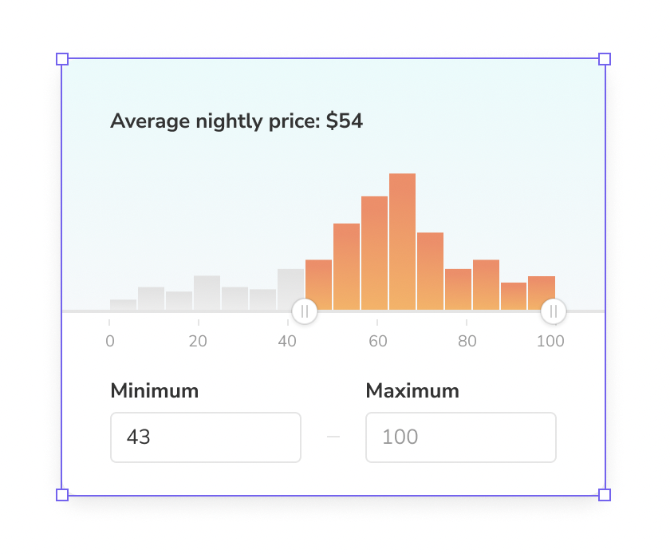
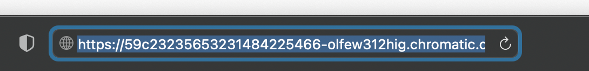
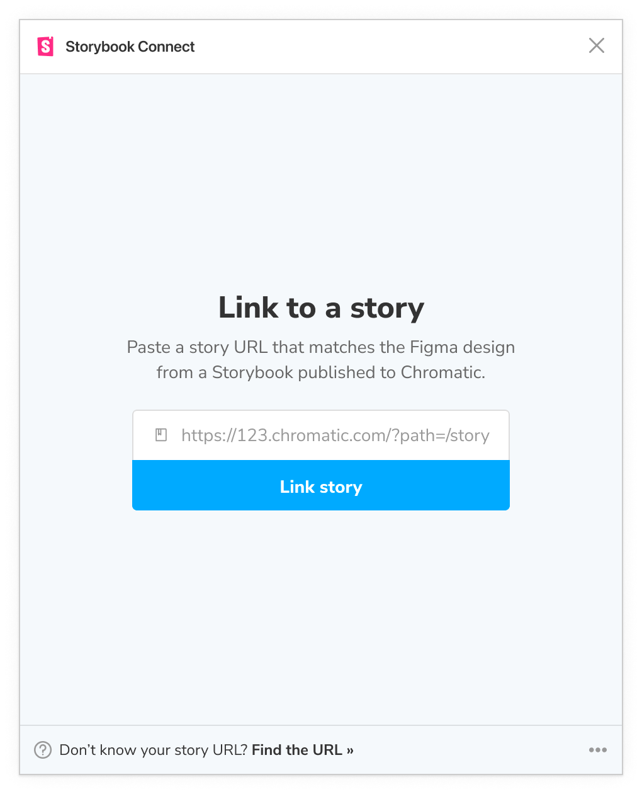
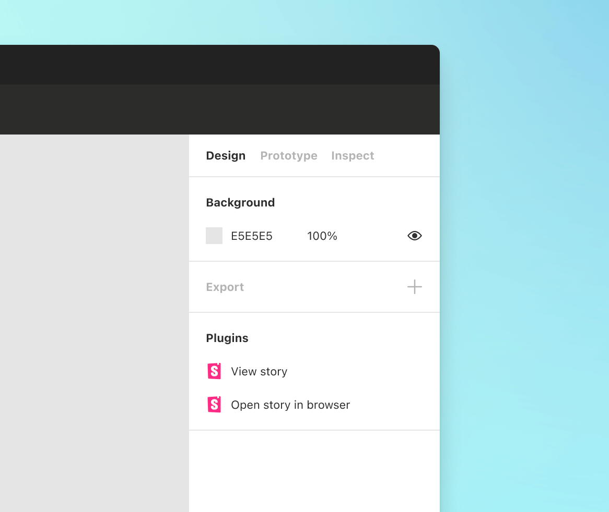
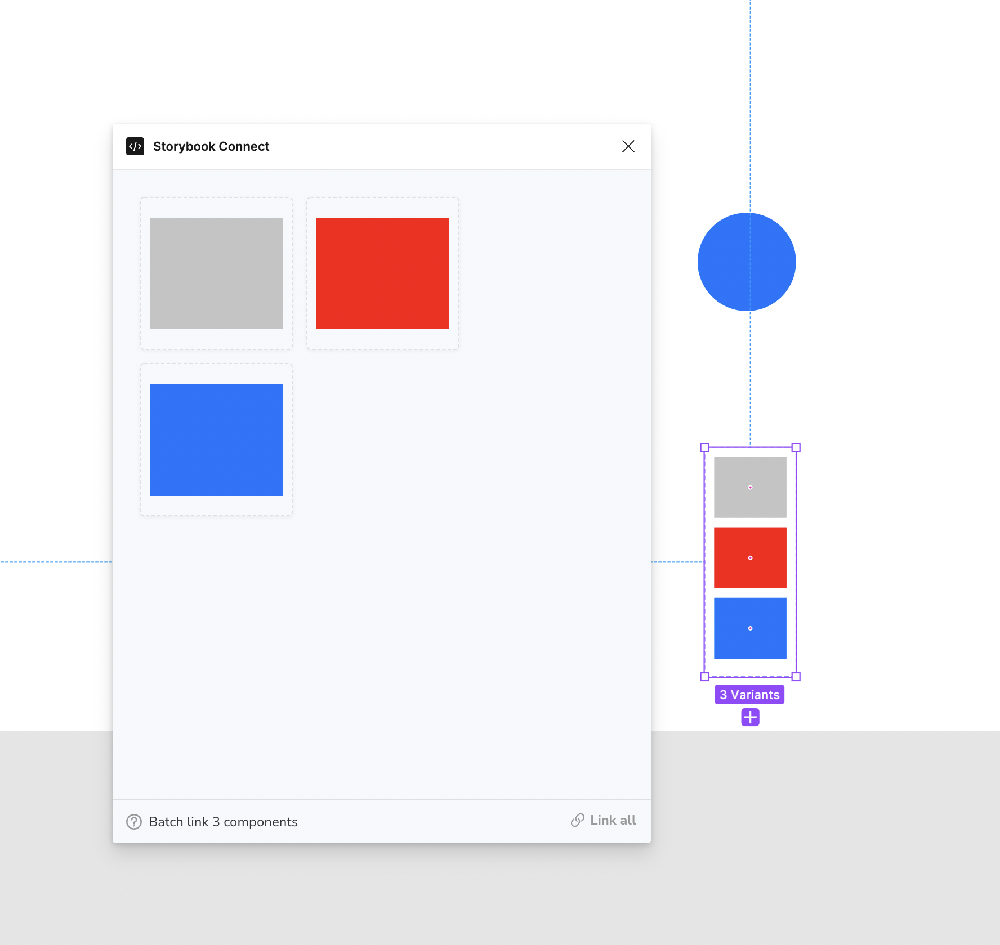
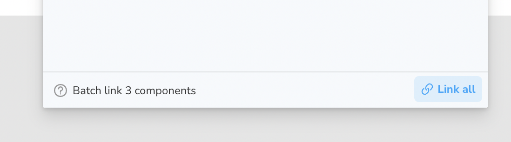

# Figma plugin

Storybook Connect is a Figma plugin that allows you to link stories to Figma components. Once linked, you can view your live stories in the design workspace without leaving Figma.

<video autoPlay muted playsInline loop width="560px" class="center" style="pointer-events: none;">
  <source src="img/figma-plugin-overview.mp4" type="video/mp4" />
</video>

#### Prerequisites

- Figma `editor` role (to both link and view stories)
- Listed as a [collaborator](#collaborators) in the Chromatic project

### Install the plugin

1. Go to [Storybook Connect](https://www.figma.com/community/plugin/1056265616080331589/Storybook-Connect) in the Figma community to install the plugin.
2. Open the plugin from the Resources Tab (shift+i) > Plugins > Storybook Connect. 
   Alternatively you can use the command palette in Figma `command + /` then type `Storybook Connect`. 
3. Follow the installation instructions to authenticate with Chromatic.

### Link a story to a Figma component

1. Select a Figma component to link. The plugin supports linking stories to Figma components, variants, and instances. It does not support linking stories to layers. 

2. Navigate to a story in a Storybook published on Chromatic. Make sure it's on the branch you want to link. Then copy the URL to the story. 

3. Paste the URL into the plugin’s form field. 

4. Once linked, the component and its instances will all have links in the sidebar to view the corresponding story. 

Do I need to re-link components everytime Storybook is published?

Nope. Chromatic automatically updates your linked stories to reflect the latest build on the designated branch. That means even when the build URL for a branch changes in Chromatic, the Figma component will always display the latest build on the branch.

### Link a story to multiple Figma variants at the same time

1. Select Figma variants. 

2. Click "Link all". 

3. Paste the URL into the plugin’s form field. 

### Open a story in Figma

1. Select the component that you've previously linked in Figma.
2. Then navigate to Figma’s Design sidebar and click the “View story” action. Alternatively, open the plugin by using the command palette `command + /` then type the name `Storybook Connect`.

<video autoPlay muted playsInline loop width="560px" class="center" style="pointer-events: none;">
  <source src="img/figma-plugin-open-story.mp4" type="video/mp4" />
</video>

### Collaborators

When a story is linked to a Figma component, that link persists across teams and Figma files. Only [collaborators](collaborators) can find and access linked components for security purposes.

Invite non-technical teammates like designers or PMs to your Chromatic project as [external collaborators](collaborators#external-collaborators). That gives them permissions to view and manage linked components.

Every Chromatic plan comes with unlimited collaborators and [fine-grained roles](collaborators#roles). There are no extra charges "per seat".

# Figma in Chromatic
In 2022 Chromatic released Storybook Connect, a Figma plugin that connects stories to Figma components. This connection allowed you to view your team’s Storybook stories without leaving Figma. Since then, thousands have downloaded the plugin to bring their stories closer to the designs.
Recently, Chromatic introduced a new integration with Figma. This allows you to view Figma components in Chromatic and make new connections between your Figma designs and your Storybook stories from within Chromatic. 

## Enable

Since this workflow is still in early release, we must opt you in first. Please email us via support@chromatic.com to get access. 

To get started with this integration, you need to connect your Figma account with Chromatic. Visit your project’s Manage page, and under the configuration tab, you’ll find a new “Connected Applications” section. If you or a teammate have the appropriate Figma access to view your team's designs you can go ahead and connect Figma to this project.

## View a linked Figma design

If you’ve already linked Figma components and stories via the [Storybook Connect Figma plugin](https://www.figma.com/community/plugin/1056265616080331589/Storybook-Connect) then you’ll be able to view those Figma components in Chromatic already. Just visit the Library in your Chromatic project and click one of your components. You’ll see a new “Designs” tab which renders the Figma component in a canvas.

You can zoom, pan, and even inspect the layers.

## Create a link to a Figma design

If you haven’t used the Figma plugin already, you can now connect your Figma components to your stories from within the Chromatic web app. You just need to grab the Figma URL for a component like so:

Next, drop that URL in the form on any component’s design tab and save the connection for all your teammates to view this design in the future. 

## Things to note
- When you link a Figma frame or layer that is not a component it will not show up in the Figma plugin, Storybook Connect, because the plugin only supports Components at this time.
- Components linked from either the plugin or the Chromatic side that have not been published to a Figma library yet will not render within the Designs tab.
