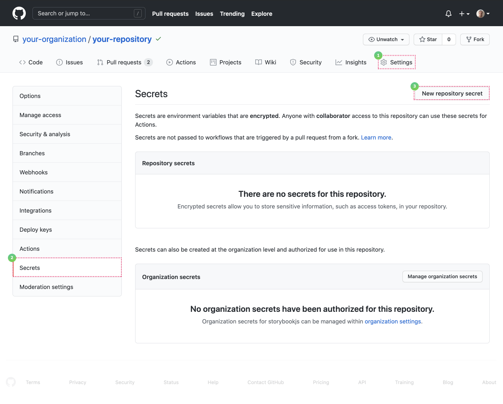

# Automate Chromatic with GitHub Actions

Chromatic provides a [GitHub Action](https://github.com/marketplace/actions/publish-to-chromatic) to help you automate your visual regression tests and publish Storybook.

### Setup

In your `.github/workflows` directory, create a new file called `chromatic.yml` and add the following:

```yml
# .github/workflows/chromatic.yml

# Workflow name
name: 'Chromatic'

# Event for the workflow
on: push

# List of jobs
jobs:
  chromatic-deployment:
    # Operating System
    runs-on: ubuntu-latest
    # Job steps
    steps:
      - uses: actions/checkout@v1
      - name: Install dependencies
        # 👇 Install dependencies with the same package manager used in the project (replace it as needed), e.g. yarn, npm, pnpm
        run: yarn
        # 👇 Adds Chromatic as a step in the workflow
      - name: Publish to Chromatic
        uses: chromaui/action@v1
        # Chromatic GitHub Action options
        with:
          # 👇 Chromatic projectToken, refer to the manage page to obtain it.
          projectToken: ${{ secrets.CHROMATIC_PROJECT_TOKEN }}
```

For extra security, you'll need to configure secrets.

In a new browser window, navigate to your GitHub repository. Click the **Settings** tab, followed by **Secrets** and then **New secret**.



Fill in the form with the necessary information, as detailed below, and replace `Value` with your own Chromatic project token.


Finish by clicking the **Add secret** button.

<div class="aside">
Read the official <a href="https://docs.github.com/en/free-pro-team@latest/actions/reference/encrypted-secrets">GitHub secrets documentation</a>.
</div>

### Forked repositories

GitHub secrets work at a repository level. Forked repositories will not have access to them. If you want to run Chromatic on cross-repository (forked) PRs, you'll need to make the `project-token` public in your `package.json` as part of a script:

```json
{
  "scripts": {
    "chromatic": "chromatic --project-token CHROMATIC_PROJECT_TOKEN"
  }
}
```

<div class="aside">
Replace <code>CHROMATIC_PROJECT_TOKEN</code> with your own token obtained from Chromatic.
</div>

Or you could disable Chromatic on pull requests from forked repositories.

### Available options

Chromatic's GitHub Action includes additional options to customize your workflow. The table below lists what's currently available:

| Option                      | Description                                                                                                          | Type                  | Example value            | Default value        |
| --------------------------- | -------------------------------------------------------------------------------------------------------------------- | --------------------- | ------------------------ | -------------------- |
| **autoAcceptChanges**       | Automatically accepts all changes in Chromatic.                                                                      | `string` or `boolean` | `"my-branch"` or `true`  | `false`              |
| **buildScriptName**         | The script that builds your Storybook.                                                                               | `string`              | `"build:storybook"`      | `"build-storybook"`  |
| **debug**                   | Output verbose debugging information.                                                                                | `boolean`             | `true`                   | `false`              |
| **diagnostics**             | Write process context information to `chromatic-diagnostics.json`.                                                   | `boolean`             | `true`                   | `false`              |
| **dryRun**                  | Run without actually publishing to Chromatic.                                                                        | `boolean`             | `true`                   | `false`              |
| **exitZeroOnChanges**       | Positive exit of action even when changes are detected.                                                              | `string` or `boolean` | `"my-branch"` or `true`  | `true`               |
| **exitOnceUploaded**        | Exit with status 0 (OK) once the build has been sent to Chromatic.                                                   | `string` or `boolean` | `"my-branch"` or `true`  | `false`              |
| **externals**               | Disable [TurboSnap](turbosnap) when any of these files have changed since the baseline build.                        | `string`              | `"my-folder/**"`         |                      |
| **forceRebuild**            | Do not skip build when a rebuild is detected.                                                                        | `string` or `boolean` | `"my-branch"` or `true`  | `false`              |
| **ignoreLastBuildOnBranch** | Do not use the last build on this branch as a baseline if it is no longer in history (i.e., the branch was rebased). | `string`              | `"my-branch"`            |                      |
| **onlyChanged**             | Enables [TurboSnap](turbosnap): Only run stories affected by files changed since the baseline build.                 | `boolean`             | `true`                   | `false`              |
| **onlyStoryFiles**          | Only run a single story or a subset of stories by their filename(s).                                                 | `string`              | `"src/ui/**"`            | `false`              |
| **onlyStoryNames**          | Only run a single story or a subset of stories by their name.                                                        | `string`              | `"Atoms/Button/*"`       | `false`              |
| **projectToken**            | Your Chromatic project token.                                                                                        | `string`              | `"chpt_b2ae83517a0a706"` |                      |
| **skip**                    | Skip Chromatic tests, but mark the commit as passing. It avoids blocking Pull Requests due to required merge checks. | `string` or `boolean` | `"my-branch"` or `true`  | `false`              |
| **storybookBaseDir**        | Relative path from repository root to Storybook project root.                                                        | `string`              | `"src/ui"`               |                      |
| **storybookBuildDir**       | Provide a directory with your built Storybook; use it if you have already built it.                                  | `string`              | `"dist/storybook"`       | `"storybook-static"` |
| **storybookConfigDir**      | Relative path from where you run Chromatic to your Storybook config directory.                                       | `string`              | `"storybook-config"`     | `".storybook"`       |
| **traceChanged**            | Print dependency trace for changed files to affected story files; set to "expanded" to list individual modules.      | `string` or `boolean` | `"expanded"` or `true`   | `false`              |
| **workingDir**              | Provide the location of Storybook's `package.json` if installed in a subdirectory (i.e., monorepos).                 | `string`              | `"my-folder"`            |                      |
| **untraced**                | Disregard these files and their dependencies when tracing dependent stories for [TurboSnap](turbosnap).              | `string`              | `"my-folder/\*\*"`       |                      |
| **zip**                     | Publish your Storybook to Chromatic as a single zip file instead of individual content files.                        | `boolean`             | `true`                   | `false`              |

### Outputs

Chromatic's GitHub Action returns some information about your build in the form of outputs. The table below lists what's currently available:

| Name                             | Type     | Description                                                                                                               |
| -------------------------------- | -------- | --------------------------------------------------------------------------------------------------------------------------|
| **url**                          | `string` | An alias for the build URL.<br/> `https://www.chromatic.com/build?appId=example-app-id&number=100`                        |
| **buildUrl**                     | `string` | The build URL. <br/> `https://www.chromatic.com/build?appId=example-app-id&number=100`                                    |
| **storybookUrl**                 | `string` | The Storybook preview URL for your current branch / Pull Request.<br/> `https://example-app-id-<unique-id>.chromatic.com` |
| **code**                         | `string` | The exit code for the current run of the Chromatic [CLI](cli#exit-codes).                                                 |
| **actualCaptureCount**           | `number` | The number of captured snapshots.                                                                                         |
| **changeCount**                  | `number` | The number of tests with visual changes, including any inherited changes (e.g., due to [TurboSnap](turbosnap)).           |
| **componentCount**               | `number` | The number of components in the published Storybook.                                                                      |
| **errorCount**                   | `number` | The number of tests with error(s), including any inherited errors (e.g., due to [TurboSnap](turbosnap)).                  |
| **inheritedCaptureCount**        | `number` | The number of inherited (not captured) snapshots (e.g., due to [TurboSnap](turbosnap)).                                   |
| **interactionTestFailuresCount** | `number` | The number of stories with interaction test failures.                                                                     |
| **specCount**                    | `number` | The number of stories in the published Storybook.                                                                         |
| **testCount**                    | `number` | The number of tests on the build.                                                                                         |

Please refer to [this GitHub document](https://docs.github.com/en/actions/using-workflows/workflow-syntax-for-github-actions#jobsjob_idoutputs) discussing how to use these outputs.

### Support for `actions/checkout@v2` and above

Chromatic supports the latest versions of the `actions/checkout` (i.e., versions 2 and 3). Both of them come with a caveat. They will only retrieve a single commit without any additional history. Chromatic needs the full Git history to keep track of changes in your repository.

You'll need to make the following change to your workflow:

```yml
# .github/workflows/chromatic.yml

# Other configuration required

jobs:
  chromatic-deployment:
    steps:
        # 👇 Version 2 of the action
      - name: Checkout repository
        uses: actions/checkout@v2
        with:
          fetch-depth: 0 # 👈 Required to retrieve git history
      - name: Install dependencies
        # 👇 Install dependencies with the same package manager used in the project (replace it as needed), e.g. yarn, npm, pnpm
        run: yarn
        # 👇 Adds Chromatic as a step in the workflow
      - name: Publish to Chromatic
        uses: chromaui/action@v1
        # Options required to the GitHub Chromatic Action
        with:
          # 👇 Chromatic projectToken, refer to the manage page to obtain it.
          projectToken: ${{ secrets.CHROMATIC_PROJECT_TOKEN }}
```

<div class="aside">
 Read the official <a href="https://github.com/actions/checkout">GitHub Actions documentation</a>.
</div>

### Run Chromatic on specific branches

If you need to customize your workflow to run Chromatic on specific branches, adjust your workflow like so:

```yml
# .github/workflows/chromatic.yml

# Other necessary configuration

# 👇 Workflow event to trigger execution
on:
  push:
    branches-ignore:
      - "example" # 👈 Excludes the example branch

jobs:
# The list of jobs and steps
```

<div class="aside">
Read the official <a href="https://docs.github.com/en/free-pro-team@latest/actions/reference/workflow-syntax-for-github-actions#example-ignoring-branches-and-tags">GitHub branch workflow documentation</a>.
</div>

Now Chromatic will run for any branch except `example`.

Other branches, such as the ones created by the Renovate bot, can also be included.

### Run Chromatic on large projects

Chromatic is prepared to handle large file uploads (with a limit of 5000 files, including stories and assets). If your project exceeds this limit, we recommend enabling the `zip` option in your workflow to compress your build before uploading it. For example:

```yml
# .github/workflows/chromatic.yml

# Other configuration required

# List of jobs
jobs:
  chromatic-deployment:
    # Operating System
    runs-on: ubuntu-latest
    # Job steps
    steps:
      - uses: actions/checkout@v1
        # 👇 Install dependencies with the same package manager used in the project (replace it as needed), e.g. yarn, npm, pnpm
      - run: yarn
        # 👇 Adds Chromatic as a step in the workflow
      - uses: chromaui/action@v1
        # Options required for Chromatic's GitHub Action
        with:
          projectToken: ${{ secrets.CHROMATIC_PROJECT_TOKEN }}
          # 👇Runs Chromatic with the option to compress the build output.
          zip: true
```

### Run Chromatic on monorepos

Chromatic can be run on monorepos that have multiple subprojects. Each subproject will need its project token.

#### Prerequisites

1. Ensure that you're in the correct working directory for the subproject.
2. Have the `build-storybook` npm script in the subproject's `package.json` file OR explicitly name the script using the `buildScriptName` parameter and ensure the script is listed in the subproject's `package.json` file.

If you've already built your Storybook in a separate CI step, you can alternatively point the action at the build output using the `storybookBuildDir` parameter.

```yml
# .github/workflows/chromatic.yml

# Workflow name
name: 'Chromatic'

# Event for the workflow
on: push

# List of jobs
jobs:
  chromatic-deployment:
    # Operating System
    runs-on: ubuntu-latest
    # Job steps
    steps:
      - uses: actions/checkout@v1
      - name: Install dependencies
        # 👇 Install dependencies with the same package manager used in the project (replace it as needed), e.g., yarn, npm, pnpm
        run: yarn
        # 👇 Adds Chromatic as a step in the workflow
      - name: Publish Project 1 to Chromatic
        uses: chromaui/action@v1
        # Chromatic GitHub Action options
        with:
          # 👇 Chromatic projectToken, refer to the manage page to obtain it.
          projectToken: ${{ secrets.CHROMATIC_PROJECT_TOKEN_1 }}
          workingDir: packages/project_1
      - name: Publish Project 2 to Chromatic
        uses: chromaui/action@v1
        # Chromatic GitHub Action options
        with:
          # 👇 Chromatic projectToken, refer to the manage page to obtain it.
          projectToken: ${{ secrets.CHROMATIC_PROJECT_TOKEN_2 }}
          workingDir: packages/project_2
```

If you want to run Chromatic in parallel for each subproject, you will need to create a workflow for each.

```yml
# .github/workflows/chromatic-1.yml

# Workflow name
name: 'Chromatic 1'

# Event for the workflow
on: push

# List of jobs
jobs:
  chromatic-deployment:
    # Operating System
    runs-on: ubuntu-latest
    # Job steps
    steps:
      - uses: actions/checkout@v1
      - name: Install dependencies
        # 👇 Install dependencies with the same package manager used in the project (replace it as needed), e.g. yarn, npm, pnpm
        run: yarn
        # 👇 Adds Chromatic as a step in the workflow
      - name: Publish to Chromatic
        uses: chromaui/action@v1
        # Chromatic GitHub Action options
        with:
          # 👇 Chromatic projectToken, refer to the manage page to obtain it.
          projectToken: ${{ secrets.CHROMATIC_PROJECT_TOKEN_1 }}
          workingDir: packages/project_1
```

```yml
# .github/workflows/chromatic-2.yml

# Workflow name
name: 'Chromatic 2'

# Event for the workflow
on: push

# List of jobs
jobs:
  chromatic-deployment:
    # Operating System
    runs-on: ubuntu-latest
    # Job steps
    steps:
      - uses: actions/checkout@v1
      - name: Install dependencies
        # 👇 Install dependencies with the same package manager used in the project (replace it as needed), e.g. yarn, npm, pnpm
        run: yarn
        # 👇 Adds Chromatic as a step in the workflow
      - name: Publish to Chromatic
        uses: chromaui/action@v1
        # Chromatic GitHub Action options
        with:
          # 👇 Chromatic projectToken, refer to the manage page to obtain it.
          projectToken: ${{ secrets.CHROMATIC_PROJECT_TOKEN_2 }}
          workingDir: packages/project_2
```

### Enable TurboSnap

TurboSnap is an advanced Chromatic feature implemented to improve the build time for large projects, disabled by default once you add Chromatic to your CI environment. To enable it, you'll need to adjust your existing workflow and add the `onlyChanged` option to the workflow as follows:

```yml
# .github/workflows/chromatic.yml

# Other necessary configuration

jobs:
  chromatic-deployment:
    steps:
        # 👇 Adds Chromatic as a step in the workflow
      - name: Publish to Chromatic
        uses: chromaui/action@v1
        # Options required to the GitHub chromatic action
        with:
          # 👇 Chromatic projectToken, refer to the manage page to obtain it.
          projectToken: ${{ secrets.CHROMATIC_PROJECT_TOKEN }}
          onlyChanged: true # 👈 Required option to enable TurboSnap
```

<div class="aside">

TurboSnap is highly customizable and can be configured to fit your requirements. For more information, read our [documentation](turbosnap).

</div>

#### Trigger full rebuilds

By default, TurboSnap relies on Webpack's dependency graph to determine which files changes since the last build. If you're working with files processed outside the scope of Webpack (e.g., fonts, images, CSS, external libraries), you can use the `externals` option to tell Chromatic to rebuild the entire project when a file matching the pattern is changed. For example:

```yml
# .github/workflows/chromatic.yml

# Other necessary configuration

jobs:
  chromatic-deployment:
    steps:
        # 👇 Adds Chromatic as a step in the workflow
      - name: Publish to Chromatic
        uses: chromaui/action@v1
        # Options required to the GitHub chromatic action
        with:
          # 👇 Chromatic projectToken, refer to the manage page to obtain it.
          projectToken: ${{ secrets.CHROMATIC_PROJECT_TOKEN }}
          onlyChanged: true # 👈 Required option to enable TurboSnap
          externals: packages/(icons/icons|tokens/src)/**
```

<div class="aside">

The `externals` option also accept additional glob patterns defined via [picomatch].

</div>

### Support for environment variables

Environment variables are supported in Chromatic. You can use them to customize your workflow execution or provide project-related variables (e.g., API URLs). Below is a table and condensed examples featuring the available Chromatic variables and how to set up a project-specific variable.

| Environment variable          | Description                                                                                                                                                                           |
| ----------------------------- | ------------------------------------------------------------------------------------------------------------------------------------------------------------------------------------- |
| `CHROMATIC_PROJECT_TOKEN`     | Sets Chromatic's project token, used as an advanced case.<br/> See [setup](#setup) to learn how to configure the token.<br/> `env: CHROMATIC_PROJECT_TOKEN: 'Example-project-token'`  |
| `CHROMATIC_POLL_INTERVAL`     | Configures a polling interval in milliseconds to wait for the build to finish. <br/> Default value: `1000`.<br/> `env: CHROMATIC_POLL_INTERVAL: 3000`                                 |
| `CHROMATIC_RETRIES`           | Configures the number of attempts to upload to Chromatic.<br/> Default value: `5`.<br/> `env: CHROMATIC_RETRIES: 10`                                                                  |
| `CHROMATIC_STORYBOOK_VERSION` | Overrides Storybook package/version detection. <br/> `env: CHROMATIC_STORYBOOK_VERSION: '@storybook/react@6.5.0-alpha.25'`                                                            |
| `STORYBOOK_BUILD_TIMEOUT`     | Sets the waiting period in milliseconds for Storybook's build process to finish. <br/> Default value: `600000` (10 minutes).<br/> `env: STORYBOOK_BUILD_TIMEOUT: 30000`               |
| `CI`                          | Marks the execution environment as CI.<br/> `env: CI: true`                                                                                                                           |
| `LOG_LEVEL`                   | Configures the log level.<br/> Available options are: `silent`, `error`, `warn`, `info`, `debug`. <br/> `env: LOG_LEVEL:'info'`                                                       |
| `DISABLE_LOGGING`             | Disables logging. Similar to setting `env: LOG_LEVEL: 'silent'`.<br/> `env: DISABLE_LOGGING: true`                                                                                    |
| `HTTPS_PROXY` or `HTTP_PROXY` | Provides the proxy server's URL.<br/> Used to configure [https-proxy-agent](https://www.npmjs.com/package/https-proxy-agent).<br/> `env: HTTPS_PROXY: 'https://example-proxy-server'` |

```yml
# .github/workflows/chromatic.yml

# Other configuration required

# List of jobs
jobs:
  chromatic-deployment:
    # Operating System
    runs-on: ubuntu-latest
    # Job steps
    steps:
      - uses: actions/checkout@v1
        # 👇 Install dependencies with the same package manager used in the project (replace it as needed), e.g. yarn, npm, pnpm
      - run: yarn
        # 👇 Adds Chromatic as a step in the workflow
      - uses: chromaui/action@v1
        # Options required for Chromatic's GitHub Action
        with:
          projectToken: ${{ secrets.CHROMATIC_PROJECT_TOKEN }}
        env:
          # 👇 Sets the environment variable
          CHROMATIC_RETRIES: 5
          LOG_LEVEL: 'error'
```

It comes with a caveat if you need to provide project-specific environment variables. We recommend that you prefix each variable with the `STORYBOOK` keyword and adjust your workflow to the following:

```yml
# .github/workflows/chromatic.yml

# Other configuration required

# List of jobs
jobs:
  chromatic-deployment:
    # Operating System
    runs-on: ubuntu-latest
    # Job steps
    steps:
      - uses: actions/checkout@v1
      - run: yarn
        #👇 Adds Chromatic as a step in the workflow
      - uses: chromaui/action@v1
        # Options required for Chromatic's GitHub Action
        with:
          projectToken: ${{ secrets.CHROMATIC_PROJECT_TOKEN }}
        env:
          #👇 Sets the environment variable
          STORYBOOK_SOME_ENV_VAR: ${{ secrets.STORYBOOK_SOME_ENV_VAR }} 
```

<div class="aside">
Read the official <a href="https://storybook.js.org/docs/react/configure/environment-variables">Storybook environment variable's documentation </a>.
</div>

### Recommended configuration for build events

GitHub's Actions, like other CI systems, can run based on any type of event. Our recommendation is to run Chromatic's step on `push` events. All other event types except `pull-request` will not work.

The `pull-request` event requires special consideration. Like other CI systems, GitHub allows workflow execution on either commits pushed to a branch in a pull request. Or for "merge" commits between that branch and the base branch (main).

These specific types of commits (merge) don't persist in the history of your repository. That can cause Chromatic's baselines to be lost in certain situations. Hence why we recommend running Chromatic's step on `push`.

### UI Test and UI Review

[UI Tests](test) and [UI Review](review) rely on [branch and baseline](branching-and-baselines) detection to keep track of [snapshots](snapshots). We recommend the following configuration.

#### Command exit code for "required" checks

If you are using pull request statuses as required checks before merging, you may not want your workflow step to fail if test snapshots render without errors (but with changes). To achieve this, pass the option `exitZeroOnChanges` to the `with` clause, and your workflow will continue in such cases. For example:

```yml
# .github/workflows/chromatic.yml

# Other necessary configuration

jobs:
  chromatic-deployment:
    steps:
        # 👇 Adds Chromatic as a step in the workflow
      - name: Publish to Chromatic
        uses: chromaui/action@v1
        # Options required to the GitHub chromatic action
        with:
          # 👇 Chromatic projectToken, refer to the manage page to obtain it.
          projectToken: ${{ secrets.CHROMATIC_PROJECT_TOKEN }}
          exitZeroOnChanges: true # 👈 Option to prevent the workflow from failing
```

<div class="aside">
Read about the <a href="#available-options">available options</a>.
</div>

When using `exitZeroOnChanges`, your workflow will still stop and fail if your Storybook contains stories that error.

#### Re-run failed builds after verifying UI test results

Builds that contain visual changes need to be [verified](test#verify-ui-changes). They will fail if you are not using the `exitZeroOnChanges` option. Once you accept all the changes, re-run the workflow, and the `chromatic-deployment` job will pass.

If you deny any change, you will need to make the necessary code changes to fix the test (and thus start a new run) to get Chromatic to pass again.

#### Maintain a clean "main" branch

A clean `main` branch is a development **best practice** and **highly recommended** for Chromatic. This means ensuring that test builds in your `main` branch are passing.

If the builds result from direct commits to `main`, you must accept changes to keep the main branch clean. If they're merged from `feature-branches`, you must ensure those branches are passing _before_ you merge into `main`.

#### GitHub squash/rebase merge and the "main" branch

GitHub's squash/rebase merge functionality creates new commits that have no association with the branch being merged. If you've enabled our GitHub application in the [UI Review](review) workflow, then we will automatically detect this situation and bring baselines over (see [Branching and Baselines](branching-and-baselines#squash-and-rebase-merging) for more details).

If you’re using this functionality but notice the incoming changes were not accepted as baselines in Chromatic, then you'll need to adjust the workflow to include a new step with the `autoAcceptChanges` option. For example:

```yml
# .github/workflows/chromatic.yml

# Other necessary configuration for the action

jobs:
  chromatic-deployment:
    steps:
        # Other steps

        # 👇 Checks if the branch is not main and runs Chromatic
      - name: Publish to Chromatic
        if: github.ref != 'refs/heads/main'
        uses: chromaui/action@v1
        # Required options for the Chromatic GitHub Action
        with:
          # 👇 Chromatic projectToken, refer to the manage page to obtain it.
          projectToken: ${{ secrets.CHROMATIC_PROJECT_TOKEN }}
        # 👇 Checks if the branch is main and accepts all changes in Chromatic
      - name: Publish to Chromatic and auto accept changes
        if: github.ref == 'refs/heads/main'
        uses: chromaui/action@v1
        # Required options for the Chromatic GitHub Action
        with:
          # 👇 Chromatic projectToken, refer to the manage page to obtain it.
          projectToken: ${{ secrets.CHROMATIC_PROJECT_TOKEN }}
          autoAcceptChanges: true # 👈 Option to accept all changes

```

<div class="aside">
Read about the <a href="#available-options">available options</a>.
</div>

Including the `autoAcceptChanges` option ensures all incoming changes will be accepted as baselines. Additionally, you'll maintain a clean `main` branch.

If you want to test the changes introduced by the rebased branch, you can adjust your workflow and include a new step with the `ignoreLastBuildOnBranch` option. For example:

```yml
# .github/workflows/chromatic.yml

# Other necessary configuration

jobs:
  chromatic-deployment:
    steps:
        # 👇 Adds Chromatic as a step in the workflow
      - name: Publish to Chromatic
        uses: chromaui/action@v1
        # Options required to the GitHub chromatic action
        with:
          # 👇 Chromatic projectToken, refer to the manage page to obtain it.
          projectToken: ${{ secrets.CHROMATIC_PROJECT_TOKEN }}
          ignoreLastBuildOnBranch: 'my-branch' # 👈 Option to skip the last build on target branch
```

<div class="aside">
Read about the <a href="#available-options">available options</a>.
</div>

Including the `ignoreLastBuildOnBranch` option ensures the latest build for the specific branch is not used as a baseline.

#### Run Chromatic on external forks of open source projects

You can enable PR checks for external forks by sharing your project token where you configured the Chromatic command (often in `package.json` or in the pipeline step).

Sharing project tokens allows contributors and others to run Chromatic builds on your project, consuming your snapshot quota. They cannot access your account, settings, or accept baselines. This can be an acceptable tradeoff for open source projects that value community contributions.

#### Skipping builds for certain branches

Sometimes you might want to skip running a build for a certain branch but still have Chromatic mark the latest commit on that branch as "passed". Otherwise, pull requests could be blocked due to required checks that remain pending. To avoid this issue, you can run `chromatic` with the `--skip` flag. This flag accepts a branch name or glob pattern.

For instance, Dependabot automatically updates the dependencies of a project. Although some dependencies can result in UI changes, you might not find it worthwhile to run Chromatic for every dependency update. Instead, you could rely on Chromatic running against the `main` or `develop` branch. One use case for this feature is skipping builds for branches created by a bot.

To skip builds for `dependabot` branches, use the following:

```shell
chromatic --skip 'dependabot/**'
```

<div class="aside">
Read our <a href="/docs/cli#chromatic-options"> CLI documentation</a>.
</div>

To apply this to multiple branches, use an "extended glob". See [picomatch] for details.

```shell
chromatic --skip '@(renovate/**|dependabot/**)'
```

[picomatch]: https://www.npmjs.com/package/picomatch#globbing-features
