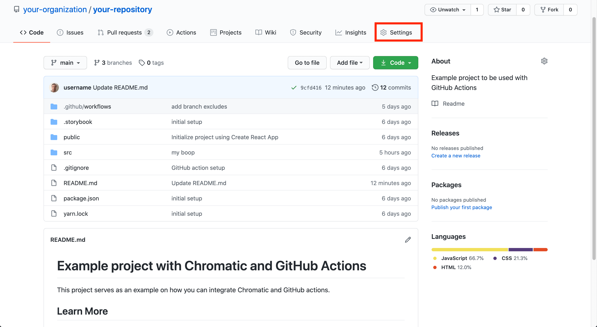
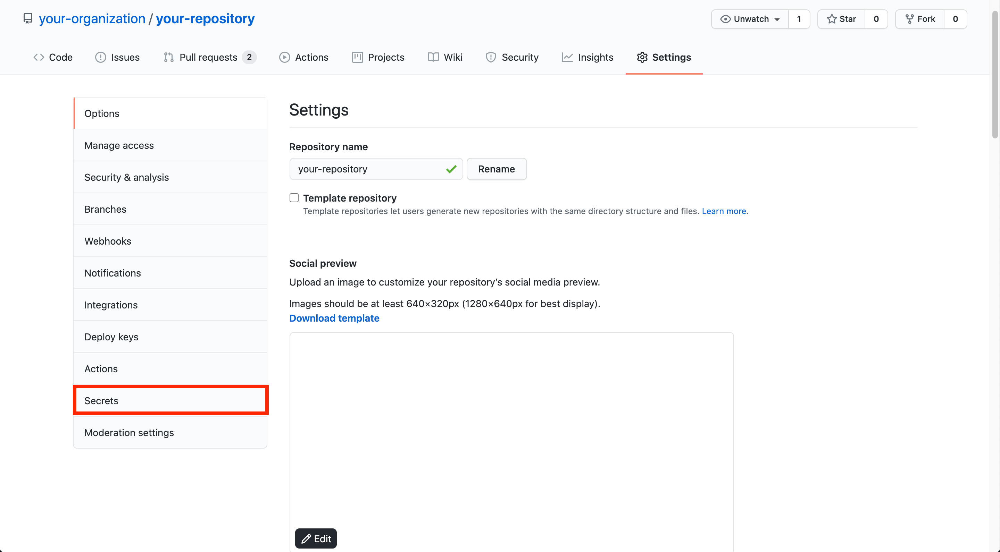
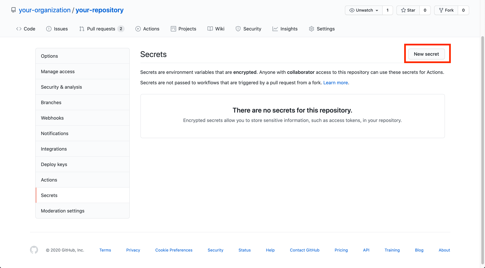
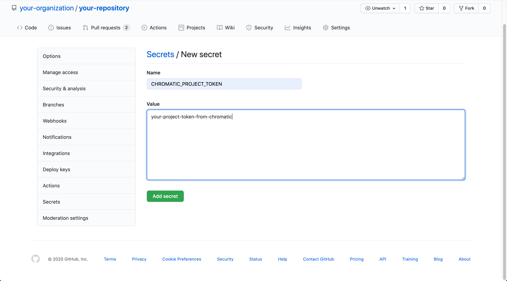

# Automate Chromatic with GitHub Actions

Chromatic has a [GitHub Action](https://github.com/chromaui/action) to help you automate your visual regression tests and publish Storybook. 

## Initial configuration

In your `.github/workflows` directory, create a new file called `chromatic.yml` and add the following:

```yml
# .github/workflows/chromatic.yml

# name of our workflow
name: 'Chromatic Deployment'

# the event that will trigger the action
on: push

# list of jobs executed
jobs:
  chromatic-deployment:
    # Operating System
    runs-on: ubuntu-latest
    # steps that the action will go through
    steps:
      - name: Install dependencies
        run: yarn
      - name: Deploy to Chromatic
        uses: chromaui/action@v1
        # options required to the GitHub chromatic action
        with:
          # Chromatic project token, refer to the manage page to obtain it.
          token: ${{ secrets.GITHUB_TOKEN }}
          projectToken: ${{ secrets.CHROMATIC_PROJECT_TOKEN }}
```

For extra security, you'll need to configure secrets. 

Go to the **settings** tab in your repository.



Click **Secrets**. 



Followed by the **New secret** button.



Fill in the form with the necessary information, as detailed below, replace `Value` with your own Chromatic project token




Finish by clicking the **Add secret** button.

<div class="aside">
See the official <a href="https://docs.github.com/en/free-pro-team@latest/actions/reference/encrypted-secrets">GitHub secrets documentation</a> for more context.
</div>

### Forked repositories

Secrets work at a repository level. Forked repositories will not have access to them. If you want to run Chromatic on cross-repository (forked) PRs, you'll need to make the `projectToken` public in your `package.json` as part of a script:

```json
{
  scripts:{
    chromatic:"chromatic --project-token=CHROMATIC_PROJECT_TOKEN"
  }
}
```

<div class="aside">
Replace <code>CHROMATIC_PROJECT_TOKEN</code> with your own token obtained from Chromatic.
</div>

Or you could disable Chromatic on pull requests from forked repositories.

### Available options

Chromatic's GitHub Action includes additional options to customize your workflow. The table below lists what's currently available:


| Option                 | Description                                                                              | Type                  | Example value                              |
| ---------------------- | ---------------------------------------------------------------------------------------- | ----------------------| -------------------------------------------|
| **buildScriptName**    | The script that builds your Storybook                                                    | *String*              | <code>build-storybook</code>               |
| **storybookBuildDir**  | Provide a directory with your built Storybook.                                           | *String*              | <code>storybook-static</code>              |
| **allowConsoleErrors** | Do not exit when runtime errors occur in Storybook                                       | *N/A*                 | <code>N/A</code>                           |
| **autoAcceptChanges**  | Automatically accepts all changes in Chromatic                                           | *String* or *Boolean* | <code>my-branch</code> or <code>true</code>|
| **exitZeroOnChanges**  | Positive exit of action even when there are changes detected                             | *String* or *Boolean* | <code>my-branch</code> or <code>true</code>|
| **exitOnceUploaded**   | Exit with status 0 (OK) once the build has been sent to Chromatic                        | *String* or *Boolean* | <code>my-branch</code> or <code>true</code>|


### Support for `actions/checkout@v2` 

Version 2 of the `actions/checkout` is supported. But it comes with a caveat. It will only retrieve a single commit without any additional history. Chromatic needs the full Git history to keep track of changes in your repository. 

You'll need to make the following change to your workflow:

```yml
# .github/workflows/chromatic.yml

# name of our action
name: 'Chromatic Deployment'

# the event that will trigger the action
on: push

# what the action will do
jobs:
  chromatic-deployment:
    # Operating System
    runs-on: ubuntu-latest
    # the list of steps that the action will go through
    steps:
        # version 2 of the action
      - name: Checkout repository
        uses: actions/checkout@v2
        with:
          fetch-depth: 0 # 👈  Required to retrieve git history
      - name: Install dependencies
        run: yarn
      - name: Deploy to Chromatic
        uses: chromaui/action@v1
        # options required to the GitHub chromatic action
        with:
          # Chromatic project token, refer to the manage page to obtain it.
          projectToken: ${{ secrets.GITHUB_TOKEN }}
          token: ${{ secrets.CHROMATIC_PROJECT_TOKEN }}
```

<div class="aside">
 See the official <a href="https://github.com/actions/checkout">GitHub Actions documentation</a> for more context.
</div>

### Run Chromatic on specific branches

If you need to customize your workflow to run Chromatic on specific branches, adjust your workflow like so:

```yml
# .github/workflows/chromatic.yml

# name of our action
name: 'Chromatic Deployment'
# the event that will trigger the action
on:
  push:
    branches-ignore: 
      - 'example' ## 👈  Excludes the example branch

# what the action will do
jobs:
  chromatic-deployment:
    # the operating system it will run on
    runs-on: ubuntu-latest
    # the list of steps that the action will go through
    steps:
        # version 2 of the action
      - name: Checkout repository
        uses: actions/checkout@v2
        with:
          fetch-depth: 0 # 👈  Required to retrieve git history
      - name: Install dependencies
        run: yarn
      - name: Deploy to Chromatic
        uses: chromaui/action@v1
        # options required to the GitHub chromatic action
        with:
          # Chromatic project token, refer to the manage page to obtain it.
          token: ${{ secrets.GITHUB_TOKEN }}
          projectToken: ${{ secrets.CHROMATIC_PROJECT_TOKEN }}
```

<div class="aside">
See the official <a href="https://docs.github.com/en/free-pro-team@latest/actions/reference/workflow-syntax-for-github-actions#example-ignoring-branches-and-tags">GitHub branch workflow documentation</a> for more context.
</div>

Now Chromatic will run for any branch except `example`.

Other branches can also be included such as the ones created by the Renovate bot.


### Recommended configuration for build events

GitHub's Actions like other CI systems can run based on any type of event. Our recommendation is to run the Chromatic's step on `push` events. All other event types except `pull-request` will not work. 

The `pull-request` event requires special consideration. Like other CI systems, GitHub allows workflow execution on either commits pushed to a branch in a pull request. Or for "merge" commits between that branch and the base branch (master).

These specific types of commits (merge) don't persist in the history of your repository. That can cause Chromatic's baselines to be lost in certain situations. Hence why we recommend running Chromatic's step on `push`.