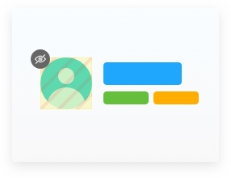

# Ignore stories and elements

Sometimes a component's appearance changes every render or contains content like video and [animation](animations) that is impossible to test consistently. This will trigger visual changes even when the component code hasn't changed. Ignore stories or DOM elements to tell Chromatic to skip them when looking for changes.

<details>
<summary>How does it work?</summary>

Chromatic uses the rendered visual output at the pixel level to determine whether components' have changed.
It's important to ensure the calculated bounding rectangle fully covers the changing content and maintains the exact dimensions as the baseline (e.g., width, height, and relative positioning). Setting the `.chromatic-ignore` class or `[data-chromatic="ignore"]` attribute instructs the diffing algorithm to ignore the
pixels within the bounding rectangle of ignored elements.

</details>



## Ignore stories

If you have a story you do not wish to snapshot in Chromatic, you can disable snapshotting with the
`disableSnapshot` [story parameter](https://storybook.js.org/docs/react/writing-stories/parameters#story-parameters):

```js
// MyComponent.stories.js|jsx

import { MyComponent } from "./MyComponent";

export default {
  component: MyComponent,
  title: "MyComponent",
};

export const StoryName = {
  parameters: {
    // Disables Chromatic's snapshotting on a story level
    chromatic: { disableSnapshot: true },
  },
};
```

<div class="aside">

Using `disableSnapshot` stops Chromatic from capturing a snapshot of the story, but the story will remain indexed and appear in the Library view. You'll no longer see a "Snapshot" tab for that story. If you want to remove the story altogether, you will need to delete it from your Storybook.

</div>

If you want to adopt snapshotting incrementally, you can use Storybook's parameter inheritance to whitelist stories.

In your [`.storybook/preview.js`](https://storybook.js.org/docs/react/configure/overview#configure-story-rendering) add the `disableSnapshot` option in the [parameters](https://storybook.js.org/docs/react/writing-stories/parameters#global-parameters):

```js
// .storybook/preview.js

const preview = {
  parameters: {
    // Disables Chromatic's snapshotting on a global level
    chromatic: { disableSnapshot: true },
  },
};

export default preview;
```

In the component's stories you'd like to enable snapshotting:

```js
// MyComponent.stories.js|jsx

import { MyComponent } from "./MyComponent";

export default {
  component: MyComponent,
  title: "MyComponent",
  // Enables snapshotting for the component
  parameters: {
    chromatic: { disableSnapshot: false },
  },
};

export const StoryName = { args: {} };
```

## Ignore DOM elements

Add the `chromatic-ignore` CSS class or `data-chromatic="ignore"` attribute to elements in your component you want

Chromatic to ignore. It's important to ensure the calculated bounding rectangle fully covers the changing content and maintains the exact dimensions as the baseline (e.g., width, height, and relative positioning). If the dimensions change, Chromatic will capture the incoming changes.

```js
// MyComponent.js|jsx

export function MyComponent() {
  return (
    <div>
      <p>
        This date will always change so ignore it:{" "}
        <span className="chromatic-ignore">{new Date()}</span>
      </p>
      <p>
        Also ignore the animated gif:
        
      </p>
    </div>
  );
}
```
