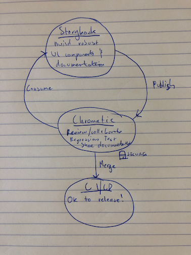

# Overview

{: .center }

## What is Chromatic?

Chromatic is a cloud-based toolchain for [Storybook](https://storybook.js.org) that helps teams ship UI components faster. It's made by the team behind Storybook. Here's how it works.

#### Publish Storybook

Publish your Storybook to a secure CDN when you push code. Chromatic provides a shared workspace for teams to comment and review UI work together. It integrates with your existing CI workflow and Git hosting provider.

#### UI Tests

Test for visual regressions in components. Chromatic turns your stories into test baselines. Each story is rendered in Chrome, Firefox, and Internet Explorer 11 simultaneously then compared to a screenshot of the "last known good state" to detect bugs. [Learn more »](test)

#### UI Review

Review a visual changeset of components each pull request. Chromatic compares the new and updated components on a given feature branch versus a target branch to generate a UI changeset. Review changes with tech leads, designers, and product managers. Think of it like code review, but for UI. [Learn more »](review)

#### Index and version

Maintain a documented, versioned, and searchable library for your components. Chromatic helps teammates discover your work to reuse. Reference Chromatic's library inside your local Storybook or on our website. [Learn more »](document)

#### Powered by continuous integration

Automate your component library with CI and version control. Chromatic includes three PR/MR checks: "Storybook Publish", "UI Tests", and "UI Review". This makes it easy to require certain workflows and gauge implementation progress.

## Why Storybook?

[Storybook](http://storybook.js.org) is an open source tool built for developing UI components in isolation and creating living, interactive component documentation. Storybook makes it trivial to reproduce hard to reach component states and ensuring those states are documented in code. When you adopt Storybook you also unlock automation for UI components and libraries via Chromatic.

New to Storybook? Read our peer-reviewed guides for professional developers at [LearnStorybook.com](https://learnstorybook.com).

---

## Next: Setup Chromatic

🎉Setup Chromatic to publish your Storybook (< 2 mins).

<a class="btn primary round" href="/setup">Read next chapter</a>
