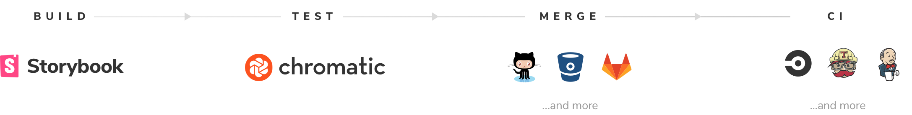
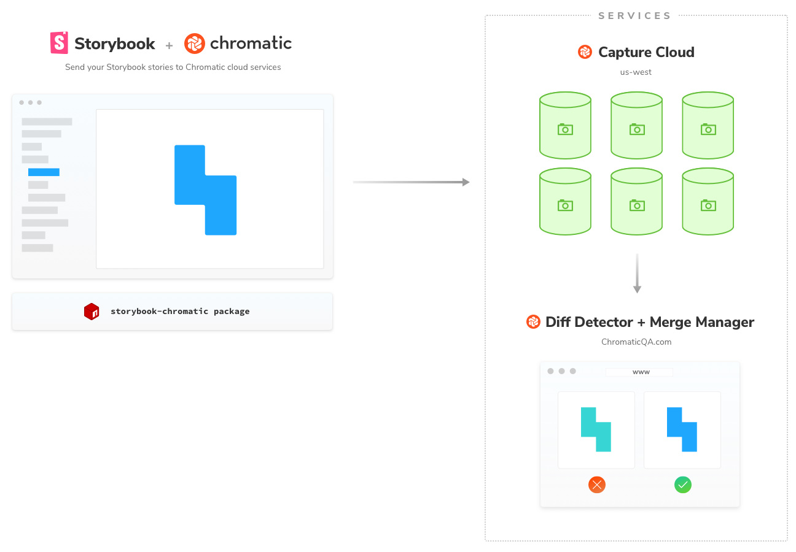

# Get started

Welcome to Chromatic 2.0, the toolchain for Storybook made by Storybook maintainers. This quick guide shows you how to get the most out of Chromatic.

Chromatic supports every view layer Storybook supports out of the box. React, Angular, Vue, and many more.



---

## Overview

Chromatic is a Storybook addon that automatically turns your stories into visual test specifications.

The addon uploads your Storybook bundle to our **Capture Cloud** infrastructure where your tests run in parallel in a consistent browser environment.

**Diff Detector** renders the UI of each story and takes a visual snapshot. Snapshots are compared to "[baselines](branching-and-baselines)" –the last known good state of stories. If there are visual changes we notify you in a PR, email, or via CI.

You then review changes using **Merge Manager**, a web interface that helps identify bugs and update baselines. Tests pass when there are no changes or all changes are accepted.



---

## Installation

Install the `storybook-chromatic` package from NPM. Storybook 3.4 and above is required. In case you're not already using Storybook, read about [how to install it](storybook) and begin creating Stories for Chromatic to test (takes < 5 mins).

```
npm install --save-dev storybook-chromatic
```

---

## Next: Run your first test

🎉That was easy. Now you're ready to run your first Chromatic test.

<a class="btn primary round" href="/test">Read next chapter</a>
