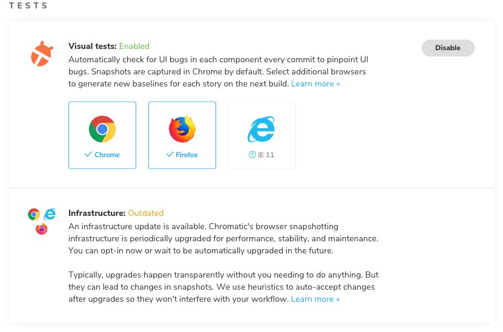
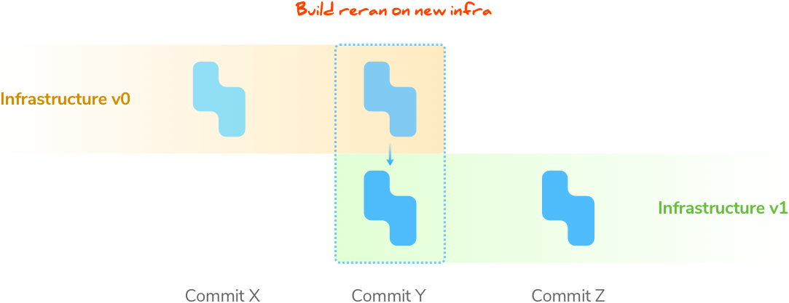
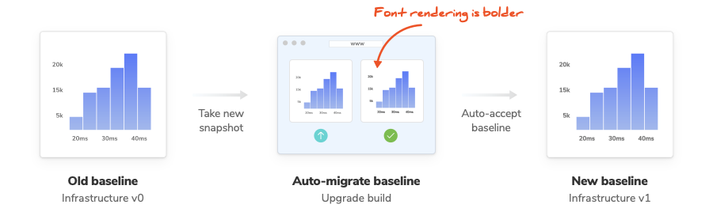

# Infrastructure upgrades

Chromatic's browser infrastructure is periodically upgraded. This can lead to changes in how your stories render due to underlying rendering engine upgrades or tweaks in how stories are executed and snapshotted.

Typically, upgrades happen without you needing to do anything. But more extensive upgrades may lead to noticeable rendering differences. Here's what we do in those cases.

## How to upgrade your project

When an infrastructure upgrade is available you're notified in the app. You choose which projects are updated and when within a four week time window. Once the time window has passed, all projects will automatically upgrade.

### Opt-in to upgrade

Opt-in to the upgrade on the Manage screen for your project. This will switch you over to the new infrastructure and migrate UI test baselines using **upgrade builds**.

### Upgrade builds

Chromatic runs an "upgrade build" to ensure stories are snapshotted using a consistent infrastructure. That allows you to migrate your UI test baselines between infrastuctures without test flake or false positives. Each open branch gets its own upgrade build(s).

An upgrade build isolates all the UI changes caused by swapping infrastructure in one build. Unlike typical builds, upgrade builds don't snapshot new code. They work by **rerunning** the most recent build on that branch using the new infrastructure.

Existing baselines that were snapshotted on old infrastructure are re-snapshotted using the new infrastructure. This ensures that subsequent builds are compared "apples-to-apples" to baselines snapshotted on the same infrastructure.

### Changes are auto-accepted

Visual differences between old and new infrastructure are auto-accepted. Since the upgrade build compares the same code but on different infrastructure, minor visual variation can be attributed to the infrastructure upgrade itself (not your code).

Future builds will use the upgrade build's auto-accepted baselines as the source of truth.

### Release notes for infrastructure upgrades

Read about the infrastructure changes in the release notes.

|                Capture Stack version                | Status                                                                                                                             |
| :-------------------------------------------------: | ---------------------------------------------------------------------------------------------------------------------------------- |
| [Version 3](infrastructure-release-notes#version-3) | General availability                                                                                                               |
| [Version 2](infrastructure-release-notes#version-2) | Outdated ([opt in for upgrade](#opt-in-to-upgrade))                                                                                |
| [Version 1](infrastructure-release-notes#version-1) | No longer available                                                                                                                |
