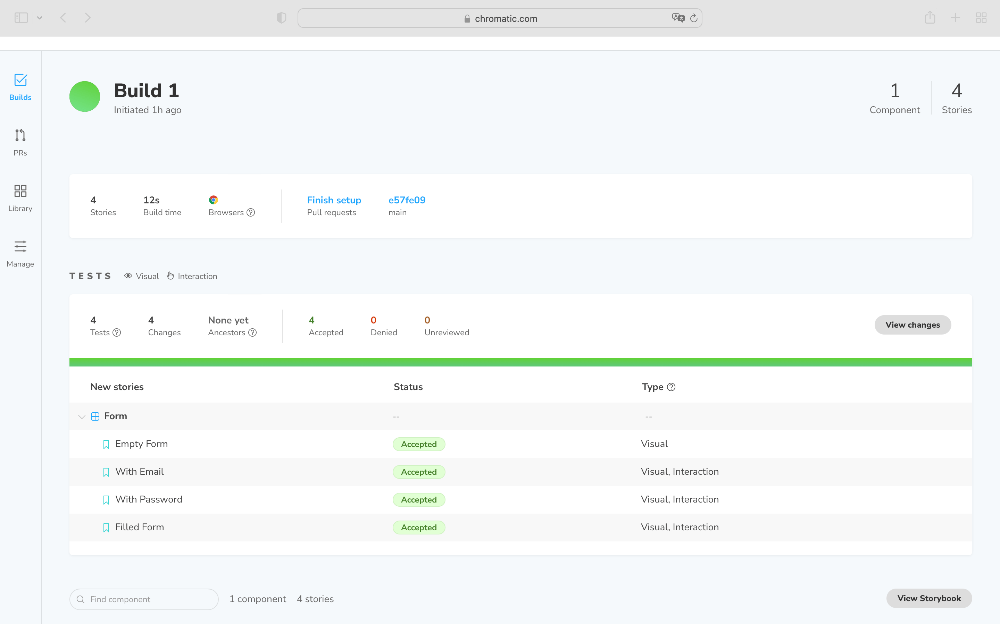
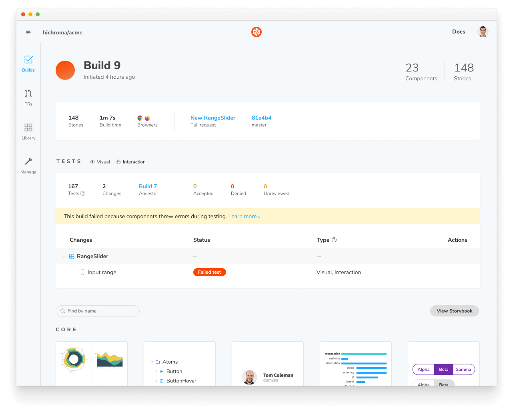
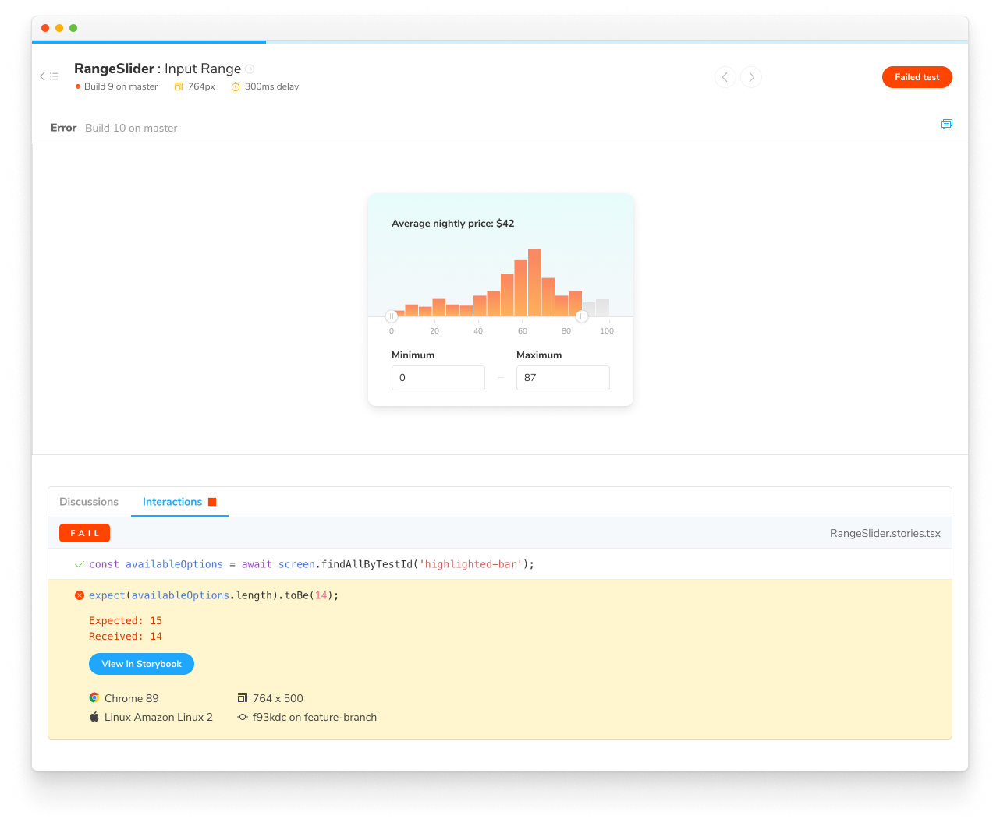
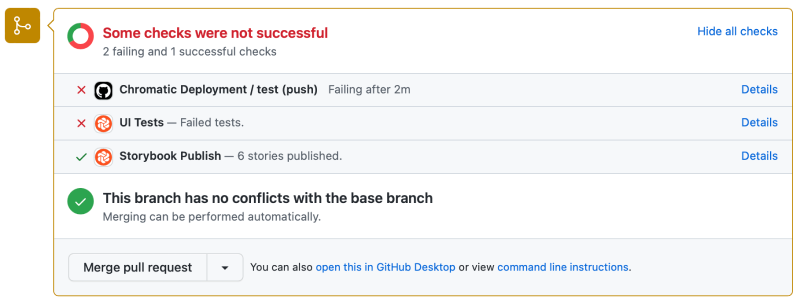

# Interaction tests

Building components and testing them in Chromatic safeguards you against unexpected regressions. But not every component can be tested without user intervention—for instance, forms, tooltips, and dropdowns.

Interaction testing enables you to emulate how a component responds to user interaction. You can test how a component behaves when a user clicks a button, hovers over an element, or types into a form via the [`play`](https://storybook.js.org/docs/react/writing-stories/play-function) function.

## How to write interaction tests

Add a `play` function to your component's story to set up interaction testing. For example, if you were working with a form and you want to validate it, you can write the following story:
 
```js
// LoginForm.stories.js|jsx

import React from 'react';

import { within, userEvent } from '@storybook/testing-library';
import { expect } from '@storybook/jest';

import { Form } from './LoginForm';

export default {
  component: Form,
  title: 'Form',
};

const Template = (args) => <Form {...args} />;

// 👇 This is a story with an interaction test enabled via the play function
export const FilledForm = Template.bind({});
FilledForm.play = async ({ canvasElement }) => {
  // Assigns canvas to the component root element
  const canvas = within(canvasElement);

  // Starts querying the DOM tree from the component's root element
  await userEvent.type(canvas.getByLabelText('Email'), 'Example@email.com');
  await userEvent.type(canvas.getByLabelText('Password'), 'password');

  await userEvent.click(canvas.getByRole('button'));

  await expect(
    canvas.getByText('Login Successful! Redirecting you to your account.')
  ).toBeInTheDocument();
};
```

<div class="aside">
Read more about interaction testing in the official Storybook <a href="https://storybook.js.org/docs/react/writing-tests/interaction-testing">documentation</a>. 
</div>

### Confirm interaction tests are working

To verify that interaction tests are working in Chromatic, publish your story either via [CLI](cli) or [CI](ci). Once published, you'll see interaction tests listed in the build screen alongside the other types of tests that ran on your story.



Click the newly added build to preview the test. Chromatic will wait for the `play` to run before capturing the snapshot.

## Debug test failures

In case of interaction test failure, you'll get a visual notification on the build screen that your test has a problem. [Reviewing](review) and accepting the build as a baseline will be blocked until the tests are fixed.



To find out which steps failed in your interaction test, click the "View exceptions" button for a detailed log alongside some helpful metadata on the environment in which the tests ran.




## PR check for "Interaction tests"

If you already enabled Chromatic as part of your [CI workflow](ci), interaction test failures are automatically reported in your list of checks.



---

### Frequently asked questions

<details>
<summary>Why are my interaction tests not working in IE11?</summary>

IE11 has entered the end of life and isn't supported by the instrumented libraries that Chromatic relies upon to run interaction tests. We recommend previewing your tests using the other available browsers (e.g., Firefox, Chrome).

</details>
