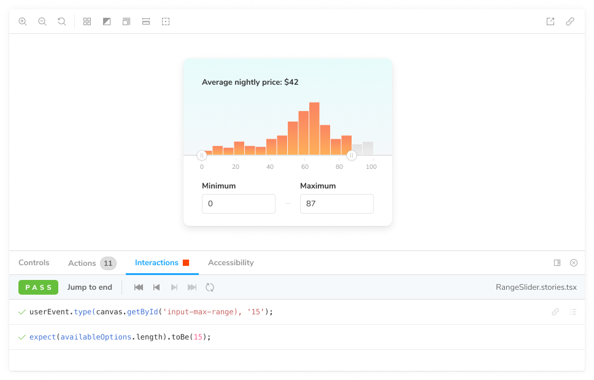
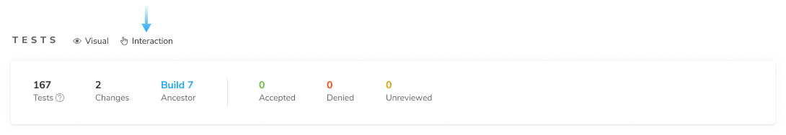
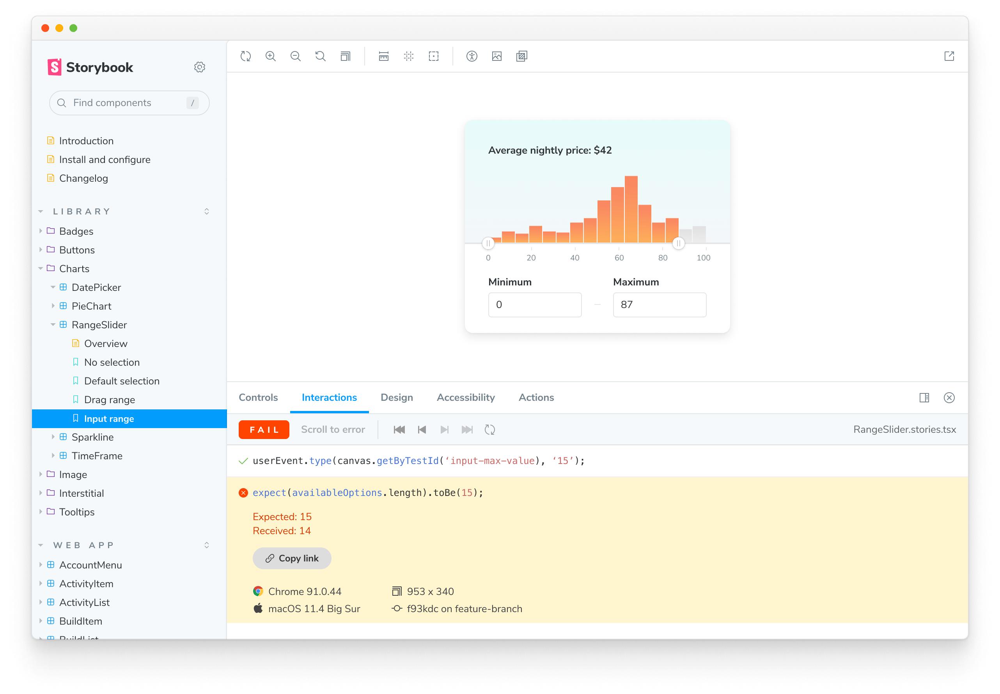

# Interaction tests

Interaction tests enable you to verify how a component responds to user behaviors like click, type, keyboard, and hover. It uses the [`play`](https://storybook.js.org/docs/react/writing-stories/play-function) function in Storybook.

## How to write interaction tests

Add a `play` function to your component's story to enable interaction tests. For example, if you want to validate a component's behavior write the following story:

```js
// RangeSlider.stories.js|jsx

import React from 'react';

import { within, userEvent } from '@storybook/testing-library';
import { expect } from '@storybook/jest';

import { RangeSlider } from './RangeSlider';

export default {
  component: RangeSlider,
  title: 'Library/Charts/RangeSlider',
};

const Template = (args) => <RangeSlider {...args} />;

export const RangeSlider = Template.bind({});
RangeSlider.play = async ({ canvasElement }) => {
  // Assigns canvas to the component root element
  const canvas = within(canvasElement);

  // ⌨️ Type into input field
  await userEvent.type(canvas.getByTestId('input-max-range'), '15');

  // ✅ Assert that component is responding to user behavior
  const availableOptions = await canvas.findAllByTestId('highlighted-bar');
  await expect(availableOptions.length).toBe(15);
};
```

<div class="aside">

Read Storybook's interaction testing [docs](https://storybook.js.org/docs/react/writing-tests/interaction-testing). Get an API cheatsheet for user events [here](https://storybook.js.org/docs/react/writing-tests/interaction-testing#api-for-user-events).

</div>

In Storybook, your interactions and assertions are visualized in the addon panel. Use the playback buttons to step through each interaction to confirm that it’s working as intended.



### Confirm interaction tests are working

Interaction tests run behind the scenes without you having to configure anything. To verify that they are working in Chromatic, publish your Storybook either via [CLI](cli) or [CI](ci). You can confirm that they’re running with the “Interaction” label in the Build page’s Tests section.



## Debug test failures

Chromatic notifies you when an interaction errors or an assertion fails. We designate these as critical failures that need immediate attention. You won’t be able to review the change or pass the build until the test is fixed.


To find out which steps failed in your interaction test, click on the change to see a snapshot of the state where the error occurred. You'll see a detailed log and browser environment metadata to help with reproductions.


### Permalinks for reproductions

Go to your published Storybook to reproduce the exact state of your story when the test failed. Click the "View Storybook" button to open the erroring story with the error message visible. Share the link with your team to help them reproduce the error.



## PR check for interaction tests

Interaction tests are reported in the UI Tests pull request check. When a test fails, you'll see a "Failed tests" status message prompting you to fix the test before moving on.


---

### Frequently asked questions

<details>
<summary>Why are my interaction tests not working in IE11?</summary>

IE11 has entered the end of life and isn't supported by the instrumented libraries that Chromatic relies upon to run interaction tests. We recommend previewing your tests using the other available browsers (e.g., Firefox, Chrome).

</details>
