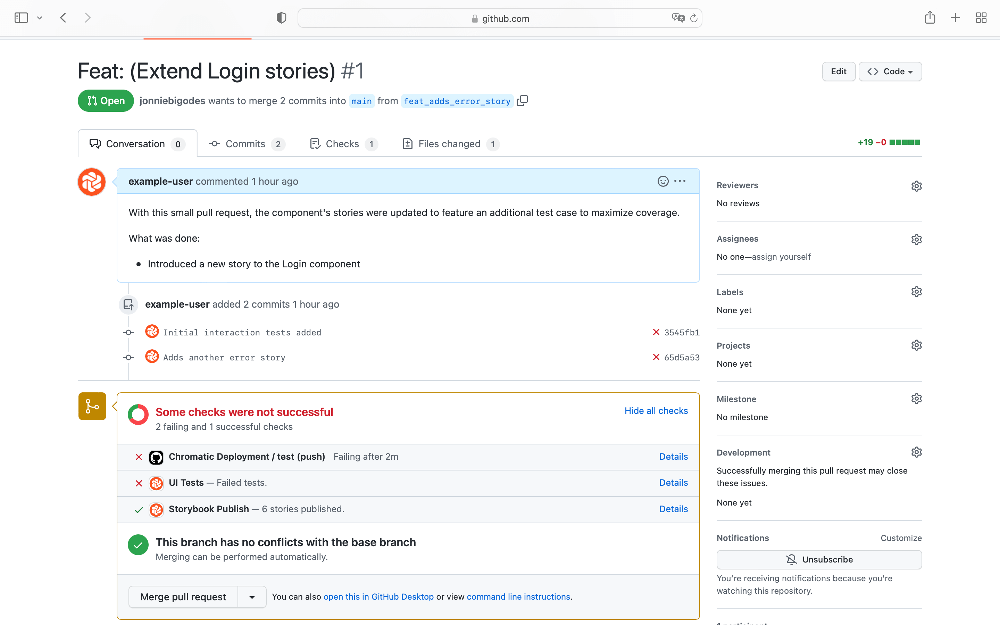

# Interaction tests

Building components and testing them in Chromatic safeguards you against unexpected regressions. But not every component can be tested without user intervention—for instance, forms, tooltips, and dropdowns.

Interaction testing enables you to emulate how a component responds to user interaction. You can test how a component behaves when a user clicks a button, hovers over an element, or types into a form via [`play`](https://storybook.js.org/docs/react/writing-stories/play-function) function.

## How interaction tests work in Chromatic

Enable interaction testing by adding a `play` function to your component's story. For example, if you were working with a form and you want to validate you can write the following story:

```js
// LoginForm.stories.js|jsx

import React from 'react';

import { within, userEvent } from '@storybook/testing-library';
import { expect } from '@storybook/jest';

import { LoginForm } from './LoginForm';

export default {
  component: Form,
  title: 'Form',
};

const Template = (args) => <Form {...args} />;

export const FilledForm = Template.bind({});
FilledForm.play = async ({ canvasElement }) => {
  // Assigns canvas to the component root element
  const canvas = within(canvasElement);

  // Starts querying the DOM tree from the component's root element
  await userEvent.type(canvas.getByLabelText('Email'), 'Example@email.com');
  await userEvent.type(canvas.getByLabelText("Password"), 'password');

  await userEvent.click(canvas.getByRole('button'));

  await expect(
    canvas.getByText('Login Successful! Redirecting you to your account.')
  ).toBeInTheDocument();
};
```

<div class="aside">
Read more about interaction testing in the official Storybook <a href="https://storybook.js.org/docs/react/writing-tests/interaction-testing">documentation</a>. 
</div>

Publish your newly added story either via the [CLI](cli) or [CI](ci) and access your project's build screen to preview the types of tests which ran on your story.


Click the newly added build to preview the test. Chromatic will wait for the `play` to run before capturing the snapshot.

## Debug test failures

In case there's an error with the interaction test, Chromatic provides you with a detailed log of which interactions ran, alongside some helpful metadata on the environment in which the tests ran. For example:

```js
// LoginForm.stories.js|jsx

import React from 'react';

import { within, userEvent } from '@storybook/testing-library';
import { expect } from '@storybook/jest';

import { LoginForm } from './LoginForm';

export default {
  component: Form,
  title: 'Form',
};

const Template = (args) => <Form {...args} />;

export const WithButtonClick = Template.bind({});
WithButtonClick.play = async ({ canvasElement }) => {
  // Assigns canvas to the component root element
  const canvas = within(canvasElement);

  // Starts querying the DOM tree from the component's root element
  await userEvent.type(canvas.getByLabelText('Email'), 'Example@email.com');
  await userEvent.type(canvas.getByLabelText("Password"), 'password');

  //👇 This assertion will cause an error in the story
  await expect(canvas.getByRole('button')).not.toBeInTheDocument();
};
```


## PR status checks

If you already enabled Chromatic as part of your [CI workflow](ci), interaction test failures are automatically reported in your list of checks.



---

### Frequently asked questions

<details>
<summary>Why are my interaction tests not working in IE11?</summary>

IE11 has entered the end of life and isn't supported by the instrumented libraries that Chromatic relies upon to run interaction tests. We recommend previewing your tests using the other available browsers (e.g., Firefox, Chrome).

</details>
