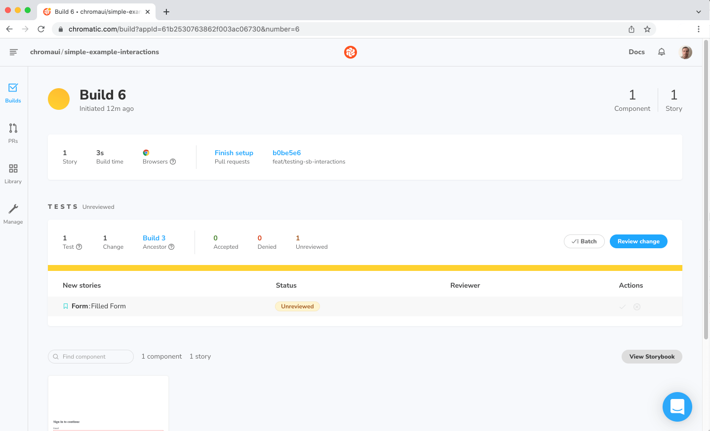

# Interactive stories

Building components and testing them in Chromatic safeguard you against unexpected regressions. But not every component can be thoroughly tested without user intervention.

Storybook's interactive stories enable you to test such scenarios. You automate component interactions using a [`play`](https://storybook.js.org/docs/react/writing-stories/play-function) function, which includes small snippets of code that run after the story renders—scripting the exact steps a user would take to interact with the component.

## How it works

Enable interactive stories by adding a `play` function to your component's story. For example, if you were working with a form and you want to validate it, you can write the following story:

```js
// LoginForm.stories.js|jsx

import React from "react";
import { userEvent, within } from "@storybook/testing-library";
import { Form } from "./Form";

export default {
  component: Form,
  title: "Form",
};

/*
 * Read more about Storybook templates at:
 * https://storybook.js.org/docs/react/writing-stories/introduction#using-args
 */
const Template = (args) => <Form {...args} />;

export const Default = Template.bind({});

export const FilledForm = Template.bind({});
/*
 * Read more about Storybook play function at:
 * https://storybook.js.org/docs/react/writing-stories/play-function
 */
FilledForm.play = async ({ canvasElement }) => {
  // Starts querying the component from its root
  const canvas = within(canvasElement);

  // Looks up the input and fills it.
  const emailInput = canvas.getByLabelText("email", {
    selector: "input",
  });

  await userEvent.type(emailInput, "Example");
  // Looks up the input and fills it.
  const passwordInput = canvas.getByLabelText("password", {
    selector: "input",
  });

  await userEvent.type(passwordInput, "Example");

  const submitButton = canvas.getByRole("button");
  await userEvent.click(submitButton);
};
```

<div class="aside">
Read more about interactive stories with the play function in the official Storybook <a href="https://storybook.js.org/docs/react/writing-stories/play-function">documentation</a>. 
</div>

Publish your newly added story. Chromatic will wait for the play function to run before capturing the snapshot.


