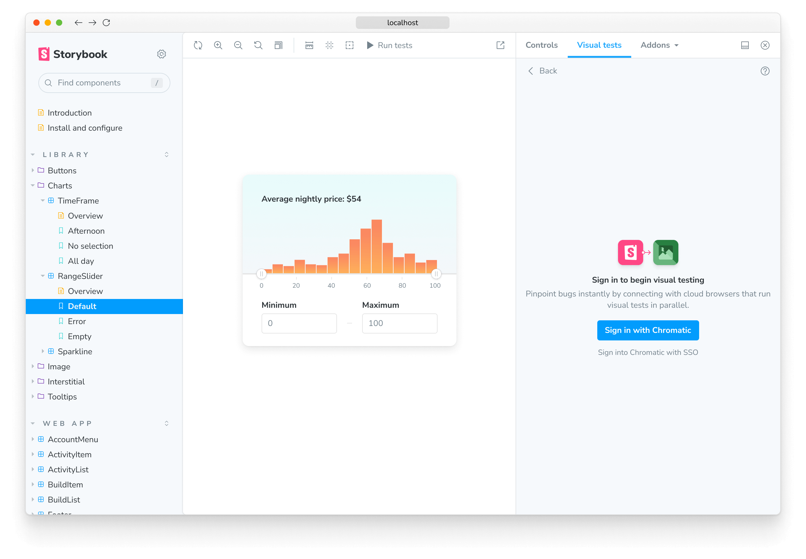

# Visual testing addon for Storybook

<div class="aside">

🧪 **Experimental** We're actively integrating feedback from [early access users](https://forms.gle/NCDV1BMGuNfjWrPm9). As a result, both APIs and functionality may undergo potential changes.

</div>

<!-- This is required to avoid the aside from overlapping into the text. -->

<p></p>

Chromatic's Visual Testing addon helps you detect UI bugs during development. It enables you to run visual tests on your stories and compare changes with the latest baselines across multiple browsers and viewport sizes. Pinpoint changes in UI appearance and behavior and automate visual testing without leaving Storybook.

## Installation

To enable visual testing with Storybook, you must take additional steps to set it up properly. We recommend that you have a fully functional Storybook project running the latest version (e.g., 7.2 or higher) and a Chromatic account configured with a [project](setup#sign-up) to which you have access.

Run the following command to install the addon:

```shell
yarn add --dev @chromaui/addon-visual-tests
```

Update your Storybook configuration file `.storybook/main.js|ts` file to include the addon:

```js
// .storybook/main.js

const config = {
  stories: ['../src/**/*.mdx', '../src/**/*.stories.@(js|jsx|mjs|ts|tsx)'],
  addons: [
    // Other Storybook addons
    '@chromaui/addon-visual-tests',
  ],
};
export default config;
```

Start your Storybook, and you'll see some noticeable changes in the UI: a new toolbar icon and the Visual tests panel where you can inspect the test results.


## Authentication

Before using the Visual Testing addon, you must authenticate yourself with Chromatic. Click the "Enable" button in the addon panel and follow the onboarding workflow to set up your account and link your existing Storybook instance with Chromatic. After the authentication process is complete, you'll be redirected back to Storybook, where you'll see a list of available projects to which you have access.



<div class="aside">

💡 As part of the authentication process, the addon will ask you for light permissions to access your Chromatic account. The addon will only use this information to authenticate you and to synchronize your visual tests with Chromatic. The addon won't use this information for any other purpose.

</div>

Select the project on which you want to run your visual tests to complete the onboarding process. The addon will automatically save your selection, adjust the configuration file to include the necessary project identifiers, and retrieve the latest baselines if available.

## Configure

By default, Storybook offers zero-config support to run visual tests with Storybook and Chromatic. However, you can extend your Storybook configuration file (i.e., `.storybook/main.js|ts`) and provide additional options to control how tests are run. Listed below are the available options and examples of how to use them.

| Option            | Description                                                                                                                              |
| ----------------- | ---------------------------------------------------------------------------------------------------------------------------------------- |
| `projectId`       | Automatically configured. Sets the value for the project identifier <br/> `options: { projectId: Project:64cbcde96f99841e8b007d75 }`     |
| `projectToken`    | Automatically configured. Sets the value for the project token <br/> `options: { projectToken: 'chpt_b2ae83517a0a706' }`                 |
| `buildScriptName` | Defines the custom Storybook build script <br/> `options: { buildScriptName: 'deploy-storybook' }`                                       |
| `debug`           | Output verbose debugging information to the console. <br/> `options: { debug: true }`                                                    |
| `zip`             | Recommended for large projects. Configures the addon to deploy your Storybook to Chromatic as a zip file. <br/> `options: { zip: true }` |

```js
// .storybook/main.js

const config = {
  stories: ['../src/**/*.mdx', '../src/**/*.stories.@(js|jsx|mjs|ts|tsx)'],
  addons: [
    // Other Storybook addons
    {
      name: '@chromaui/addon-visual-tests',
      options: {
        projectId: 'Project:64cbcde96f99841e8b007d75',
        projectToken: 'chpt_fa88b088041ccde',
        buildScriptName: 'deploy-storybook',
        debug: true,
        zip: true
      },
    },
  ],
};
export default config;
```

## How to run visual tests

Get started visual testing by introducing a change in one of your components; for example, change a background color or font size. Then save the file, and commit your local changes. Click the "Run tests" button in the toolbar to begin the process. This will:

1. Connect to Chromatic
2. Start a local build, which will:
   - Snapshot your components, including [browsers](browsers) and [viewport sizes](viewports)
   - Compare the new snapshots against the latest baselines
3. Display the results in the addon panel


## Review changes

To find out which changes were introduced in the latest build, the addon highlights the stories that require your attention. Cycle through them and review them. If the changes are intentional, click the "Accept" button to update the baseline with the latest changes and mark them as accepted in Chromatic. This will ensure that when you push the changes into your remote repository, they will be reconciled with builds deployed from [CI](ci) or the [CLI](cli).


## Troubleshooting

<details>
<summary>Why is my private project token available in the configuration?</summary>

If you have any security concerns, you can save it in a `.env` file. The Visual testing addon is still in its early access stage, and we'll be improving how we use this token in future releases.

</details>

<details>
<summary>Running Storybook with the addon enabled throws an error</summary>

When running Storybook with the addon enabled, you may encounter the following error:

```shell
const stringWidth = require('string-width');

Error [ERR_REQUIRE_ESM]: require() of ES Module /my-project/node_modules/string-width/index.js is not supported.
```

This is a [known issue](https://github.com/storybookjs/storybook/issues/22431#issuecomment-1630086092) when using an older version of the Yarn package manager (e.g., version 1.x). To solve this issue, you can upgrade to the latest stable version. However, if you cannot upgrade, adjust your `package.json` file and provide a resolution field to enable the Yarn package manager to install the correct dependencies. In doing so, you may be required to delete your `node_modules` directory and `yarn.lock` file before installing the dependencies again.

```json
{
  "resolutions": {
    "jackspeak": "2.1.1"
  }
}
```

</details>
