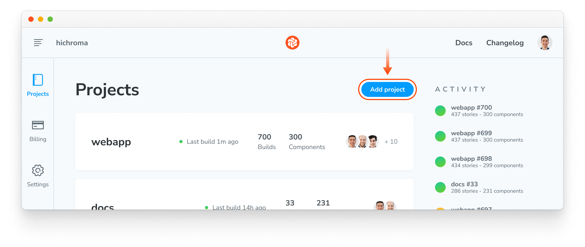
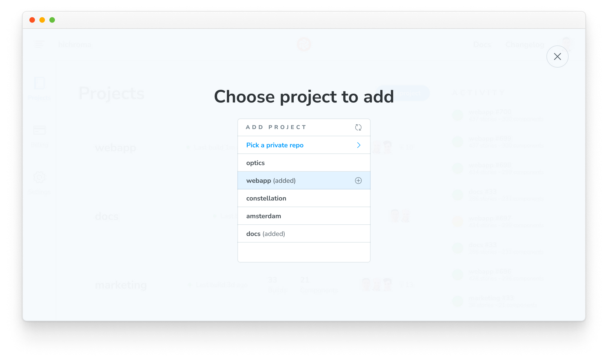
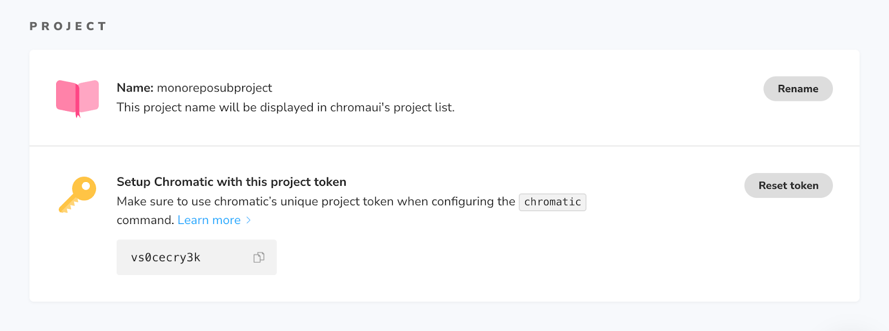

# Monorepos

A common pattern in modern web development is monorepos -- having a single repository that contains multiple distinct projects. As a monorepo can be associated with many Chromatic projects, there are a few tips that can help with using Chromatic with a monorepo.

Chromatic doesn’t assume anything about how you run the CLI. This means you can run it from inside any project or subproject so long as you pass the correct project token.

## Running Chromatic for more than one subproject's Storybook

You can have multiple linked subprojects in Chromatic for any given repository, so if you want to run Chromatic for more than one subproject, you have two options:

### Combine multiple projects into a single Storybook

A common approach that works well for many teams is to combine multiple subproject's Storybooks into a single Storybook. When you run Chromatic on the principal Storybook, you test all stories in a single Chromatic project.

For example, you could write in your `.storybook/main.js`:

```js
// .storybook/main.js

const config = {
  stories: ["../project-1/**/*.stories.js", "../project-2/**/*.stories.js"],
};

export default config;
```

Often teams find a single Storybook for all their development works quite well, also!

### Run Chromatic for each subproject

In Chromatic, a project is typically linked to a Git repository and will synchronize permissions from the permissions of that repository as well as post build status messages to the repository’s pull/merge requests.

Each subproject in a monorepo can now be associated with a separate Chromatic project that adds additional build statuses to the repository’s pull/merge requests. Here's how to set it up.

1. Open [your Chromatic app](http://chromatic.com/start), browse to your account, and press the “Add project” button:

   

2. Choose your monorepo repository a second time:

   

3. Choose a name for your new project:

   

4. Take note of the token for the new project. You can also find it on the project’s manage page:

   

## Automate visual testing with the Visual Testing addon

You can integrate Chromatic's Visual Testing addon into your monorepo environment to automate visual testing and detect UI bugs during development. The Visual Testing addon enables you to run visual tests on your stories and compare changes with the latest baselines across multiple browsers and viewport sizes.

### Setup

To enable visual tes
The instructions below detail how to get started

1. Run the following command to install the addon:

```shell
yarn workspace design-system add @chromaui/addon-visual-tests --dev
```

2. Update your Storybook configuration file `packages/design-system/.storybook/main.js|ts` file to include the addon:

```js
// packages/design-system/.storybook/main.js

const config = {
  stories: ["../src/**/*.mdx", "../src/**/*.stories.@(js|jsx|mjs|ts|tsx)"],
  addons: [
    // Other Storybook addons
    "@chromaui/addon-visual-tests",
  ],
};
export default config;
```

3. Start your Storybook, and you'll see a new toolbar icon and the Visual tests panel where you can inspect the test results.

4. Click the "Enable" button and follow the onboarding workflow to set up your account and link your existing Storybook instance with Chromatic.

5. Select the project for which you want to run visual tests. The addon will automatically detect your choice, adjust the configuration file to include the necessary project identifiers, and retrieve the latest baselines if available.

### Working with custom

By default, the Visual testing addon will automatically detect the required configuration file and include the required configuration options when you finish the onboarding process

By default the Visual Testing adddon relies on the standard Storybook build script to run the tests.

If you're working with a customized monorepo with specific configuration requirements (i.e, custom build scripts), you can adjust the configuration file to

If you're working with a customized monorepo with specific configuration requirements, you can adjust the configuration file to include the necessary project identifiers and customize the build script to run the tests.

By default, the Visual Testing addon will automatically detect the configuration file and include the necessary project identifiers when you finish the onboarding process and rely on the default build script to run the tests. If you're working with a customized monorepo with specific configuration requirements, you can adjust the configuration file to include the necessary project identifiers and customize the build script to run the tests.

```js
// packages/design-system/.storybook/main.js

const config = {
  stories: [
    '../app/components/**/*.@(mdx|stories.*)',
    '../UI/**/*.@(mdx|stories.*)',
  ],
  addons: [
    // Other Storybook addons
    {
      name: '@chromaui/addon-visual-tests",
      options: {
        projectId: 'Project:64cbcde96f99841e8b007d75',
        projectToken: 'chpt_fa88b088041ccde',
        buildScriptName:'design-system:build-storybook'
      },
    },
  ],
};
export default config;
```

. If you're working with a customized monorepo environment whe

### Improving performance

If you're running visual tests in a larger project and notice a significant increase in build times, you can improve the performance of the Visual Testing addon by adding the `zip` option to your Storybook configuration file. This will compress the Storybook build before uploading it to Chromatic, significantly reducing the time it takes to run the tests and report the results.

```js
// .storybook/main.js

const config = {
  stories: [
    '../app/components/**/*.@(mdx|stories.*)',
    '../UI/**/*.@(mdx|stories.*)',
  ],
  addons: [
    // Other Storybook addons
    {
      name: '@chromaui/addon-visual-tests",
      options: {
        projectId: 'Project:64cbcde96f99841e8b007d75',
        projectToken: 'chpt_fa88b088041ccde',
        zip: true,
      },
    },
  ],
};
export default config;
```

## Automate with CI

To enable Chromatic as a standalone project as part of your CI workflow, you'll need to adjust your configuration file based on your chosen CI provider (e.g., [GitHub Actions](github-actions), [GitLab](gitlab), [CircleCI](circleci)). However, if you're working with individual subprojects, you'll need to adjust the workflow to include a step for each project. Listed below are starter instructions for each CI provider that Chromatic supports.

- [GitHub Actions](github-actions#run-chromatic-on-monorepos)
- [GitLab Pipelines](gitlab#run-chromatic-on-monorepos)
- [Bitbucket Pipelines](bitbucket-pipelines#run-chromatic-on-monorepos)
- [CircleCI](circleci#run-chromatic-on-monorepos)
- [Travis CI](travisci#run-chromatic-on-monorepos)
- [Jenkins](jenkins#run-chromatic-on-monorepos)
- [Azure Pipelines](azure-pipelines#run-chromatic-on-monorepos)
- [Other CI providers](custom-ci-provider#run-chromatic-on-monorepos)

Every monorepo subproject will get build statuses posted to the pull/merge request. In CI, you’ll need to add a step for each project and use the specific project token for that project.


## Advanced configuration

The following sections detail advanced configuration options only available when running Chromatic from [CLI](cli) or [CI](ci). Currently, they're unavailable when configuring the Visual Testing addon in a monorepo environment.

### Only run Chromatic when changes occur in a subproject

If your monorepo consists of both UI and backend subprojects, it may be common to have commits that do not touch UI at all. In such cases, running Chromatic on those commits makes little sense.

You can use tools like [`lerna changed`](https://github.com/lerna/lerna/tree/master/commands/changed#readme) to detect such situations (depending on how you've set up your monorepo).

If you want to get a Chromatic PR badge for such commits (for instance, if you block merging on Chromatic builds), you can use the `--skip` CLI flag to indicate that this commit does not need to be built and tested.

### Run tests on a subset of stories

If you are combining multiple Storybooks into one (see [above](#combine-multiple-projects-into-a-single-storybook)) but detect that only a subset of projects has changed, you can instruct Chromatic to capture and test that particular subset of stories as follows:

- Recommended: Use [TurboSnap](turbosnap) to automatically only snapshot stories for which related source files have changed.
- Use [`--only-story-files`](cli#chromatic-options) to only snapshot stories matching a glob pattern by story file name.
- Use [`--only-story-names`](cli#chromatic-options) to only snapshot stories matching a glob pattern by component/story name.

In each case, stories that aren't tested are "inherited" from their baseline. You cannot use both `--only-story-files` and `--only-story-names` CLI flags directly from the CLI or your CI workflow.

#### With TurboSnap

TurboSnap is an excellent feature to use with monorepos to avoid re-snapshotting all components across all projects when any changes occur.

The `--untraced` CLI flag can be used to ignore all changes outside of a package or related packages. For example, given a monorepo with unrelated packages `UI` and `app`, you can add the following CLI option to `UI`’s Chromatic command to only run snapshots when files inside the `UI` package change: `--untraced \"./packages/!(UI)/**\"` .

Note that the glob pattern starts from the root directory of the repository, not from the directory of the `UI` package. You can also specify `--untraced` multiple times to include multiple glob patterns.

```shell
npx chromatic --only-changed --untraced=package.json,yarn.lock --exit-zero-on-changes
```

Some monorepo setups manage third-party dependencies at the root level (so all dependencies in the monorepo have consistent versions). You may wish to ignore these root-level files (e.g., lockfile) to avoid unnecessary snapshots, but be aware that changes can go unnoticed.

#### With onlyStoryFiles

The `--only-story-files` flag accepts a glob and can be specified multiple times. Any story files (e.g., `Example.stories.js`) that match the glob will have all their stories captured and tested.

```shell
npx chromatic --only-story-files "./src/components/**/.stories.js" --only-story-files "./shared/**/*.stories.js"
```

<div class="aside">
Using quotes around the glob patterns is intentional and recommended to avoid being incorrectly detected by your shell, preventing the command from executing correctly.
</div>

#### With onlyStoryNames

The `--only-story-names` flag accepts a glob and can be specified multiple times. Any component/story name (e.g., `Forms/Button/*`) that matches the glob will have all its stories captured and tested.

```shell
npx chromatic --only-story-names "Forms/**" --only-story-names "**/Header/*"
```

This would match all stories for all components under "Forms" (i.e., any story file whose `title` path starts with "Forms"), as well as all stories for the "Header" component, regardless of where it is in the hierarchy (i.e., any story file which `title` path ends with "Header"). Again, make sure to use quotes around glob patterns.

### Building a subset of your stories

With the removal of the `--preserve-missing` flag, building a partial Storybook containing a subset of your stories is no longer recommended. Publishing a Storybook with missing stories will result in those missing stories being marked as "removed".

---

## Troubleshooting

<details>
<summary>Why am I not seeing my monorepo subproject listed in my pull request checklist?</summary>

When using an existing project that is part of the monorepo and [requiring PR checks](ci#pull-request-checks) for merging, you will need to remove and re-add them within your Git provider as the name linked to the check will have changed. It also applies if a subproject is renamed.

</details>

<details>
<summary>Why is my monorepo project triggering a full rebuild?</summary>

If TurboSnap is enabled inside a monorepo project, [file changes](turbosnap#full-rebuilds) that impact one package will automatically trigger a full rebuild on all related projects when running Chromatic. Read more about ignoring changes in unrelated packages [above](#with-turbosnap).

</details>

<details>
<summary></summary>

If you've enabled the Visual Testing addon and notice a significant increase in build times, you may need to adjust your root-level Storybook configuration file or the individual sub-package configuration file and add the `zip` option. This will compress the Storybook build before uploading it to Chromatic, which may significantly reduce the build time.

</summary>
