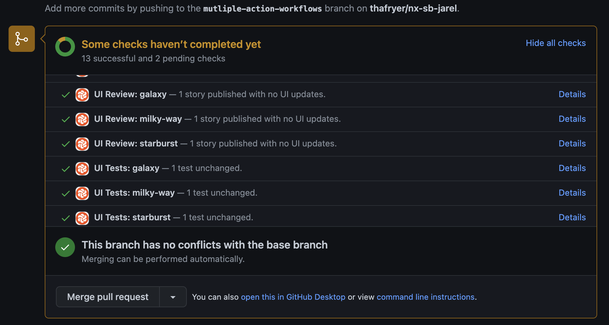

# Monorepos

A common pattern in modern web development is monorepos -- having a single repository that contains multiple distinct projects. As a monorepo can be associated with many Chromatic projects, there are a few tips that can help with using Chromatic with a monorepo.

## Running Chromatic from a subproject

Chromatic doesn't assume anything about how you run the CLI, so there is no reason that you cannot run it from inside a sub-project. Ensure you pass the correct project token and it will work fine.

## Running Chromatic for more than one subproject's Storybook

You can have multiple linked projects in Chromatic for any given repository, so if you want to run Chromatic for more than one subproject, you have two options:

### Combine multiple projects into a single Storybook

A common approach that works well for many teams is to combine multiple subproject's Storybooks into a single Storybook. When you run Chromatic on the principal Storybook you test all stories in a singe Chromatic project.

For example, you could write in your `.storybook/main.js`:

```js
// .storybook/main.js

module.exports = {
  stories: ["../project-1/**/*.stories.js", "../project-2/**/*.stories.js"],
};
```

Often teams find a single Storybook for all their development works quite well, also!

### Run Chromatic more than once in a second Chromatic project

In Chromatic a project is typically linked to a repository and will synchronize permissions from the permissions of that repository as well as post build status messages to the repository's Pull (Merge) Requests.

For each sub-project in the monorepo that you would like to run Chromatic on, you will need to create a project in Chromatic from a previously linked repository and retreive the project token for it. Then, you can run Chromatic for each sub project using that token.

For every project that you link within the monorepo, you will get commit statuses for each project. In CI, you will need to add a step for each project and use the specific project token for that project.



---

## Only run Chromatic when changes occur in a subproject

If your monorepo consists of both UI subprojects and backend subprojects, it may be common to have commits that do not touch UI at all. In such cases it makes little sense to run Chromatic on those commits.

You can use tools like [`lerna changed`](https://github.com/lerna/lerna/tree/master/commands/changed#readme) to detect such situations (depending on how you've setup your monorepo).

If you want to get a Chromatic PR badge for such commits (for instance if you block merging on Chromatic builds), you can use the `--skip` CLI flag to indicate that this commit does not need to be built and tested.

## Advanced: Only test a subset of stories

If you are combining your Storybooks into a single Storybook (see above), but you have detected only a subset of projects have changed, in order to avoid unnecessarily capturing unchanged stories, you can instruct Chromatic to only capture and test a subset of your Storybook's stories. There are three ways to do so:

- Recommended: Use [TurboSnap](turbosnap) to automatically only snapshot stories for which related source files have changed.
- Use [`--only-story-files`](cli#chromatic-options) to only snapshot stories matching a glob pattern by story file name.
- Use [`--only-story-names`](cli#chromatic-options) to only snapshot stories matching a glob pattern by component/story name.

In each of these cases, any stories that aren't tested are "inherited" from their baseline. You cannot use both `--only-story-files` and `--only-story-names`.

### `onlyStoryFiles`

The `--only-story-files` flag accepts a glob and can be specified multiple times. Any story files (e.g. `Example.stories.js`) which match the glob will have all of its stories captured and tested.

```
npx chromatic --only-story-files "./src/components/**/.stories.js" --only-story-files "./shared/**/*.stories.js"
```

Make sure you include quotes around glob patterns, otherwise they will be interpreted by your shell and it won't work.

### `onlyStoryNames`

The `--only-story-names` flag accepts a glob and can be specified multiple times. Any component/story name (e.g. `Forms/Button/*`) which match the glob will have all of its stories captured and tested.

```
npx chromatic --only-story-names "Forms/**" --only-story-names "**/Header/*"
```

This would match all stories for all components under "Forms" (i.e. any story file which `title` path starts with "Forms"), as well as all stories for the "Header" component, regardless of where it is in the hierarchy (i.e. any story file which `title` path ends with "Header"). Again, make sure to use quotes around glob patterns.

### Building a subset of your stories

With the deprecation (and eventual removal) of the `--preserve-missing` flag, it is no longer recommended to build a partial Storybook containing a subset of your stories. Publishing a Storybook with missing stories will result in those missing stories to be marked as "removed".

## Advanced: TurboSnap

TurboSnap is an good feature to use with monorepos to avoid re-snapshotting all components across all projects when any changes occur. The `--untraced` CLI flag can be used to ignore all changes outside of a package or related packages. For example, given a monorepo with unrelated packages `foo` and `bar` , you can add the following CLI option to `foo`’s Chromatic command to only run snapshots when files inside the `foo` package change: `--untraced \"./packages/!(foo)/**\"` . Note that the glob pattern starts from the root directory of the repository, not from the directory of the `foo` package. You can also specify `--untraced` multiple times to include multiple glob patterns

Some monorepo setups manage third-party dependencies at the root level (so all dependencies in the monorepo have consistent versions). You may wish to ignore these root-level files (like a lockfile) to avoid unnecessary snapshots, but be aware that some changes may go unnoticed.
