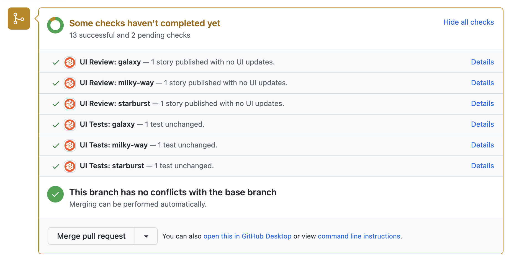
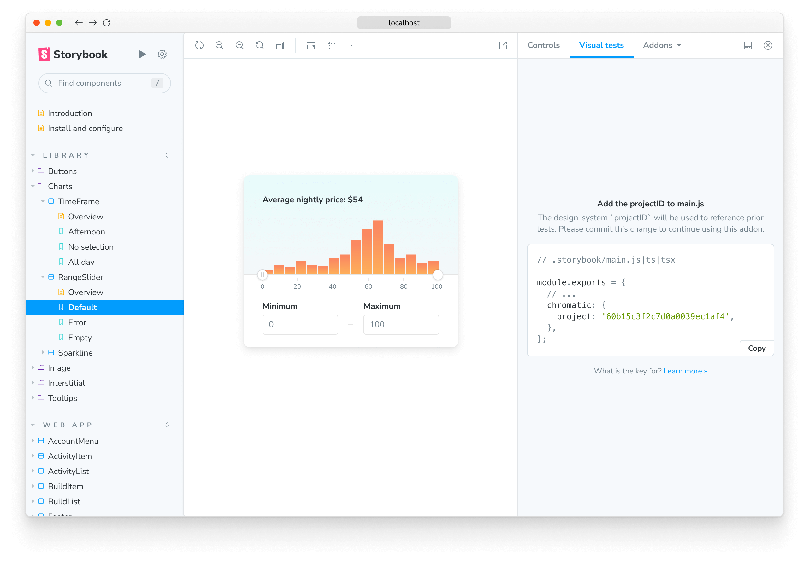

# Monorepos

A common pattern in modern web development is monorepos -- having a single repository that contains multiple distinct projects. With Chromatic, developers can test for UI changes in each project individually or as a single project, all while integrating seamlessly with your CI pipeline or the Visual Testing addon to ensure your UI remains consistent and error-free throughout the development process.

## Add a monorepo project

To enable Chromatic in your monorepo environment, you can combine every package's stories into a single Storybook instance. This allows for efficient visual testing of individual subprojects while maintaining a unified view across your monorepo. For example:

For example:

```js
// .storybook/main.js

const config = {
  stories: ['../project-1/**/*.stories.js', '../project-2/**/*.stories.js'],
};

export default config;
```

### Run Chromatic for each subproject

If you're working with a monoporepo containing multiple subprojects, you can run Chromatic separately for each subproject, allowing a more granular testing approach. To add individual subprojects to Chromatic, you'll need to:

1. Click the "Add project" button on your account dashboard to add a new project

   

2. Select the project's repository a second time

   

3. Enter a name for your new project
   

## Set up CI to run Chromatic

To enable Chromatic as a standalone project as part of your CI workflow, you'll need to adjust your configuration file based on your CI provider (e.g., [GitHub Actions](github-actions), [GitLab](gitlab), [CircleCI](circleci)). However, if you're working with individual subprojects, you must adjust the workflow to include a step for each project with the correct project token. Listed below are starter examples for each CI provider that Chromatic supports.

- [GitHub Actions](github-actions#run-chromatic-on-monorepos)
- [GitLab Pipelines](gitlab#run-chromatic-on-monorepos)
- [Bitbucket Pipelines](bitbucket-pipelines#run-chromatic-on-monorepos)
- [CircleCI](circleci#run-chromatic-on-monorepos)
- [Travis CI](travisci#run-chromatic-on-monorepos)
- [Jenkins](jenkins#run-chromatic-on-monorepos)
- [Azure Pipelines](azure-pipelines#run-chromatic-on-monorepos)
- [Other CI providers](custom-ci-provider#run-chromatic-on-monorepos)

When Chromatic runs in your CI workflow, it will provide a build status check for your pull/merge request based on the build results.



## Execute tests with the Visual Testing addon

The Visual Tests addon brings the power of Chromatic right into Storybook, so you can run visual tests without waiting on CI. It simplifies the visual testing process by turning your stories into tests that pinpoint regressions. When it tests your stories, it will generate a separate build, capturing component snapshots for each browser and viewport size. These builds are treated separately, with distinct approvals.

### Setup

To enable visual testing with the addon, you'll need to take additional steps to set it up properly. We recommend you go through the [Visual Testing addon documentation](visual-testing-addon) before proceeding with the rest of the required configuration.


### Manual configuration

By default, during onboarding, the addon will try to detect the project's Storybook configuration file. If it's unable to find it, it will notify you in the addon panel and provide you with the necessary instructions to configure it manually.



### Override the default configuration

If you're working with a customized monorepo with specific configuration requirements (i.e., custom build scripts), you can adjust the configuration file, either globally or individually, for each package and configure the build script to run the tests. For example:

```js
// packages/design-system/.storybook/main.js

const config = {
  stories: [
    '../app/components/**/*.@(mdx|stories.*)',
    '../UI/**/*.@(mdx|stories.*)',
  ],
  addons: [
    // Other Storybook addons
    {
      name: '@chromaui/addon-visual-tests",
      options: {
        projectId: 'Project:64cbcde96f99841e8b007d75',
        projectToken: 'chpt_fa88b088041ccde',
        //👇 Configures the custom Storybook build script
        buildScriptName:'design-system:build-storybook',
      },
    },
  ],
};
export default config;
```

### Improving performance

If you're running visual tests in a larger project and notice a significant increase in the time the addon takes to run your tests, you can improve its performance by adding the `zip` option to your Storybook configuration file. This will compress the Storybook build before uploading it to Chromatic, significantly reducing the time it takes to run the tests.

```js
// .storybook/main.js

const config = {
  stories: [
    '../app/components/**/*.@(mdx|stories.*)',
    '../UI/**/*.@(mdx|stories.*)',
  ],
  addons: [
    // Other Storybook addons
    {
      name: '@chromaui/addon-visual-tests",
      options: {
        projectId: 'Project:64cbcde96f99841e8b007d75',
        projectToken: 'chpt_fa88b088041ccde',
        //👇 Compresses Storybook before uploading it to Chromatic
        zip: true,
      },
    },
  ],
};
export default config;
```

---

## Advanced configuration

The following sections detail advanced configuration options only available when running Chromatic from CLI or CI. As the Visual Testing addon is still in early access enabling any of the options below (e.g., TurboSnap) will result in the addon ignoring them and use the default configuration instead. This will not affect your builds as they are treated separately, and any incoming change will be reconciled with builds generated via CLI or CI.

### Only run Chromatic when changes occur in a subproject

If your monorepo consists of both UI and backend subprojects, it may be common to have commits that do not touch UI at all. In such cases, running Chromatic on those commits makes little sense.

You can use tools like [`lerna changed`](https://github.com/lerna/lerna/tree/master/commands/changed#readme) to detect such situations (depending on how you've set up your monorepo).

If you want to get a Chromatic PR badge for such commits (for instance, if you block merging on Chromatic builds), you can use the `--skip` CLI flag to indicate that this commit does not need to be built and tested.

### Run tests on a subset of stories

If you are combining multiple Storybooks into one (see [above](#combine-multiple-projects-into-a-single-storybook)) but detect that only a subset of projects has changed, you can instruct Chromatic to capture and test that particular subset of stories as follows:

- Recommended: Use [TurboSnap](turbosnap) to automatically only snapshot stories for which related source files have changed.
- Use [`--only-story-files`](cli#chromatic-options) to only snapshot stories matching a glob pattern by story file name.
- Use [`--only-story-names`](cli#chromatic-options) to only snapshot stories matching a glob pattern by component/story name.

In each case, stories that aren't tested are "inherited" from their baseline. You cannot use both `--only-story-files` and `--only-story-names` CLI flags directly from the CLI or your CI workflow.

#### With TurboSnap

TurboSnap is an excellent feature to use with monorepos to avoid re-snapshotting all components across all projects when any changes occur.

The `--untraced` CLI flag can be used to ignore all changes outside of a package or related packages. For example, given a monorepo with unrelated packages `UI` and `app`, you can add the following CLI option to `UI`’s Chromatic command to only run snapshots when files inside the `UI` package change: `--untraced \"./packages/!(UI)/**\"` .

Note that the glob pattern starts from the root directory of the repository, not from the directory of the `UI` package. You can also specify `--untraced` multiple times to include multiple glob patterns.

```shell
npx chromatic --only-changed --untraced=package.json,yarn.lock --exit-zero-on-changes
```

Some monorepo setups manage third-party dependencies at the root level (so all dependencies in the monorepo have consistent versions). You may wish to ignore these root-level files (e.g., lockfile) to avoid unnecessary snapshots, but be aware that changes can go unnoticed.

#### With onlyStoryFiles

The `--only-story-files` flag accepts a glob and can be specified multiple times. Any story files (e.g., `Example.stories.js`) that match the glob will have all their stories captured and tested.

```shell
npx chromatic --only-story-files "./src/components/**/.stories.js" --only-story-files "./shared/**/*.stories.js"
```

<div class="aside">
Using quotes around the glob patterns is intentional and recommended to avoid being incorrectly detected by your shell, preventing the command from executing correctly.
</div>

#### With onlyStoryNames

The `--only-story-names` flag accepts a glob and can be specified multiple times. Any component/story name (e.g., `Forms/Button/*`) that matches the glob will have all its stories captured and tested.

```shell
npx chromatic --only-story-names "Forms/**" --only-story-names "**/Header/*"
```

If you use the above configuration in Chromatic, it will attempt to match the glob pattern to your stories. The lookup process will start with stories that have a "Forms" title prefix. It will then scan for stories with a "Header" suffix.

### Building a subset of your stories

With the removal of the `--preserve-missing` flag, building a partial Storybook containing a subset of your stories is no longer recommended. Publishing a Storybook with missing stories will result in those missing stories being marked as "removed".

## Troubleshooting

<details>
<summary>Why am I not seeing my monorepo subproject listed in my pull request checklist?</summary>

When using an existing project that is part of the monorepo and [requiring PR checks](ci#pull-request-checks) for merging, you will need to remove and re-add them within your Git provider as the name linked to the check will have changed. It also applies if a subproject is renamed.

</details>

<details>
<summary>Why is my monorepo project triggering a full rebuild?</summary>

If TurboSnap is enabled inside a monorepo project, [file changes](turbosnap#full-rebuilds) that impact one package will automatically trigger a full rebuild on all related projects when running Chromatic. Read more about ignoring changes in unrelated packages [above](#with-turbosnap).

</details>
