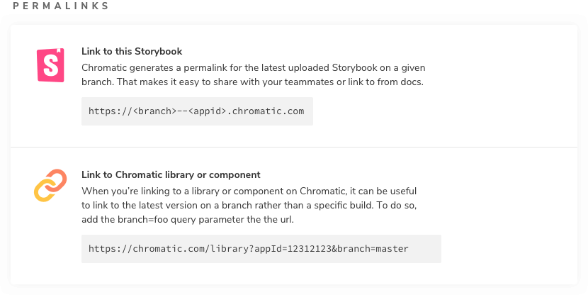

# Permalinks

Chromatic generates a unique permalink when a Storybook is published. This gives teams secure, convenient access to browse components and stories. You can also use permalinks to combine different Storybooks using [Composition](composition).

## Get permalinks to your project

Before we begin, find your project's unique app id. Go to the permalink section of your project's manage screen. In the input field, you'll see the app id along with instructions for linking to the latest published Storybook and your Chromatic library.

## Build your own permalink

Build your own permalinks to get more flexibility. For example, link to the `master` branch of Storybook in your external documentation site. Or link to a specific Storybook version (via commit) for [Composition](composition).

| Permalink   | Format                                        |
| ----------- | --------------------------------------------- |
| To a branch | `https://<branch>--<appid>.chromatic.com`     |
| To a commit | `https://<commithash>--<appid>.chromatic.com` |
