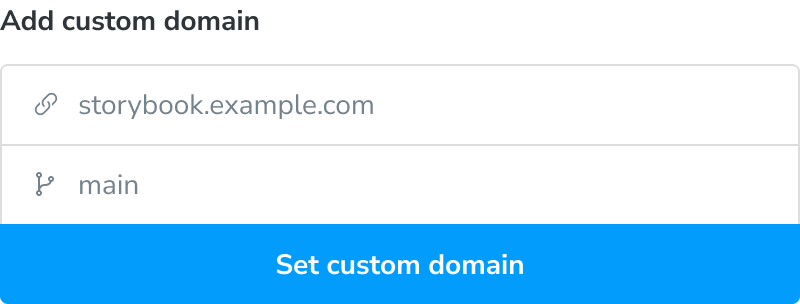

# Permalinks

Chromatic generates a unique permalink when a Storybook is published. This gives teams secure, convenient access to browse components and stories. You can also use permalinks to combine different Storybooks using [Composition](composition).

## Get permalinks to your project

Before we begin, find your project's unique app id. Go to the permalink section of your project's manage screen. In the input field, you'll see the app id along with instructions for linking to the latest published Storybook and your Chromatic library.

### Build your own permalink

Build your own permalinks to get more flexibility. For example, link to the `main` branch of Storybook in your external documentation site. Or link to a specific Storybook version (via commit) for [Composition](composition).

| Permalink   | Format                                        |
| ----------- | --------------------------------------------- |
| To a branch | `https://<branch>--<appid>.chromatic.com`     |
| To a commit | `https://<commithash>--<appid>.chromatic.com` |

### Custom domain for your Storybook

A custom domain gives you a memorable URL to share with stakeholders and teammates. It points to your project’s latest published Storybook on a given branch.

You'll need to set [Storybook's visibility](https://www.chromatic.com/docs/collaborators#visibility) to `public` and domain registrar access.

**How to setup a custom domain**

1. Go to the DNS management interface provided by your domain registrar or web hosting provider. Find the section where you can add DNS records.
2. Add a CNAME record for the subdomain you would like to use, such as `storybook.example.com`, then enter `domains.chromatic.com` as the value.
3. Back in Chromatic, enter the full domain name you’d like to use and choose a target branch. The domain will link to the most recent build on that branch.

