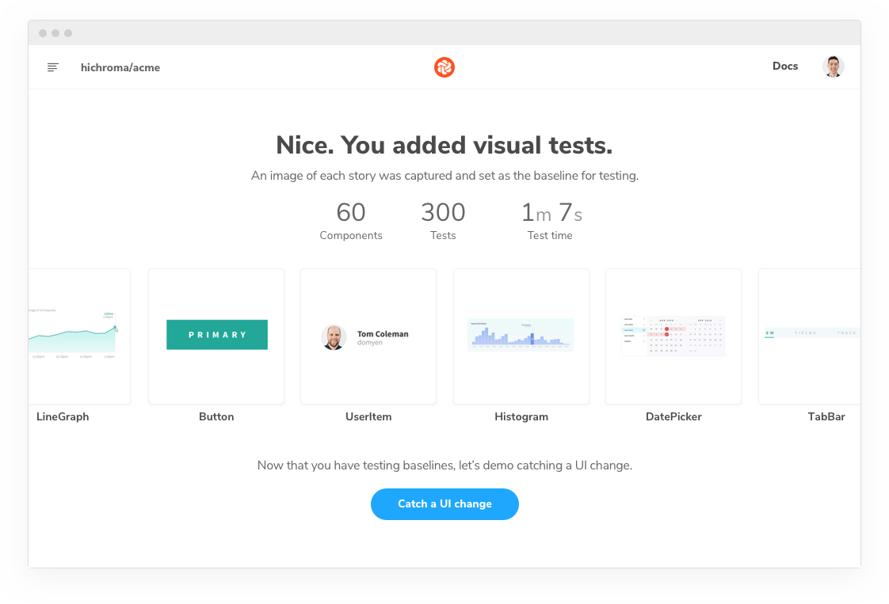
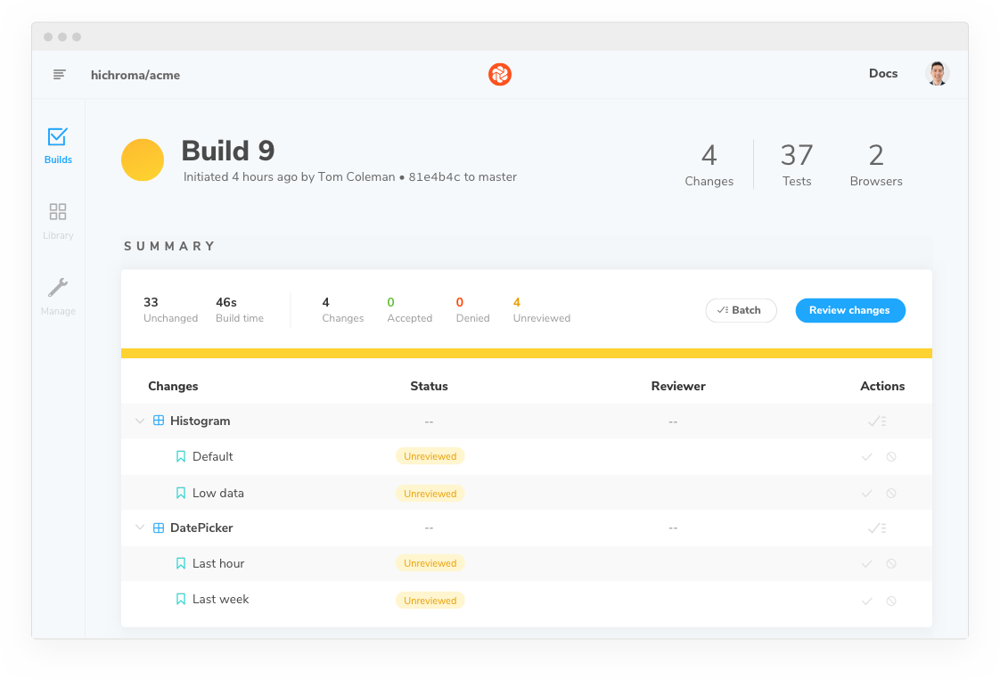

# Publish

Chromatic's CLI tool is used to build and publish storybooks to the cloud. It reports the result of running UI Tests (if enabled) which can be used to block builds in CI when tests fail.

Chromatic must be integrated into your CI environment to ensure your storybook is published for every commit. During setup we recommend running `chromatic` on the command line to make sure everything is configured correctly.

## Installation

Install the [storybook-chromatic](https://github.com/chromaui/chromatic-cli) package from Npm. Storybook 3.4 and above is required.

```bash
# Yarn
yarn add storybook-chromatic

# Npm
npm install --save-dev storybook-chromatic
```

## Running

Before beginning, make sure you have an `<app-code>` by logging in to [Chromatic](https://www.chromatic.com/start) and creating a project. For your first project, we'll guide you through setup and catching your first change with a step-by-step walkthrough.

Once you've installed the `storybook-chromatic` package and have an `<app-code>`, run the following command in your project directory.

```bash
./node_modules/.bin/chromatic --app-code=<your-app-code>
```

<div class="aside">
Chromatic uses the `build-storybook` script from your `package.json` by default but you can specify a different name (see <a href="#available-options">options</a>). You may need to update the `build-storybook` script if you customized your `storybook` script (for example if you added a static directory with `-s`). Whilst it's possible for Chromatic to run against a development Storybook, we strongly recommend you use a built storybook. 
</div>

If everything worked, you'll see some informational output followed by

```bash
Build 1 published.

View it online at https://www.chromatic.com/build?appId=59c5a73849dd100364e1d57&number=1.
```

What this did:

1. Ran `storybook-build` and published the resulting static storybook to Chromatic resulting in a new 'Build'.
2. Updated the Build with local Git history so that Chromatic can associate Git commits with published storybooks.
3. A 'Snapshot' was created for every Story by rendering it and capturing the output on Chromatic's cloud infrastrcture.
4. The Snapshots were used to run UI Tests and create visual comparisons to power UI Review.
5. Pull Requests that are affected by the commit were updated with links to the published storybook and UI Review along with UI Test results.

---

---

## Run your first test to establish baselines

Before beginning, make sure you have an `<app-code>` by logging to [Chromatic](https://www.chromatic.com/start) and creating a project.

Your first test will setup visual testing for your Storybook. Run the following command in your project directory.

```bash
./node_modules/.bin/chromatic --app-code=<your-app-code>
```

<div class="aside">
Chromatic uses the `build-storybook` script from your `package.json` by default. You may need to update that script if you changed the `storybook` script (for example if you added a static directory with `-s`).

Otherwise you may need to add <a href="#available-options">options</a> to our test command.

</div>

After the first test completes, you'll have new test [baselines](/branching-and-baselines) for each story on this branch. In other words, screenshots of the last know good state. Any future changes to your stories will be compared to the baselines.



## Run tests to check for UI changes

Visual testing relies on comparing images of the new rendered UI code to the baseline images. If a UI change is caught you get notified.

Let's demo how that works. In your project, make a change to the UI and save it (you can always undo later).

Then use the same test command you ran earlier. Add [options](#available-options) as needed.

```bash
./node_modules/.bin/chromatic --app-code=<your-app-code>
```

Follow the link to the Chromatic app where you'll see the changes.



There are changes – perhaps even some you didn't expect! The component hierarchy enables small changes to snowball into major regressions. Visual testing with Chromatic helps you catch these changes in development –as they happen– instead of during QA or production (5-10x more costly).

---

## Ensure test consistency to prevent false positives

It's essential that your components and stories render in a **consistent** fashion between tests to prevent false positives. Some reasons your stories might not render consistently and ways you can avoid this include:

- **Randomness in stories**: It's not uncommon to use random number generators to generate data for complex component inputs. To avoid this, you can hard-code the input data, but often a more convenient solution is to use a tool like [seedrandom](https://github.com/davidbau/seedrandom) which you can use to make your "random" number generator consistent.

- **Use of the current date/time**: Dates and times are a testers bane! To get consistency in components or tests that use the current time, you can use a tool to also "seed" the time, like [timemachine](https://github.com/schickling/timemachine) for the `Date` object.

- **Animations and video**: Chromatic will attempt to pause all animations and video. However, you may need to [configure](/animations) Chromatic's exact behaviour.

- **Unpredictable resource hosts**: Resources that load from unpredictable or flaky sources may not load in time (15s) to capture. Workaround this by serving resources as [static files in Storybook](https://storybook.js.org/configurations/serving-static-files/) or using a [placeholder service](https://placeholder.com/). Learn more about how we [load resources](/resource-loading).

- **Skip stories**: Some stories may render unpredictably intentionally. If this is the case you may want to [ignore the story](ignoring-elements) from testing and move on.

<div class="aside">
  If you want to utilize the above techniques to ensure consistency for Chromatic's tests, but you still want the random element for your live storybook, you can use the <code>isChromatic()</code> function (exported from <code>storybook-chromatic/isChromatic</code>) to check.
</div>

---

## Create an npm script for future test builds

The `chromatic` command will also give you the option of adding an npm script to your `package.json` so you can run future builds with `npm run chromatic`. If you want to add it manually, it should look something like:

```json
{
  "scripts": {
    "chromatic": "chromatic"
  }
}
```

The above script command will pick up your app code by reading the `CHROMATIC_APP_CODE` environment variable. After adding the above, ensure you set `CHROMATIC_APP_CODE` when you run builds---such as in your CI config.

If you allowed `chromatic` to add the above line, it will also have written the environment variable to your `package.json`. Depending on your level of trust of your code hosting provider, you should consider removing the environment variable and setting via your CI config.

---

## Next: Update baselines

📸You know how to trigger tests! Now catch bugs and update baselines by [reviewing test results](/builds).

<a class="btn primary round" href="/builds">Read next chapter</a>

---

### Available options

If you have customized the way your Storybook runs, you may need to pass additional options to the test command.

| Option                   | Use case                                                                                                                                                                       |
| ------------------------ | ------------------------------------------------------------------------------------------------------------------------------------------------------------------------------ |
| `--app-code`             | The unique code for your app -- note you can just pass this via the `CHROMATIC_APP_CODE` environment variable.                                                                 |
| `--build-script-name`    | The npm script that builds your Storybook we should take snapshots against (defaults to `build-storybook`). Use this if your Storybook build script is named differently.      |
| `--storybook-build-dir`  | If you have already built your Storybook, provide the path to the built Storybook.                                                                                             |
| `--script-name`          | The npm script that starts your Storybook we should take snapshots against (defaults to `storybook`). Use this flag if you want to avoid building your storybook.              |
| `--storybook-port`       | The port that Storybook serves on (autodetected by `--script-name`, override with this if that fails)                                                                          |
| `--do-not-start`         | Use this if your Storybook is already running (for instance your Storybook is running in a different terminal already).                                                        |
| `--exec`                 | Alternatively, start your Storybook with an arbitrary command. If you use this option, pass `--storybook-port` to configure the port Storybook runs on.                        |
| `--auto-accept-changes`  | If there are any changes to the build, automatically accept them. This is useful in some branching situations. See more in the [**branching docs**](/branching-and-baselines). |
| `--exit-zero-on-changes` | If all snapshots render but there are visual changes, exit with a 0 exit code, rather than the usual 1.                                                                        |
| `--preserve-missing`     | Treat missing stories as unchanged rather than deleted.                                                                                                                        |
| `--no-interactive`       | Don't ask interactive questions about your setup.                                                                                                                              |
| `--debug`                | Output extra debugging information.                                                                                                                                            |
| `CI=true`                | Tell Chromatic that you're running in CI. This will hide the "Setup CI / Automation" messages in the UI. Add _before_ the test command like so: `CI=true yarn chromatic...`    |

---

### Troubleshooting

#### Test build failures

A build will _fail_ if any of the snapshots fail to render (i.e. in rendering the latest version of the component, the snapshot throws a JavaScript exception). You'll need to fix the code for errored components before we can pass the build.

#### Errored builds

Chromatic builds and runs Storybook flawlessly _most of the time_, but we're not perfect (we wish). Sometimes builds don't run due to the rare infrastructure hiccup. If this happens, try to re-run the build. Rest assured, we keep track of errors and continue to work to improve the service every day.

#### Timed out

Chromatic takes snapshots very quickly. However, if we lose the connection to your server (for instance if you stop your server mid-build, or your internet connection goes down), builds can time out. Simply restart the build---perhaps with a more stable connection.

#### Failed to evaluate your stories when running tests

To make a list of Chromatic specs from your Storybook stories, we evaluate your story code from a node script, using JSDOM to simulate a browser environment. We don't render your stories but just gather a list of them by including your story files. You may need to avoid calling various browser-only constructs at the top-level or mock them out. Pass `--debug` to the script command to get extra info if it fails.

#### No Storybook specs found

To get a list of specs from your stories, we evaluate your Storybook with [JSDOM](https://github.com/tmpvar/jsdom). This is a slightly different environment to a normal browser and can sometimes have problems. We will try to output errors if we see them; using the `--debug` flag to `chromatic` may help if we didn't catch any errors.

#### Image size too large

We have a 25 million pixel size limit for image snapshots. This ensures fast and reliable performance for every build.

If your stories are larger than this, perhaps something has gone wrong? Let us know if you need this limit increased by chat or [email](mailto:support@hichroma.com?Subject=Image Size Limit).
