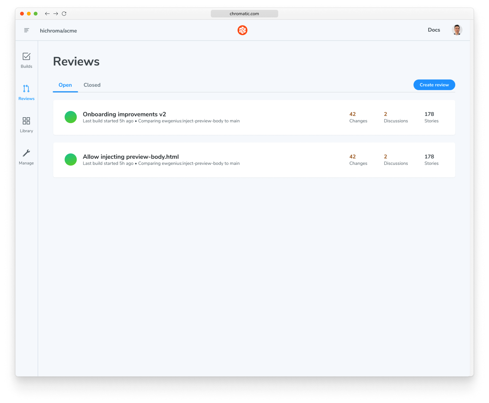
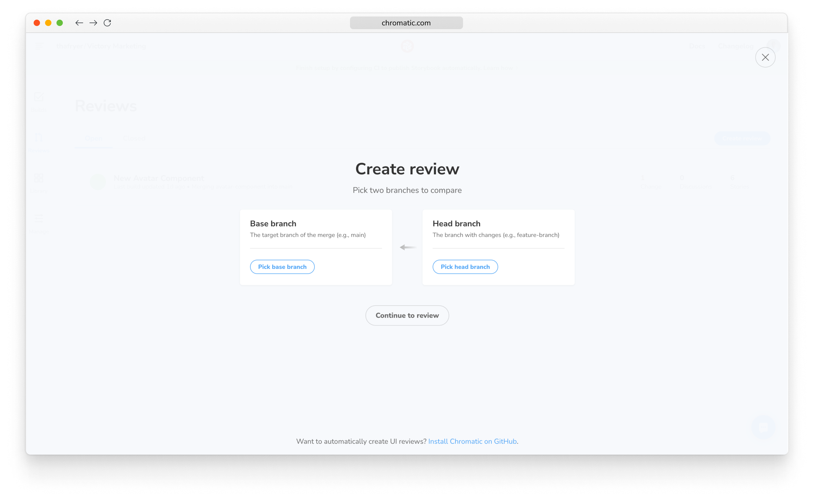
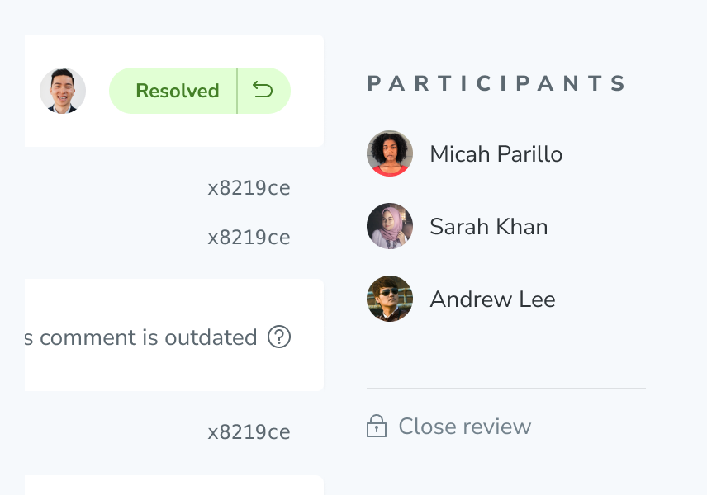

# UI Review

UI tests protect you from accidental regressions. But, before you ship, you’ll want to invite developers, designers, and PMs to review the UI, discuss changes, and get the final team to sign off.

UI Review creates a changeset of the exact visual changes introduced on a new branch. You assign reviewers who can comment and request tweaks on changes that aren’t quite right. Think of it like a code review, but for your UI.

Previously, this feature was only available for accounts that [linked projects](access#linked-projects) with GitHub, GitLab, or Bitbucket. We are now making the feature available to all of our customers, on both linked and unlinked projects.


## Enable

### For linked projects
Enable UI Review for your project on the Manage screen. Then go to the Reviews tab in the web app sidebar. You’ll be prompted to install the GitHub app or webhooks for GitLab or Bitbucket.


<div class="aside">
<p><b>Note:</b> For linked projects, you must <a href="ci">set up CI</a> so that Chromatic is able to run builds for each commit on the PR branch.</p>
</div>

### For unlinked projects
This workflow is still in Beta, so we must opt you in first. Please reach out to your Customer Success contact or [support@chromatic.com](mailto:support@chromatic.com) in order to get access.

Once you’re in the beta for Unlinked UI Review, any new projects created will automatically have UI Review enabled. For your existing projects, you can enable UI Review on the Manage screen (see above).

<div class="aside">
<p><b>Note:</b> In order to create a Review, you will need to have at least two git branches with a build on each.</p>
</div>

## Create a Review
### For linked projects
If you have [linked your project](access#linked-projects) to a repository on GitHub, Bitbucket, or GitLab, [enabled UI Review](review#enable), and [set up CI](ci), Chromatic will run builds automatically for each commit on a PR branch. Nothing else is needed from you to create a Review.

### For unlinked projects
Navigate to the Reviews link in the sidebar and click the “Create Review” button.



* Select the base branch, which is the branch that’s used as the source of truth for comparison.
* Select the head branch, which is the branch that has the changes that you want to compare with the source of truth. Then, click “Continue to review.”
* Enter a title for the Review. Then, press “Compare branches”



<div class="aside">
<p><b>Note:</b> If you are trying to review the changes completed in a pull (merge) request, you will want to match the head and base branches of the Review with the respective branches of the pull (merge) request.</p>
<p>Additionally, you can only have one open Review at a time with the same branch combination. For example, if your head branch is <code>new-changes</code> and your base branch is <code>main</code>, you cannot open another Review with <code>new-changes</code> as the head branch and <code>main</code> as the base branch.</p>
</div>

<details>
<summary>Glossary</summary>

* The base branch is the branch that you want to use as a baseline for the comparison.
* The head branch is the branch that has the actual changes that need to be compared against the base branch.

</details>

## Understanding the Review

Once a Review has been created—either manually or through CI—navigate to the Reviews tab and select the appropriate Review. You will then land on the Activity tab, which shows a timeline of [builds](setup#view-published-storybook), active discussions, and Review status. This showcases what needs to be done in the Review process.


#### Invite teammates

Invite other developers, designers, PMs, and stakeholders to help review changes. This closes the feedback loop between disciplines and helps you find the answer to “does this look right?”

If you [linked your project](access) to GitHub, Bitbucket, or GitLab, your project permissions are synced so collaborators can sign in to review immediately. If your [project is unlinked](access), use the project invite code to add collaborators.

#### Assign reviewers

Use the Assign Reviewers link on the Review’s Activity screen to choose reviewers from the project’s collaborators. Reviewers will be emailed a link to the Review screen to begin their review.


#### Pull requests from forks

Chromatic supports UI Test and UI Review across forks, but there's some caveats. First, it only works with [CI integration](ci#configure-ci) configured to also build PR branches from forks. Secondly, you must expose your `project-token` so that forks can use it. The easiest way to do that is to simply include it in in your `package.json`, for example:

```json
{
  "scripts": {
    "chromatic": "chromatic --project-token <CHROMATIC_PROJECT_TOKEN>"
  }
}
```

If you use a CI provider other than GitHub, you can still use an environment variable. Just make sure your CI is configured to also build forked branches. The `project-token` does not grant access to the project (it can only retrieve a strict set of insensitive data), but it does allow running new builds which count against your snapshot quota.

## Review the changes

The Review screen includes a Changeset tab showing a side-by-side view of all visual changes introduced on your head branch. It compares the UI on the head branch to the base branch. You’ll see each change’s component story before and after the head branch changes are applied to your base branch.


<div class="aside"><b>Tip:</b> To hint at what UI changed, toggle the highlighted diff (in neon green) on and off.</div>

#### Discussions

Reviewers can request updates to the implementation via the comment box beneath each change. Discussions are threaded and attached to the specific story represented by the change.


## UI checklist

At the bottom of the Review screen’s [activity tab](review#find-your-pull-request) is a list of tasks that must be completed before UI is ready to be signed off on. If changes are found, the Review will enter the **🟡&nbsp;Pending** state. When changes are approved and checklist items are complete, the Review will be **🟢&nbsp;Passed**. Here’s how to resolve these tasks:

1. Changeset must be approved &rarr; Assign reviewers or approve yourself.
2. Outstanding discussions must be resolved &rarr; Click 'Resolve' on discussions.
3. All assigned reviewers must approve &rarr; Click 'Approve' in the Review screen tab bar.

<div class="aside">
<p><b>Note:</b> Step #3 is not required if you would like to close the Review.
</p>
</div>


## Close a Review

Once a Review is complete, it can be closed. Click the ‘Close review’ menu item in the ‘Review now’ button tooltip. Your review will be displayed in the list of ‘Closed’ Reviews on the Reviews page.

<div class="aside">
<p><b>Note:</b> closing a Review <b>does not</b> merge the branches in git.</p>
</div>


## PR check for "UI Review"

You'll get a 'UI Review' status check for each PR that shows the state of the UI Checklist. Require the check in [GitHub](https://help.github.com/en/github/administering-a-repository/enabling-required-status-checks), [GitLab](https://docs.gitlab.com/ee/api/commits.html#post-the-build-status-to-a-commit), or [Bitbucket](https://confluence.atlassian.com/bitbucket/suggest-or-require-checks-before-a-merge-856691474.html) to ensure that impactful changes are considered by the team before merging.


Manually created Reviews will not create a “UI Review” status check in GitHub, GitLab or Bitbucket. To create a status check in your Git provider for manually created Reviews, you can use a [custom webhook](integrations#custom-webhooks).

---

## Next: Learn about documenting reusable components

Now that you've seen how to review the UI changeset before merging, learn how Chromatic makes is simple to share versioned and interactive component docs.

<a class="btn primary round" href="document">Read next chapter</a>

---

### Frequently asked questions

<details>
<summary>When should I ask for UI Review?</summary>

You can initiate a UI Review at any time. However, we recommend doing it later in the development cycle, once baselines have been approved and UI Tests are green. Learn more about [UI review](review).

</details>

<details>
<summary>Can I disable UI Review if I'd prefer not to use it?</summary>

Yes. Go to the manage page for your project where you can disable UI Review. Chromatic will no longer add status checks to your PRs for UI Review once it is disabled.

</details>

<details>
<summary>What commits does Chromatic use to calculate the UI changeset?</summary>

Similar to [GitHub code review](https://github.com/features/code-review/), Chromatic compares between the latest commit on the PR branch and the 'merge base' commit, that is the commit that is the shared ancestor between the PR branch and the branch it was created from. It is important that Chromatic has run a build on both commits outlined above. If you've recently enabled CI and have existing PRs that you would like to review, ensure Chromatic has run in CI for both branches of that PR.

The process might look something like:

1. Create a new PR to `main` adding Chromatic to CI
1. Merge that PR when everything works well.
1. Update your existing feature PR(s) w/ the latest from `main` (either merge or rebase from main).

</details>
