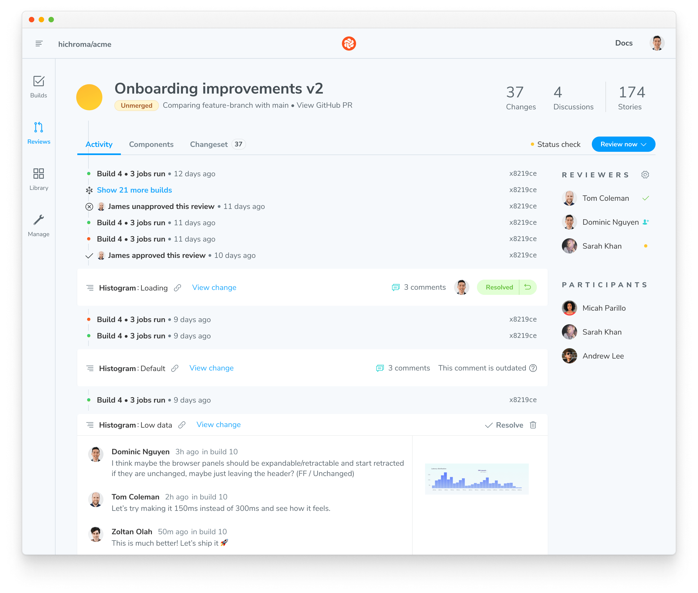
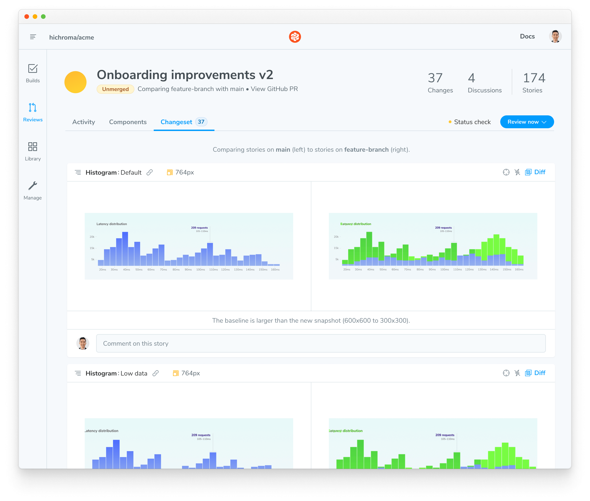
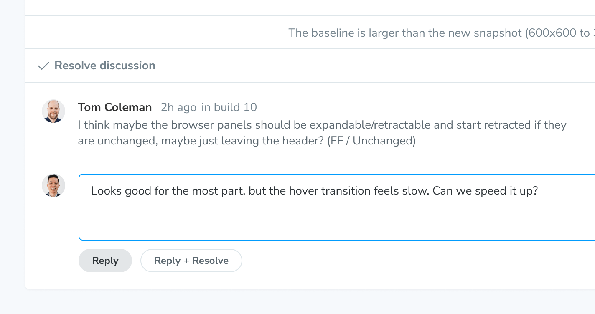

# UI Review

UI tests protect you from accidental regressions. But, before you ship, you'll want to invite developers, designers, and PMs to review the UI to make sure it's correct.

UI Review pinpoints the exact visual changes introduced by a PR. You assign reviewers who can comment and request tweaks on changes that aren't quite right. Think of it like a code review for your UI.

<b>Note:</b> You must have a <a href="access#linked-projects">linked project</a> to utilize UI Review features so that Chromatic can sync PR data.

## Enable

Enable UI Review for your project on the manage screen. Then go to the PRs/MRs tab in the web app sidebar. You'll be prompted to install the GitHub app or webhooks for GitLab/Bitbucket.

<b>Note:</b> You must <a href="ci">setup CI</a> so that Chromatic is able to run builds for each commit on the PR branch.

## Find your pull request

Navigate to the PRs link in the sidebar to find your pull/merge request. You'll land on the Activity tab which shows a timeline of [builds](setup#view-published-storybook), active discussions, and review status. This showcases what needs to be done before you're ready to merge.

#### Invite teammates

Invite other developers, designers, PMs, and stakeholders to help review changes. This closes the feedback loop between disciplines and helps you find the answer to "does this look right?".

If you [linked your project](access) to GitHub, Bitbucket, or GitLab, your project permissions are synced so collaborators can sign in to review immediately. If your [project is unlinked](access), use the project invite code to add collaborators.

#### Assign reviewers

Use the Assign Reviewers link on the PR Activity screen to choose reviewers from the project's collaborators. Reviewers will be emailed a link to the PR screen to begin their review.

## Review UI Changes

The PR screen includes a Changes tab showing a side-by-side view of all visual changes introduced by the code in the PR. It compares UI on the source branch to the base branch. Each change, you'll see the component story before and after the PR is applied.

To hint at what UI changed, toggle the highlighted diff (in neon green) on and off.

#### Discussions

Reviewers can request updates to the implementation via the comment box beneath each change. Discussions are threaded and attached to the specific story represented by the change.

## UI Checklist

At the bottom of the PR screen's [activity tab](review#find-your-pull-request) there's a list of tasks which must be completed before UI is ready to merge. If UI changes are found, the PR will enter the **🟡Pending** state. When changes are approved and checklist items are complete the PR will be **🟢Passed**.

1. UI changes must be approved &rarr; Assign reviewers or approve yourself.
2. Outstanding discussions must be resolved &rarr; Click 'Resolve' on discussions.
3. All assigned reviewers must approve &rarr; Click 'Approve' in the PR screen tab bar.

## PR check for "UI Review"

You'll get a 'UI Review' status check for each PR that shows the state of the UI Checklist. Require the check in [GitHub](https://help.github.com/en/github/administering-a-repository/enabling-required-status-checks), [GitLab](https://docs.gitlab.com/ee/api/commits.html#post-the-build-status-to-a-commit), or [Bitbucket](https://confluence.atlassian.com/bitbucket/suggest-or-require-checks-before-a-merge-856691474.html) to ensure that impactful changes are considered by the team before merging.

---

## Next: Learn about documenting reusable components

Now that you've seen how to review UI changes with teammates before merging, learn how Chromatic makes is simple to share versioned and interactive component docs.

<a class="btn primary round" href="document">Read next chapter</a>

---

### Frequently asked questions

How is UI review different from testing?

Testing is done primarily by developers, most often iteratively during development. The focus is on preventing UI regressions (bugs) and maintaining a clean set of baselines to test against.

Review is usually performed by designers, PMs, customers, and other stakeholders. The focus is not on finding bugs (this should have already happened through testing) but rather to find cases where the implementation is not quite as was intended by the design or specifications. The modern development process moves quickly and often developers are filling in gaps according to their best guess. UI review is an opportunity for developers to sync with other teammates to get a final OK before shipping.

When should I ask for UI Review?

You can initiate a UI review at any time. However, we recommend doing it later in the development cycle, once baselines have been approved and UI Tests are green.

What commits does Chromatic use to calculate UI changes?

Similar to GitHub code review, Chromatic compares between the latest commit on the PR branch and the 'merge base' commit, that is the commit that is the shared ancestor between the PR branch and the branch it was created from. It is important that Chromatic has run a build on both commits outlined above. If you've recently enabled CI and have existing PRs that you would like to review, ensure Chromatic has run in CI for both branches of that PR.

The process might look something like:

1. Create a new PR to `master` adding Chromatic to CI
2. Merge that PR when everything works well.
3. Update your existing feature PR(s) w/ the latest from `master` (either merge or rebase from master).

Can I disable UI Review if I'd prefer not to use it?

Yes. Go to the manage page for your project where you can disable UI Review. Chromatic will no longer add status checks to your PRs for UI Review once it is disabled.

