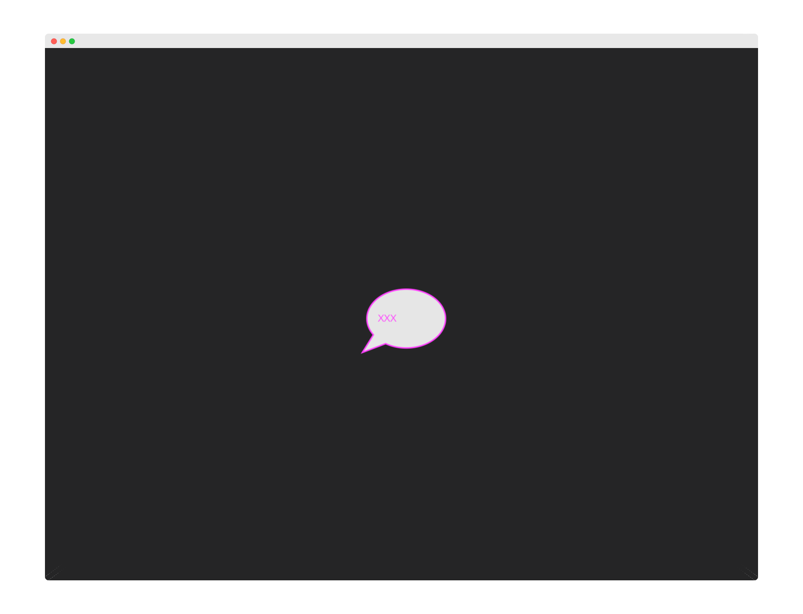

# Publish Storybook

The Chromatic CLI builds then publishes Storybook to a secure workspace in the cloud. That allows your team to access all your stories at [chromatic.com](https://www.chromatic.com/start).

## Signup

Before publishing, generate a unique `<app-code>` for your Storybook by logging in to [Chromatic](https://www.chromatic.com/start) and creating a project.

Login via oAuth from Github, Gitlab, or Bitbucket. If you require SSO or have on-premises Git hosting learn more about access control [here](access).

## Installation

Install the [storybook-chromatic](https://github.com/chromaui/chromatic-cli) package from Npm. Storybook 3.4 and above is required.

```bash
# Yarn
yarn add storybook-chromatic

# npm
npm install --save-dev storybook-chromatic
```

The `chromatic` command will also give you the option of adding an npm script to your `package.json` so you can run future builds with `npm run chromatic/yarn chromatic`. If you want to add it manually, it should look something like:

```json
{
  "scripts": {
    "chromatic": "chromatic"
  }
}
```

The above script command will pick up your app code by reading the `CHROMATIC_APP_CODE` environment variable. After adding the above, ensure you set `CHROMATIC_APP_CODE` when you run builds---such as in your CI config.

If you allowed `chromatic` to add the above line, it will also have written the environment variable to your `package.json`. This environment variable can also be set via your CI config for extra privacy.

## Run Chromatic

Once you've installed the `storybook-chromatic` package and have an `<app-code>`, run the following command in your project directory.

```bash
./node_modules/.bin/chromatic --app-code=<your-app-code>
```

<div class="aside">
Chromatic uses the <code>build-storybook</code> script from your <code>package.json</code> by default but you can specify a different name (see <a href="#available-options">options</a>). You may need to update the <code>build-storybook</code> script if you customized your <code>storybook</code> script (for example if you added a static directory with <code>-s</code>). Whilst it's possible for Chromatic to run against a development Storybook, we strongly recommend you use a built Storybook. 
</div>

When complete, you'll see the build status followed by a link to the published Storybook:

```bash
Build 1 published.

View it online at https://www.chromatic.com/build?appId=59c5a73849dd100364e1d57&number=1.
```

**Here's what the command does:**

1. Runs `storybook-build` and outputs a static Storybook
2. Publishes the static Storybook to Chromatic as a 'build'.
3. Updates the build with local Git history to associate Git commits with published Storybooks.
4. Renders every story in a cloud browser and takes a "[snapshot](snapshots)".
5. Check for visual differences between snapshots to identify bugs (UI Tests) or highlight updates (UI Review).
6. Updates relevant pull requests with links to the published Storybook, UI Tests results, and the UI Review workspace.



Every time you run the `chromatic` command you get a corresponding build in Chromatic's web app. The build screen gives you an overview of your Storybook for that commit.

- Confirm your build was successful
- Analyze components and stories
- Navigate to the published Storybook
- View UI test results for enabled browsers
- Browse the components in the Storybook for the build.
- Link to associated pull/merge request in Chromatic for UI Review.

## Configure CI

During setup we recommend running `chromatic` on the command line (as shown above) to make sure everything is configured correctly. In order to complete setup, Chromatic must be integrated into your CI environment to ensure your Storybook is published every time you push and we can detect UI changes between commits.

We support all major CI providers. If you're using Github and don't yet have CI, we've built a [Github Action](https://github.com/chromaui/action) that makes it trivial to run Chromatic on every push. Read our [XXX CI reference page](ci) for help on setting up CI.

{: .center }

When running inside CI, Chromatic will update pull request status checks for every push. You'll get links to your published Storybook for the latest commit on the branch, UI test results (optional) and UI review approvals (optional).

---

## Next: Catch UI bugs

📸 Now that you're publishing your Storybook, learn about Chromatic's visual regression [testing](test).

<a class="btn primary round" href="/test">Read next chapter</a>

---

### Available options

If you have customized the way your Storybook runs, you may need to pass additional options to the `chromatic` command.

| Option                   | Use case                                                                                                                                                                       |
| ------------------------ | ------------------------------------------------------------------------------------------------------------------------------------------------------------------------------ |
| `--app-code`             | The unique code for your app -- note you can just pass this via the `CHROMATIC_APP_CODE` environment variable.                                                                 |
| `--build-script-name`    | The npm script that builds your Storybook we should take snapshots against (defaults to `build-storybook`). Use this if your Storybook build script is named differently.      |
| `--storybook-build-dir`  | If you have already built your Storybook, provide the path to the built Storybook.                                                                                             |
| `--auto-accept-changes`  | If there are any changes to the build, automatically accept them. This is useful in some branching situations. See more in the [**branching docs**](/branching-and-baselines). |
| `--exit-zero-on-changes` | If all snapshots render but there are visual changes, exit with a 0 exit code, rather than the usual 1.                                                                        |
| `--preserve-missing`     | Treat missing stories as unchanged rather than deleted.                                                                                                                        |
| `--no-interactive`       | Don't ask interactive questions about your setup.                                                                                                                              |
| `--debug`                | Output extra debugging information.                                                                                                                                            |
| `CI=true`                | Tell Chromatic that you're running in CI. This will hide the "Setup CI / Automation" messages in the UI. Add _before_ the test command like so: `CI=true yarn chromatic...`    |

Additional options and more documentation are available in the `storybook-chromatic` package [documentation](https://github.com/chromaui/chromatic-cli).

---

## Troubleshooting

#### Test build failures

A build will _fail_ if any of the snapshots fail to render (i.e. in rendering the latest version of the component, the snapshot throws a JavaScript exception). You'll need to fix the code for errored components before we can pass the build.

#### Errored builds

Chromatic builds and runs Storybook flawlessly _most of the time_, but we're not perfect (we wish). Sometimes builds don't run due to rare infrastructure issues. If this happens, try to re-run the build. Rest assured, we keep track of errors and continue to work to improve the service every day.

#### Timed out

Chromatic takes snapshots very quickly. However, if we lose the connection to your server (for instance if you stop your server mid-build, or your internet connection goes down), builds can time out. Simply restart the build---perhaps with a more stable connection.

#### Failed to evaluate your stories

To make a list of Chromatic specs from your Storybook stories, we evaluate your story code from a node script, using JSDOM to simulate a browser environment. We don't render your stories but just gather a list of them by including your story files. You may need to avoid calling various browser-only constructs at the top-level or mock them out. Pass `--debug` to the script command to get extra info if it fails.

#### No Storybook specs found

To get a list of stories, we evaluate your Storybook with [JSDOM](https://github.com/tmpvar/jsdom). This is a slightly different environment to a normal browser and can sometimes have problems. We will try to output errors if we see them; using the `--debug` flag to `chromatic` may help if we didn't catch any errors.

#### Image size too large

We have a 25 million pixel size limit for image snapshots. This ensures fast and reliable performance for every build.

If your stories are larger than this, perhaps something has gone wrong? Let us know if you need this limit increased by chat or [email](mailto:support@hichroma.com?Subject=Image Size Limit).
