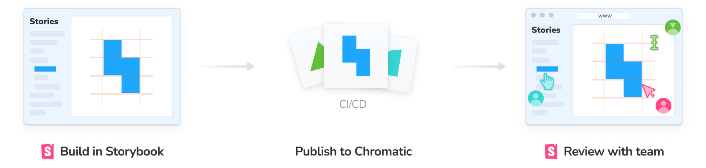
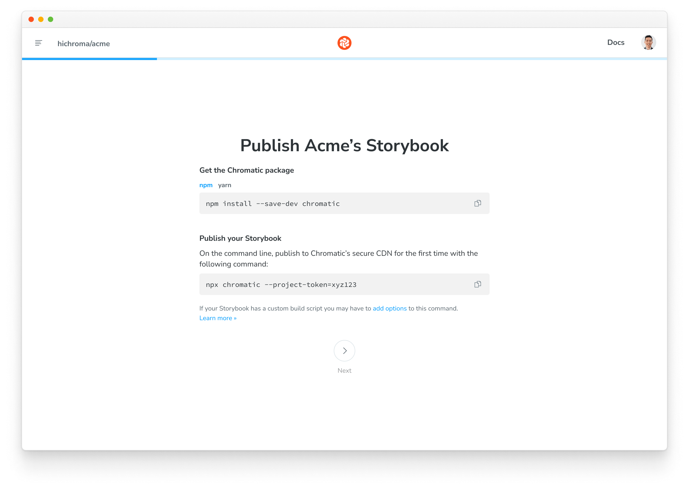

# Setup and publish Storybook

The Chromatic CLI builds then publishes Storybook to a secure workspace in the cloud. That allows your team to access all your stories at [chromatic.com](https://www.chromatic.com/start).



## Sign up

Before publishing, generate a unique `<project-token>` for your Storybook by logging in to [Chromatic](https://www.chromatic.com/start) and creating a project. Login via OAuth from GitHub, GitLab, or Bitbucket. If you require SSO or have on-premises Git hosting learn more about access control [here](access#authentication).



## Install

Install the [**chromatic**](https://github.com/chromaui/chromatic-cli) package from npm.

```bash
# Yarn
yarn add chromatic

# npm
npm install --save-dev chromatic
```

<div class="aside">Storybook 3.4 and above is required.</div>

<details>

<summary>Learn how to add <code>chromatic</code> to your package.json</summary>

The `chromatic` command will also give you the option of adding an npm script to your `package.json` so you can run future builds with `npm run chromatic/yarn chromatic`. If you want to add it manually, it should look something like:

```json
{
  "scripts": {
    "chromatic": "chromatic"
  }
}
```

The above script command will pick up your project token by reading the `CHROMATIC_PROJECT_TOKEN` environment variable. After adding the above, ensure you set `CHROMATIC_PROJECT_TOKEN` when you run builds---such as in your CI config.

If you allowed `chromatic` to add the above line, it will also have written the environment variable to your `package.json`. This environment variable can also be set via your CI config for extra privacy.

</details>

## Run Chromatic

Once you installed the `chromatic` package and have an `<project-token>`, run the following command in your project directory.

```bash
./node_modules/.bin/chromatic --project-token=<your-project-token>
```

<div class="aside">
We use the <code>build-storybook</code> script from your <code>package.json</code> by default. If you customized your <code>storybook</code> script (for example, adding a static directory with <code>-s</code>), specify them using our <a href="#command-options">options</a>.
</div>

When complete, you'll see the build status and a link to the published Storybook:

```bash
Build 1 published.

View it online at https://www.chromatic.com/build?appId=...&number=1.
```

## View published Storybook

You published Storybook online! Every time you run the `chromatic` command you get a corresponding build in Chromatic's web app. You can now browse components, view [**UI Tests**](test) results (if enabled), and navigate to associated PR/MRs for [**UI Review**](review).


## Get the PR check

Chromatic posts a "Storybook Publish" status check in your pull/merge request that links to the latest published Storybook. This gives teams secure, convenient access to browse components and stories. Get the PR check by [automating Chromatic with CI](ci).


<div class="aside">During setup we recommend running <code>chromatic</code> on the command line to make sure the configuration is correct. For production use run Chromatic in CI.</div>

---

## Next: Catch UI bugs

📸 Now that you published Storybook, let's see how to automate [UI tests](test) to catch bugs.

<a class="btn primary round" href="test">Read next chapter</a>

---

<details>
<summary><h3 class="no-anchor">Command options</h3></summary>

If you have customized the way your Storybook runs, you may need to pass additional options to the `chromatic` command. Learn more in the [package documentation](https://github.com/chromaui/chromatic-cli#main-options).

| Option                   | Use case                                                                                                                                                                      |
| ------------------------ | ----------------------------------------------------------------------------------------------------------------------------------------------------------------------------- |
| `--project-token`        | The unique code for your project -- note you can pass this via the `CHROMATIC_PROJECT_TOKEN` environment variable.                                                            |
| `--build-script-name`    | The npm script that builds your Storybook we should take snapshots against (defaults to `build-storybook`). Use this if your Storybook build script is named differently.     |
| `--storybook-build-dir`  | If you have already built your Storybook, provide the path to the built Storybook.                                                                                            |
| `--auto-accept-changes`  | If there are any changes to the build, automatically accept them. This is useful in some branching situations. See more in the [**branching docs**](branching-and-baselines). |
| `--exit-zero-on-changes` | If all snapshots render but there are visual changes, exit with a 0 exit code, rather than the usual 1.                                                                       |
| `--preserve-missing`     | Treat missing stories as unchanged rather than deleted.                                                                                                                       |
| `--no-interactive`       | Don't ask interactive questions about your setup.                                                                                                                             |
| `--debug`                | Output extra debugging information.                                                                                                                                           |
| `CI=true`                | Tell Chromatic that you're running in CI. This will hide the "Setup CI / Automation" messages in the UI. Add _before_ the test command like so: `CI=true yarn chromatic...`   |

</details>

### Troubleshooting

<details>
<summary>Command error <code>git log -n 1</code></summary>

This error often appears when `git` is not available in your CI environment. Chromatic uses `git` to associate commits to pull/merge requests and set baselines. We require that an executable git is available (on the `$PATH` ) of the `chromatic` script.

**Common cases:**

- Docker containers: Git may not be installed on certain Docker containers. You'll need to make the image includes Git.
- Heroku CI: Git history isn't available by default. You'll have to give Heroku auth access to your repo so that it can clone it before running CI. This can be unideal. Some customers end up using other CI providers to run Chromatic like GitHub Actions (free) or CircleCI.
- Google Cloud CI: The `.git` folder is ignored by default. Based on [their documentation](https://github.com/GoogleCloudPlatform/cloud-builders/issues/236#issuecomment-374629200) you can try `.gcloudignore`. However, some customers have run into trouble with this solution and instead opted to use other CI providers to run Chromatic like GitHub Actions (free) or CircleCI.
- You don't use Git: Enable Git version control in your project and try Chromatic again.

**Debug yourself:**

- Try running the command manually `git log -n 1 --format="%H,%ct,%ce,%cn"` and check if there are errors

</details>

<details>
<summary>Errored builds</summary>

Chromatic builds and runs Storybook flawlessly _most of the time_, but we're not perfect (we wish). Sometimes builds don't run due to rare infrastructure issues. If this happens, try to re-run the build via your CI provider. We keep track of these errors to improve the service.

</details>

<details>
<summary>Timed out builds</summary>

Chromatic takes snapshots very quickly. However, if we lose the connection to your server (for instance if you stop your server mid-build, or your internet connection goes down), builds can time out. Check your connection and try restarting the build.

</details>

<details>
<summary>Failed to evaluate your stories (no stories found)</summary>

We use [JSDOM](https://github.com/tmpvar/jsdom) to evaluate your stories in a simulated browser environment. JSDOM doesn't support every browser-specific construct or API. Our package provides shims for [common constructs](https://github.com/chromaui/chromatic-cli/blob/19751d87d950a2aecefb522e57c9a13c8c34fe54/bin/lib/jsdom-shims.js), but you may need mock them out yourself for extra coverage. Pass `--debug` to the script command to get extra info if it fails.

</details>
