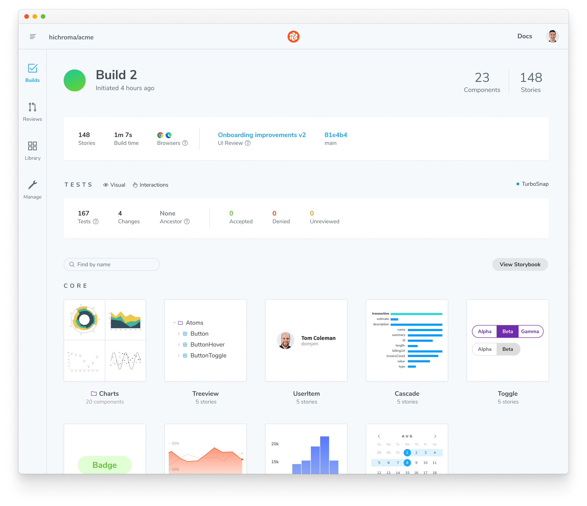

## Get started with Chromatic

Chromatic is a platform that provides tools, workflows, and infrastructure to identify UI bugs and improve team collaboration during development. It provides a secure cloud environment to publish your Storybook, test your components to catch UI bugs, and review UI changes with your team while seamlessly integrating with industry-standard tools and services.

## Sign up

To get started, create an account with [Chromatic](https://www.chromatic.com/start?startWithSignup=true). You can select the plan that's right for you [here](https://www.chromatic.com/pricing). If you're not sure which plan to choose, contact us through our <a  class="intercom-concierge-bot">in-app chat</a>, and we'll help you choose the right plan for you or your team.


Once you create an account, you can authenticate with your [GitHub](https://github.com/), [GitLab](https://about.gitlab.com/), [Bitbucket](https://bitbucket.org/), or email account. If you choose an email registration, you must provide a valid email address and create a password. After completing this step, you'll receive a verification email. Click the verification link in the email to confirm your account.

## Creating a new project

To create a new project, click the "Add project" in your account dashboard. Then, select whether to link a Git repository or create a manual project.


If you integrate with your Git provider, you're prompted to select the repository you have access to. Once you have chosen the repository, you will be directed to the final step of the setup process. Here, you will find a list of instructions to set up the Chromatic CLI and run your first build.


<details>
<summary id="demo-chromatic-unlinked">How to continue setup if you require SSO, on-premises, or have a different Git provider.</summary>

These instructions will teach you how to set up Chromatic with an ["unlinked" project](access#unlinked-projects). This can be useful in these situations:

- You need an enterprise plan but want to trial Chromatic in your project first
- You use an OAuth provider that we don't support right now
- You use Git hosting that we don't support right now

Start by signing in using your _personal_ account via any of the supported providers. We'll use this to authenticate you as a user only, so the account doesn't have to be associated with your work.

Select the "Create a project" option and type your project name to create an unlinked project.


<div class="aside">

ℹ️ The Chromatic CLI allows you to generate a JUnit XML report of your build, which you can use to handle commit / pull request statuses. See [debug options](cli#debug-options) for details.

</div>

If all goes well, you should have created an unlinked project. This will allow you to start with [UI Testing](test) workflow regardless of the underlying Git provider. You can then configure your CI system to run a Chromatic build on push automatically.

Unlinked projects have certain drawbacks:

- You won't get automatic PR checks, so pull requests will not be marked with our status messages. You'll need to set this up manually via your CI provider.
- You won't have access to our UI Review workflow because it relies on retrieving pull requests from your Git provider.
- Authentication and access control must be handled manually through user invites.

</details>

## Install

To enable Chromatic in your project, make sure you have [Node.js](https://nodejs.org/en/) version 16.19.1 and a fully functional Storybook running the latest version (e.g., 7.4 or higher).

Run the following command to install the [CLI](https://www.npmjs.com/package/chromatic):

```shell
# Yarn
yarn add --dev chromatic

# npm
npm install --save-dev chromatic
```

<div class="aside">

💡 Chromatic offers backward compatibility up to Node.js version 14.18 and Storybook 6.5. If you're running an older Node.js version and you're unable to migrate, you can set up a you can set up a node version manager like [nvm](https://github.com/nvm-sh/nvm) or [n](https://github.com/tj/n) by following the URLs provided.

</div>

## Run Chromatic

Once you've configured your project and installed the CLI, run the following command in your project directory:

```shell
npx chromatic --project-token <your-project-token>
```

The CLI will build and deploy your Storybook to Chromatic's secure cloud environment, capture snapshots, and set the initial baselines for your components. When it finishes, you'll see a detailed report in your terminal with the build status and a link to the build on Chromatic, where you can now browse components, view [**UI Tests**](test) results (if enabled), and navigate to associated PR/MRs for [**UI Review**](review).

```shell
Build 1 published.

View it online at https://www.chromatic.com/build?appId=...&number=1.
```



### Secure your project

By default, when you run the `chromatic` command, it will prompt you to set up a script in your `package.json` file to streamline the deployment process. If you choose to set up the script, the CLI will update your `package.json` file to include the command with your project token. However, for additional security, we recommend that you save your project token as an environment variable named `CHROMATIC_PROJECT_TOKEN` and update the script as follows:

```json
{
  "scripts": {
    "chromatic": "chromatic"
  }
}
```

When you run the `chromatic` command, the CLI will automatically retrieve the project token from the environment variable and use it to authenticate your project.

## Run Chromatic in a local development environment

Now that you've published your Storybook and established baselines, you can start testing your components. The Visual Testing addon provides a convenient way to run visual tests on your stories and compare changes with the latest baselines across multiple browsers and viewport sizes without leaving Storybook. Read our [documentation](visual-testing-addon) for a detailed guide on how to use the addon.

## Add more features

- [**Figma**](figma-in-chromatic) - Link your Figma designs to your components and view them side-by-side in Chromatic.
- [**Modes**](modes)- Test your components with multiple configurations, such as themes, and locales, and see how they impact your UI.
- [**E2E Testing**](e2e-visual-tests) - Integrate [Playwright](https://playwright.dev/) end-to-end tests with Chromatic and run them in parallel with your visual tests.

## Get the PR check

Once you're ready to enable Chromatic in your [CI](ci) environment, Chromatic will automatically set up a pull/merge request status check that links to the latest published Storybook. This gives teams secure, convenient access to browse components and stories.


---

## Next: Catch UI bugs

📸 Now that you have set up Chromatic and published your Storybook let's see how to automate [UI tests](test) to catch bugs.

<a class="btn primary round" href="test">Read next chapter</a>

---

<details>
<summary><h3 class="no-anchor">Command options</h3></summary>

If you have customized the way your Storybook runs, you may need to pass additional options to the `chromatic` command. Learn more in the [package documentation](cli#storybook-options).

</details>

### Troubleshooting

<details>
<summary>Chromatic doesn't work with my custom Storybook script</code></summary>

We do our best to interpret your Storybook script in package.json, but you might need to pass additional options to the `chromatic` command. [Check out all the options »](cli)

</details>

<details>
<summary>Command error <code>git log -n 1</code></summary>

This error often appears when `git` is unavailable in your CI environment. Chromatic uses `git` to associate commits to pull/merge requests and set baselines. We require that an executable git is available (on the `$PATH` ) of the `chromatic` script.

**Common cases:**

- Docker containers: Git may not be installed on specific Docker containers. You'll need to make the image include Git.
- Heroku CI: Git history isn't available by default. You'll have to give Heroku auth access to your repo so that it can clone it before running CI. This can be unideal. Some customers use other CI providers to run Chromatic, like GitHub Actions (free) or CircleCI.
- Google Cloud CI: The `.git` folder is ignored by default. Based on [their documentation](https://github.com/GoogleCloudPlatform/cloud-builders/issues/236#issuecomment-374629200), you can try `.gcloudignore`. However, some customers have run into trouble with this solution and opted to use other CI providers to run Chromatic, like GitHub Actions (free) or CircleCI.
- You don't use Git: Enable Git version control in your project and try Chromatic again.

**Debug yourself:**

- Try running the command manually `git log -n 1 --format="%H,%ct,%ce,%cn"` and check if there are errors

</details>

<details>
<summary>Why do I get errored builds randomly?</summary>

Chromatic builds and runs Storybook flawlessly _most of the time_, but we're not perfect (we wish). Sometimes, builds don't run due to rare infrastructure issues. If this happens, try to re-run the build via your CI provider. We keep track of these errors to improve the service.

</details>

<details>
<summary>Why do my builds timeout</summary>

Chromatic takes snapshots very quickly. However, builds can time out if we lose the connection to your server (for instance, if you stop your server mid-build or your internet connection goes down). Check your connection and try restarting the build.

</details>

<details>
<summary>Why is my build failing with the message <code>Cannot run a build with no stories</code>?</summary>

This happens if certain stories were disabled via the [`chromatic: { disable: true }`](ignoring-elements#ignore-stories) option at a higher level.

To solve this, you can:

1. Remove the top-level [`chromatic: { disable: true }`](ignoring-elements#ignore-stories) option
1. Enable snapshots for specific stories
1. Run `yarn storybook-build` locally and fix the issues in your stories

</details>
