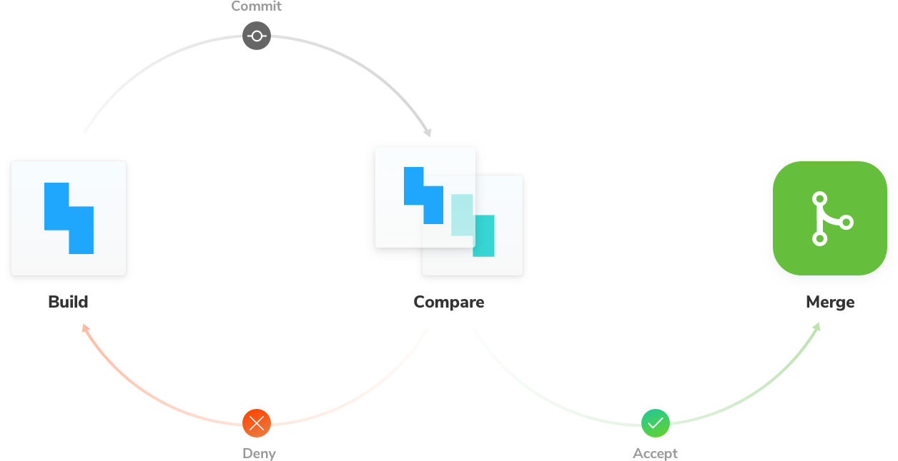

# Setup CI and PR badging

Configure CI to automate Chromatic testing whenever you push code. Badge your PRs to get notified whenever there are visual changes.



---

## Configure CI

Before we begin, make sure you set the `CHROMATIC_APP_CODE` environment variable when you run CI builds in your CI service's configuration.

Integration with popular CI tools is painless. Just run `npm run chromatic` as part of your regular CI process. It will return a non-zero exit code if there are changes to your UI. For example, with [CircleCI's](https://circleci.com) `.circleci/config.yml`, you might have:

```yml
- run:
    command: npm install # install dependencies
- run:
    command: npm lint # lint your code
- run:
    command: npm test # run your unit tests
- run:
    command: npm run chromatic # run your visual tests
```

If any of those steps fails, your CI build will fail.

### Command exit code

If you are using pull request statuses to prompt you to review visual changes, you may not want your CI job to fail if snapshots render without errors (but with changes). To achieve this, pass the flag `--exit-zero-on-changes` to the `chromatic` command, and your CI job will continue in such cases.

### Re-run failed builds after reviewing

Builds that contain visual changes need to be [reviewed](/builds)--if you are not using `--exit-zero-on-changes` they will fail. Once you accept all the changes, re-run the build using your CI tool and the `chromatic` job will pass.

If you deny any change, you will need to make the necessary code changes to fix the test (and thus start a new CI build) to get Chromatic to pass again.

### Maintain a clean "master" branch

A clean `master` branch is a development **best practice** and **highly recommended** for Chromatic. In practice, this means ensuring that test builds in your `master` branch are passing.

If the builds are a result of direct commits to `master`, you will need to accept changes to keep master clean. If they're merged from `feature-branches`, you will need to make sure those branches are passing _before_ you merge into `master`.

**Note:** If you use GitHub's squash/rebase merge functionality, add the `--auto-accept-changes` flag to `chromatic`. This means you won't need to re-review snapshots on `master` if you're already accepted them elsewhere. For example:

```bash
if [ "${CIRCLE_BRANCH}" != "master" ];
then
  yarn chromatic
else
  # We know any changes that make it to master *must* have been approved
  yarn chromatic --auto-accept-changes
fi
```

### Pull Request builds

Several CI systems offer the option of running build on either the commit that was pushed to a branch for a PR, or on a "merge" commit between that branch and the base branch (typically `master`).

As that merge commit does not actually persist in the history of your git repository, running builds on the merge commit can cause Chromatic's baselines to be lost in certain situations. As such we advise not running Chromatic tests on such commits and instead running them on the regular "push" commits. How to do this differs depending on your CI provider:

- For Travis, ensure you run Chromatic on `push` builds. Read more [below](#travis).

- For GitHub Actions, choose the [`push` event](https://help.github.com/en/articles/events-that-trigger-workflows#webhook-events).

- For Jenkins' GitHub PR plugin, choose the [`ghprbPullId` specifier](https://github.com/jenkinsci/ghprb-plugin/blob/master/README.md).

---

### Configuring specific CI services

#### Travis

Travis offers two type of builds for commits on pull requests: so called `pr` and `push` builds. It only makes sense to run Chromatic once per PR, so we suggest disabling Chromatic on `pr` builds for internal PRs (i.e. PRs that aren't from forks). You should make sure that you have `push` builds turned on, and add the following code:

```bash
if [[ $TRAVIS_EVENT_TYPE != 'pull_request' ||  $TRAVIS_PULL_REQUEST_SLUG != $TRAVIS_REPO_SLUG ]];
then
  npm run chromatic
fi
```

For external PRs (PRs from forks of your repo), the above code will ensure Chromatic does run on the `pr` build, because Travis does not trigger `push` builds in such cases.

<div class="aside">
<p><b>Note:</b> We recommend running Chromatic on <code>push</code> builds as <code>pr</code> builds can't always run and fall out of the normal git ancestry. For instance, if you change the base branch of a PR, you may find that you need to re-approve changes as some history may be lost.</p>

<p>Chromatic does work with Travis <code>pr</code> builds however!</p>
</div>

#### GitHub Actions

We have built a GitHub action for you to use: https://github.com/chromaui/action

You can add it to a workflow like so:

```
- uses: chromaui/action@v1
  with:
    token: ${{ secrets.GITHUB_TOKEN }}
    appCode: ${{ secrets.CHROMATIC_APP_CODE }}
```

You'll need to configure secrets in the settings tab at `https://github.com/{YOUR_ORGANSATION}/{YOUR_REPOSITORY}/settings/secrets`

GitHub actions can run based on any github event, but we recommend to run the workflow containing the chromatic step on `push` event. The action will work on `pull-request` events too, although [it comes with some caveats](https://docs.chromaticqa.com/setup_ci#pull-request-builds). All other events will not.

For external PRs (PRs from forks of your repo) to receive the chromatic appCode, you'll have to make the appCode public by placing it in your `package.json`. Alternatively, you could disable Chromatic on external PRs or duplicate external PRs inside your repository.

#### Hiding the persistent CI messages

Chromatic detects CI test runs for most services. But it's not possible for every system, which results in users seeing persistent "Setup CI / Automation" messages in the UI.

If this is happening to you, prepend `CI=true` to your test command like so `CI=true yarn chromatic...` to hide the "Setup CI" messages in Chromatic. [Learn more](/test#available-options)

#### GitHub's squash/rebase merge

GitHub's squash/rebase merge functionality creates new commits that have no association to branch being merged, so it is difficult for Chromatic to know that changes accepted on that branch should now be baselines on `master`.

To resolve this situation we suggest you maintain a clean `master` branch and use `--auto-accept-changes` as [mentioned here](/setup_ci#maintain-a-clean-master-branch)

---

## Pull Request statuses

When a test build runs it will automatically set a status on the current pull request or branch indicating the state of the build. This is supported out of the box for projects that are [linked to a repository](/access) on GitHub, Bitbucket, or GitLab.


If there are errors or changes need to be reviewed, this will be indicated in the service's user interface:


Depending on your policy, you may not want to block the rest of your CI script on the acceptance of visual changes, and simply rely on the above status, in which case you would write `npm run chromatic || true` in your CI build to ensure that CI completes. Learn more about [setting up CI](/setup_ci).

#### PR statuses for other services

Since Chromatic runs on CI, you can write a custom CI script to add statuses in any number of code hosting services.

---

## Next: Learn about UI Review

💬Now that you've set up CI, learn about how to invite other teammates into Chromatic's UI Review workflow to make sure that what gets shipped checks out with all stakeholders.

<a class="btn primary round" href="/ui-review">Read next chapter</a>
