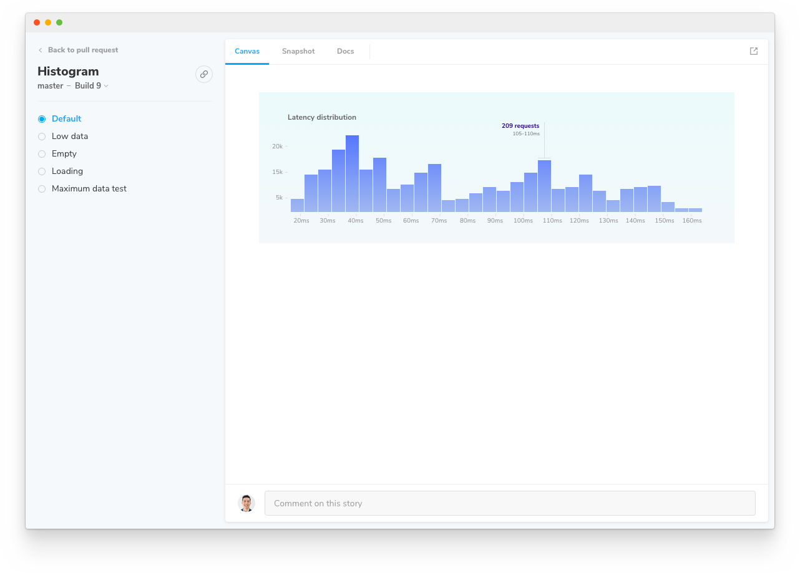

# Snapshots

A snapshot is an image of a story plus some metadata captured by a standardized browser in Chromatic's Capture Cloud infrastructure. Snapshots power [UI Test](test) and [UI Review](review).

Table of contents

- [View snapshots for a story](#view-snapshots-for-a-story)
- [How are snapshots captured?](#how-are-snapshots-captured)
- [Improve snapshot consistency](#improve-snapshot-consistency)
- [Debug snapshot rendering](#debug-snapshot-rendering)
- [Browser differences between snapshots](#browser-differences-between-snapshots)

<div class="aside">

Looking for information on snapshot billing? [Go to usage and billing docs](billing)

</div>

## View snapshots for a story

The component screen allows you to select between the 'Canvas', 'Snapshot', and 'Docs'. Under the Snapshot tab, you'll find the image captured by Chromatic's cloud browser -- this is exactly what the browser 'saw' at the time that it rendered the story. Swap between Snapshot and Canvas tabs to compare image to live implementation.



<div class="aside">Tip: Click the expand icon in the top right to open the story in your published Storybook.</div>

## How are snapshots captured?

Chromatic captures snapshots by following these steps:

<details>
<summary>1. Load each story in the designated <a href="browsers">browser</a> and <a href="viewports">viewport</a></summary>

Capture Cloud navigates to your published Storybook. It loads all stories in parallel at your desired viewport using our fleet of standardized browsers.

</details>

<details>
<summary>2. Wait for the story to render</summary>

Capture Cloud uses underlying browser APIs combined with our own set of heuristics to determine when the component has "loaded". One of the primary heuristics Chromatic uses is network "quiesence" – a period of network inactivity which signals that all resources have loaded. Loading is the closest approximation for when component renders that's currently possible.

</details>

<details>
<summary>3. Take a screenshot and crop it to the dimensions of the UI</summary>

Chromatic crops the screenshot to the size of your component. It determines crop dimensions by measuring the bounding box of the child node of Storybook's `#root` element. For atomic components, cropping eliminates negative spaces around snapshots which makes increases the visual information you have to review. For pages, Chromatic captures the full width and height of the rendered UI.

</details>

<details>
<summary>4. Save snapshot and diff between previous baseline snapshots for a build or branch</summary>

Each snapshot is associated with a story and tagged with commit, branch, and other relevant metadata. Snapshots are stored in Chromatic's cloud. For UI Test and UI Review, snapshots are visually compared (diff) to identify changes. Our infrastructure is effectively capable of snapshotting every story in parallel, no matter how many stories you have.

</details>

## Improve snapshot consistency

It's essential that your components and stories render in a **consistent** fashion to prevent false positives. Below are common reasons stories render inconsistently and ways to improve consistency:

- **Randomness in stories**: Components sometimes use random number generators to generate data for complex inputs. To avoid this, you can hard-code the input data, but often a more convenient solution is to use a tool like [seedrandom](https://github.com/davidbau/seedrandom) which you can use to make your "random" number generator consistent.

- **Use of the current date/time**: Dates and times are a testers bane! To get consistency in components or tests that use the current time, you can use a tool to also "seed" the time, like [timemachine](https://github.com/schickling/timemachine) for the `Date` object.

- **Animations**: Chromatic will attempt to pause all animations. However, you may need to [configure](animations) Chromatic's exact behavior.

- **Unpredictable resource hosts**: Resources that load from unpredictable or flaky sources may not load in time (15s) to capture. Workaround this by serving resources as [static files in Storybook](https://storybook.js.org/configurations/serving-static-files/) or using a [placeholder service](https://placeholder.com/). Learn more about how we [load resources](resource-loading).

- **Iframes rendering out of the viewport**: Some browsers only visually render iframes when they are inside of the viewport, despite the fact that they have loaded with all of their resources. For this reason, if you have an iframe that is placed below the viewport of a tall story, it will appear blank. You may want to [ignore that element](ignoring-elements) and also test it in isolation so that it fits inside of the viewport.

- **Skip stories**: Some stories may render unpredictably intentionally. If this is the case you may want to [ignore the story](ignoring-elements) from testing and move on.

- **Introduce a delay**: As a last resort, you can try adding a [delay](delay). This will delay Chromatic's snapshot for a specified amount of time. The trouble with this technique whilst it may make the problem less common, it may not eliminate the underlying issue in how the UI renders.

If you still need inconsistent elements for local development purposes inside Storybook, you can use `isChromatic()` exported from [our package](isChromatic) to apply the solutions above only when in the Chromatic environment.

## Debug snapshot rendering

<details>
<summary>Where are my images and fonts?</summary>

Image and font rendering can be tricky. Resources that load from unpredictable or flaky sources may not load in time (15s) to capture. Workaround this by:

- Ensure resources load [reliably fast in Chromatic](resource-loading)
- Serve resources as [static files in Storybook](https://storybook.js.org/configurations/serving-static-files/) (this also improves your test speed)
- Using a [placeholder service](https://placeholder.com/).

If your resources are behind a firewall, whitelist our domain so we can load your resources.

</details>

<details>
<summary>Why do my emojis look different in the snapshot versus on my machine?</summary>

Emojis are handled by your operating system's emoji font. Most OSs have a different emoji font and those fonts tend to change over time. For example, if you view a story on a Mac you'll get Apple’s set of emojis.

Chromatic captures Chrome and Firefox snapshots in a Linux environment. It includes a common set of emojis used by most systems. Those emojis will likely look different from emojis on a consumer OS like Mac or Windows. Unfortunately, there's no workaround available at this time.

</details>

<details>
<summary>Where are my videos?</summary>

Videos are interactive and time-based which introduces inconsistencies in snapshots. Chromatic hides videos by default to prevent false positives. You'll see a blank space where the video is supposed to render.

</details>

<details>
<summary>Why am I getting cross-origin errors with my stories?</summary>

Most likely you are calling into `window.parent` somewhere in your code. As we serve your Storybook preview iframe inside our www.chromatic.com domain this leads to a x-origin error as your code doesn't have access to our frame (with good reason!).

Generally speaking it is a good idea to wrap calls like that in a `try { } catch` in case the code is running in a context where that's not possible (e.g Chromatic).

</details>

<details>
<summary>Why is my content being cut off vertically in my snapshots?</summary>

Make sure there are no elements inadvertently cutting off content through the use of overflow or height styles.

For elements that have relative height styles based on the size of the viewport (such as `height: 100vh`), all content nested under that element will show up in a screenshot unless either `overflow: hidden` or `overflow: scroll` is used to hide what is outside of that element (and therefore outside of the viewport).

When Chromatic takes a screenshot for an element that has a viewport-relative height as well as styling to hide/scroll the overflow, a default viewport height of `900px` will be used. This default is only used when we can't detect a "natural" height for the outermost DOM element (root ancestor), for instance, in the case of scrollable divs.

To set the height, you can add a decorator for stories that wraps them in a container with a fixed height:

```js
// MyComponent.stories.js|jsx

import { MyComponent } from './MyComponent';

export default {
  component: MyComponent,
  decorators:  [(Story) => <div style={{ margin: '3em' }}><Story/></div>],
  title: 'Example Story',
};
```

</details>

<details>
<summary>Why are components that render in a portal (tooltip, modal, menu) getting cut off?</summary>

Portals allow components to render arbitrary elements outside of the parent component's initial DOM hierarchy. For example, tooltips, modals, and menus can be triggered by a nested button, but render close to the top of the DOM hierarchy using portals.

Chromatic uses the "natural" height for your component's outermost DOM element (using Storybook's `#root` element) to determine snapshot dimensions. But portals render outside of the Storybook `#root` element. This means that Chromatic can't auto-detect their dimensions when capturing the snapshot. This can result in your snapshot looking "cut off".

Snapshot portaled elements by adding a [decorator](https://storybook.js.org/docs/react/writing-stories/decorators#component-decorators) that wraps stories in a fixed height container. Adjust the height to account for the total dimensions of your component and portal.

```js
// MyComponent.stories.js|jsx

import { MyComponent } from './MyComponent';

export default {
  component: MyComponent,
  decorators:  [(Story) => <div style={{ height: '300px' }}><Story/></div>],
  title: 'Example Story',
};
```

</details>

<details>
<summary>How do I capture content inside scrollable <code>divs</code>?</summary>

Scrollable divs constrain the height of their children. Change the height of the scrollable div to ensure all content fits. It's not possible for Chromatic to infer how tall scrollable divs are intended to be.

</details>

<details>
<summary>Why isn’t my modal or dialog captured?</summary>

If you use an “animateIn” effect set [delay](delay) to ensure we snapshot when the animation completes.

If your component infers its dimensions from the layout of the surrounding DOM elements (e.g., it's a modal that uses `position:fixed`), you'll need to set the height of that component's stories using a decorator.

```js
// MyComponent.stories.js|jsx

import { MyComponent } from './MyComponent';

export default {
  component: MyComponent,
  decorators: [
    storyFn => (
      <div style={{ width: '1200px', height: '800px' }}>
        This is a decorator for modals and such {storyFn()}
      </div>
    ),
  ],
  title: 'Example Story',
};

export const StoryWithDimensions = () => <MyComponent/>
```

</details>

<details>
<summary>What if I have a modal component that doesn't define a width or height?</summary>

If your component infers its dimensions from the layout of the surrounding DOM elements (e.g., it's a modal that uses `position:fixed`), you can set the height of that component's stories using a <a href="https://storybook.js.org/docs/react/writing-stories/decorators#component-decorators">decorator</a>.

```js
// MyComponent.stories.js|jsx

import { MyComponent } from './MyComponent';

export default {
  component: MyComponent,
  decorators: [
    storyFn => (
      <div style={{ width: '1200px', height: '800px' }}>
        This is a decorator for modals and such {storyFn()}
      </div>
    ),
  ],
  title: 'Example Story',
};

const Template = (args) => <MyComponent/>;

export const StoryWithDimensions = Template.bind({});
StoryWithDimensions.args = {};
```

</details>

<details>
<summary>Do you support taking snapshots of a component with multiple themes?</summary>

We recommend you render stories multiple times, one for each theme. Here's [a code snippet](https://github.com/storybookjs/storybook/blob/next/code/examples/official-storybook/preview.js#L108-L172) of how to configure Storybook to show the same story in multiple themes. This is how the snapshots will [appear in Chromatic](https://www.chromatic.com/library?appId=5a375b97f4b14f0020b0cda3&branch=next).

If you'd only like to see multiple themes side-by-side in Chromatic and not in your local Storybook, use [isChromatic()](isChromatic).

</details>

<details>
<summary>Why am I seeing a blank snapshot?</summary>

Blank snapshots are often caused by:

- **An "animateIn" effect**—If your component use an “animateIn” effect [set delay](/docs/delay) to ensure we snapshot when the animation completes.

- **Position:fixed**—Fixed position elements may depend on viewport size but do not have dimensions themselves. Wrap your component in an element whose height and width are defined.

Learn more about [debugging snapshots](/docs/snapshots#troubleshooting).

</details>

<details>
<summary>Why am I getting a failing build when ignoring an element?</summary>

By default, Chromatic's diffing algorithm skips the DOM elements marked with either a `.chromatic-ignore` CSS class or `data-chromatic="ignore"` attribute.

However, if you're using this functionality but notice the incoming changes are still being captured. In that case, you'll need to ensure that both the [baseline](/docs/branching-and-baselines) and new snapshots retain the same dimensions (e.g., width, height, and relative positioning).

</details>

<details>
<summary>Why is my tab component's width rendering inconsistently in snapshots?</summary>

Certain UI libraries like Material calculate the dimensions of each tab by measuring the rendered width of the tab's children using JavaScript (for example, via `getBoundingClientRect()`).

However, this can lead to inconsistent snapshots in cases where you load a custom font. Fonts affect the dimensions of text within tabs. Since custom fonts can load before, during, or after the tab component itself loads, the dimensions calculated by the tab component can also vary.

The solution we recommend is to use a `<link rel="preload">` in your [`.storybook/preview-head.html`](https://storybook.js.org/docs/react/configure/story-rendering#adding-to-head) to preload the font before the story renders. This ensures that the dimensions of the contents inside of the tab component remain consistent when measured.

</details>

## Browser differences between snapshots

Chromatic attempts to render as consistently as possible across our supported browsers. But browsers expose different capabilities which can affect your snapshots. It's normal to have slight differences in snapshots that

Chrome gives us full access to network APIs. That means we can confirm when resources load with greater accuracy. In a nutshell, your snapshots are more consistent. In Chrome, we render your story via a Storybook JS API, and then watch network activity, waiting for quiescence (a period of no network activity) before capturing a snapshot.

Firefox and Internet Explorer have built in APIs to tell when assets are loaded. In practice, these APIs are less nuanced than Chrome which may affect your snapshots. In Firefox and IE11, we browse to a Storybook URL that renders your story, then wait for the browser “load” event in addition to our own heuristics to determine when the story finishes rendering.

The above can behave differently if your page loads resources (such as JS files) via techniques that aren’t picked up by the load event (such as AJAX / background requests).
