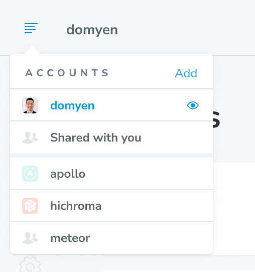

# Access control

Chromatic separates your identity, account settings, and project permissions across three layers: profiles, accounts, and projects.

A profile can access several accounts and projects. Account access and project access are separate. An account collaborator may not have access to every project. A project collaborator may not have access to the account that contains it.

| Chromatic layer | What it represents                                | Git provider equivalent                                                           |
| --------------- | ------------------------------------------------- | --------------------------------------------------------------------------------- |
| **Profile**     | Your identity and sign-in methods                 | A GitHub, GitLab, or Bitbucket account connected to your profile                  |
| **Account**     | The container for billing, settings, and projects | A personal Git account, GitHub organization, GitLab group, or Bitbucket workspace |
| **Project**     | The app or Storybook you test                     | A repository linked to the project                                                |

## Profiles

A profile represents one person in Chromatic. You can sign in through a Git provider, email and password, or [Single Sign-On (SSO)](/docs/access/sso). These are sign-in methods, not separate profile types.

Chromatic creates a personal account when it creates your profile. You can also connect more than one Git provider and access organization accounts or individual projects through the same profile.

### OAuth

Chromatic supports the cloud versions of GitHub, GitLab, and Bitbucket on [self-serve plans](https://www.chromatic.com/pricing). Connecting a Git provider lets Chromatic identify the organizations and repositories available to you.

On-premise GitHub Enterprise Server and self-managed GitLab connections require an Enterprise plan. See [how to link a repository](/docs/faq/link-a-repository) for provider permissions and setup requirements.

- <a id="what-oauth-scopes-does-chromatic-request" href="/docs/faq/link-a-repository#oauth-and-github-app-permissions">What OAuth scopes does Chromatic request?</a>
- <a id="what-do-you-need-to-link-a-project-to-a-git-provider-repository" href="/docs/faq/link-a-repository#before-you-link-a-repository">What do you need to link a project to a Git provider repository?</a>
- <a id="what-permissions-does-the-github-app-request" href="/docs/faq/link-a-repository#oauth-and-github-app-permissions">What permissions does the GitHub App request?</a>
- <a id="does-chromatic-access-my-source-code" href="/docs/faq/link-a-repository#does-chromatic-access-my-source-code">Does Chromatic access my source code?</a>
- <a id="how-do-i-request-access-from-my-github-organization-admin" href="/docs/faq/org-not-appearing#request-oauth-app-approval">How do I request access from my GitHub organization admin?</a>
- <a id="why-extra-repositories-appear-after-i-restrict-the-github-app" href="/docs/faq/org-not-appearing#why-extra-repositories-appear-after-i-restrict-the-github-app">Why do extra repositories appear after I restrict the GitHub App?</a>
- <a id="could-not-retrieve-repository-id-when-adding-a-project" href="/docs/faq/org-not-appearing#could-not-retrieve-repository-id-when-adding-a-project">Could not retrieve repository ID when adding a project</a>
- <a id="does-chromatic-support-custom-github-roles" href="/docs/faq/link-a-repository#does-chromatic-support-custom-github-roles">Does Chromatic support custom GitHub roles?</a>
- <a id="is-my-forked-repository-subject-to-access-restrictions" href="/docs/faq/link-a-repository#can-i-link-a-private-fork">Is my forked repository subject to access restrictions?</a>

If your GitHub organization uses SSO, see <a id="why-am-i-getting-an-error-when-trying-to-access-a-github-sso-project-that-i-see-listed-in-chromatics-project-list" href="https://docs.github.com/en/enterprise-cloud%40latest/authentication/authenticating-with-single-sign-on/authorizing-an-app-for-single-sign-on">GitHub's app authorization instructions for SSO</a>.

### Email

Email and password signs you in without connecting a Git provider. Use this method for unlinked projects or an unlinked organization account.

An email profile can also join individual projects as a [project collaborator](/docs/access/collaborators#external-collaborators). You can later [connect a Git provider to the same profile](/docs/faq/connect-git-user-to-chromatic-user).

<a id="how-do-i-link-a-project-to-a-git-provider-using-my-emailpassword-account" href="/docs/faq/link-a-repository">Learn how to link a repository after connecting your Git provider »</a>

### Single Sign-On (SSO)

SSO is an Enterprise sign-in method enabled on an account. It can be used with linked or unlinked projects, depending on the account's configuration.

[Learn how SSO authentication and provisioning work »](/docs/access/sso)

## Accounts

Accounts contain billing, settings, account collaborators, and projects. Two attributes describe each account:

- **Ownership:** A personal account belongs to one profile and cannot have additional account collaborators. An organization account can have several account collaborators.
- **Git connection:** A Git-linked personal account corresponds to a personal Git account. A Git-linked organization account corresponds to a GitHub organization, GitLab group, or Bitbucket workspace. An unlinked account has no account-level Git connection.

SSO is a capability enabled on an organization account, not a separate account type.

Your [personal account is created with your profile](#profiles). The table below describes personal and organization account configurations.

| Account setup                     | How account access is configured                                                                                                   | Supported project setup                                         |
| --------------------------------- | ---------------------------------------------------------------------------------------------------------------------------------- | --------------------------------------------------------------- |
| **Personal, Git-linked**          | Connect a personal Git provider account to your profile. Your profile has Admin access. You cannot add account collaborators.      | Linked projects from personal repositories or unlinked projects |
| **Personal, unlinked**            | Sign up with email and password. Your profile has Admin access. You cannot add account collaborators.                              | Unlinked projects                                               |
| **Organization, Git-linked**      | Add a Git organization or link one of its repositories. Chromatic syncs its members as account collaborators with the Member role. | Linked projects                                                 |
| **Organization, unlinked**        | [Ask Support to create the account](mailto:support@chromatic.com). Support manages account access for email and password profiles. | Unlinked projects                                               |
| **Organization with SSO enabled** | Chromatic configures SSO on an Enterprise account. Your identity provider manages account access.                                  | Linked or unlinked projects, based on the SSO configuration     |

Personal accounts cannot have additional account collaborators. Their one account collaborator has the Admin role. If colleagues need to manage billing or add projects, use an organization account or share individual projects with them.

Open the account menu to switch accounts or add one.

### Git-linked accounts

Connecting a Git provider to your profile creates a Git-linked personal account. Adding a Git organization, group, or workspace creates the matching organization account.

Git-linked organization accounts mirror account access from the Git provider. A linked project belongs to the account that matches its repository owner. Linking an existing project can therefore move it to another account.

A Git provider account can connect to only one Chromatic profile. If the connection already exists, see [why a Git account can be connected to another profile](/docs/faq/failed-to-login).

### Unlinked accounts

An unlinked personal account is created when you sign up with email and password. It can contain unlinked projects.

Unlinked organization accounts let several people manage unlinked projects without sharing credentials. They are not self-serve. [Contact Support](mailto:support@chromatic.com) to create one.

If one team needs linked and unlinked projects, use separate accounts. Keep linked projects in the Git-linked account and unlinked projects in an unlinked organization account.

## Projects

Projects contain builds, tests, reviews, project settings, and project collaborators. Projects are either linked or unlinked.

Every project needs at least one Owner and can have several. Project ownership does not grant access to the account that contains the project.

### Linked projects

A linked project is connected to a GitHub, GitLab, or Bitbucket repository. Chromatic can [sync project collaborators](/docs/access/collaborators#repository-synced-collaborators), retrieve pull request or merge request metadata, add [pull request checks](/docs/ci#pull-request-checks), and create [automatic UI Reviews](/docs/faq/automate-ui-reviews).

See [Storybook visibility](/docs/access/collaborators#storybook-visibility) for how repository visibility affects access to your published Storybook.

Git-linked organization accounts can add only linked projects. To move a linked project to another Git organization or an account with SSO enabled, unlink its repository first.

[Learn how to link a repository and maintain its connection »](/docs/faq/link-a-repository)

- <a id="why-is-my-linked-project-showing-up-as-unknown" href="/docs/faq/link-a-repository#repair-a-repository-connection">Repair an unknown repository connection</a>
- <a id="my-token-is-missing-or-invalid" href="/docs/faq/link-a-repository#repair-a-repository-connection">Replace a missing or invalid repository token</a>
- <a id="using-a-service-user-for-tokens" href="/docs/faq/link-a-repository#use-a-service-user-for-repository-tokens">Use a service user for repository tokens</a>
- <a id="why-am-i-getting-could-not-retrieve-repository-id-error-when-trying-to-link-a-repository" href="/docs/faq/org-not-appearing#request-oauth-app-approval">Check GitHub organization approval for a repository ID error</a>
- <a id="how-do-i-migrate-from-one-git-provider-to-another-eg-gitlab--github" href="/docs/faq/link-a-repository#move-projects-to-another-git-provider">Move projects to another Git provider</a>

### Unlinked projects

An unlinked project uses Git but has no repository connection in Chromatic. Use one when your repository is self-hosted or uses a provider that Chromatic does not support directly.

You manage [project collaborators](/docs/access/collaborators#external-collaborators), [pull request checks](/docs/ci#pull-request-checks), and [webhooks](/docs/custom-webhooks#how-to-integrate-custom-webhooks) manually. Unlinked projects use [manual UI Reviews](/docs/manual-ui-review) because Chromatic cannot create a review from a pull request or merge request without a repository connection.

Unlinked accounts can add only unlinked projects. A Git-linked personal account can also contain unlinked projects.

<a id="how-do-i-create-an-unlinked-project-on-my-existing-github-bitbucket-or-gitlab-account" href="/docs/faq/chromatic-sso-on-premises-other-git">Learn how to set up an unlinked project »</a>

## Manage access

- [Manage account and project collaborators and roles »](/docs/access/collaborators)
- [Configure Single Sign-On and SCIM provisioning »](/docs/access/sso)
- [Assign SCIM-synced Teams to projects »](/docs/access/teams)
