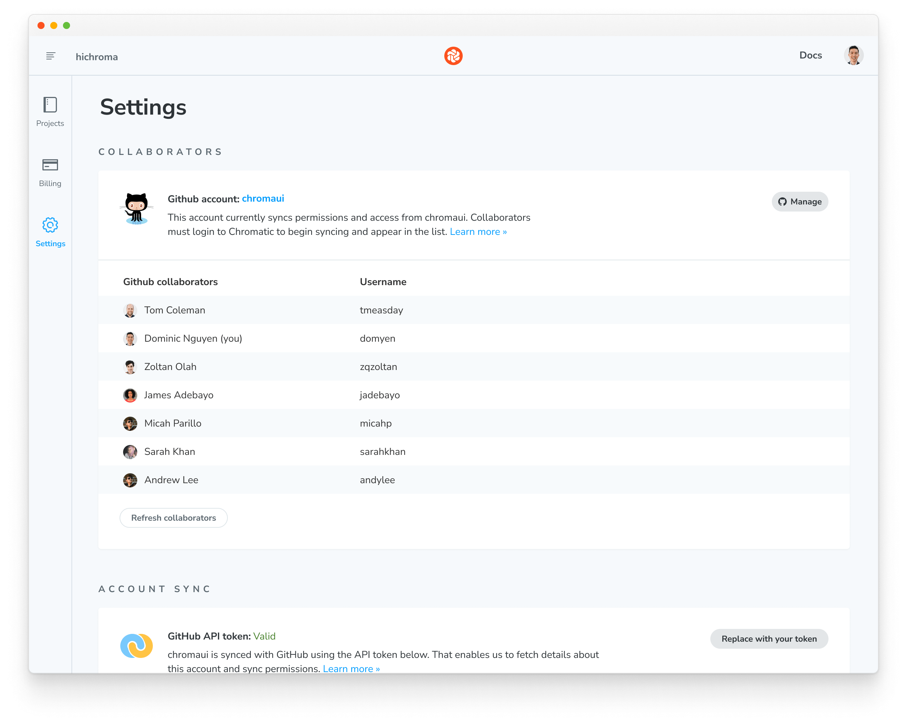
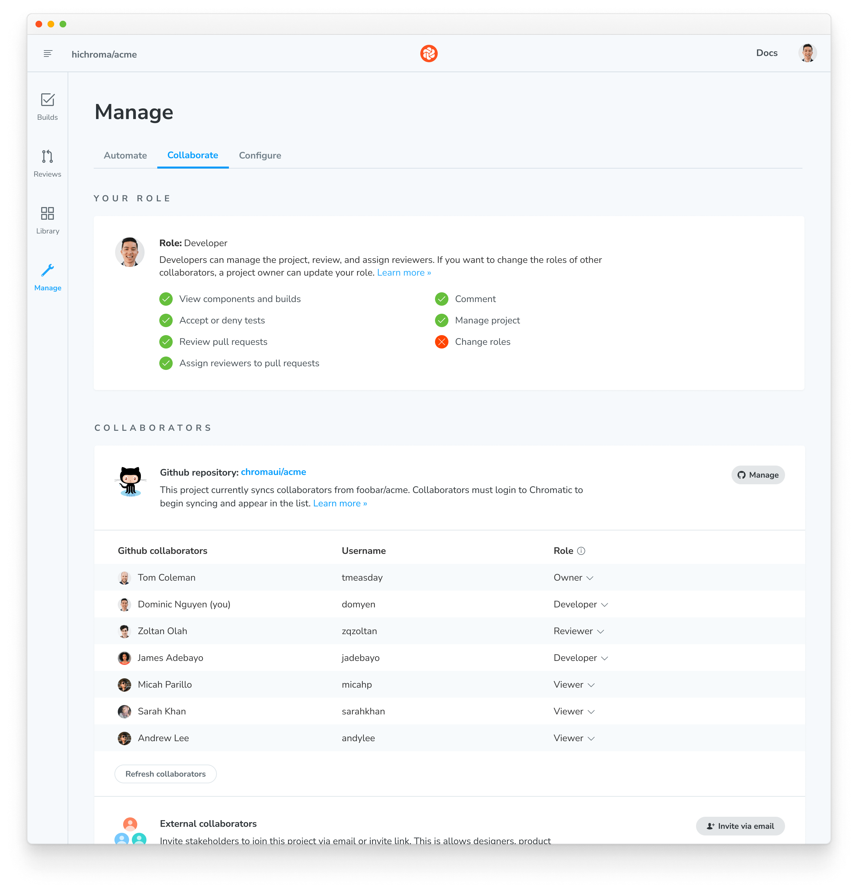
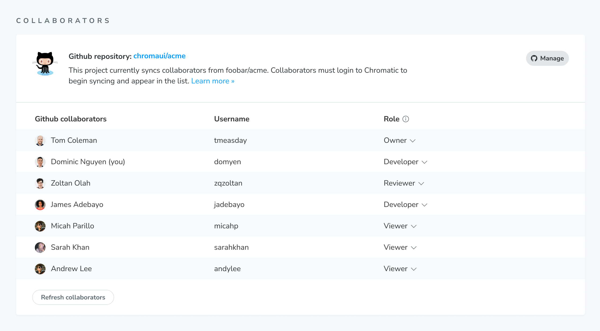
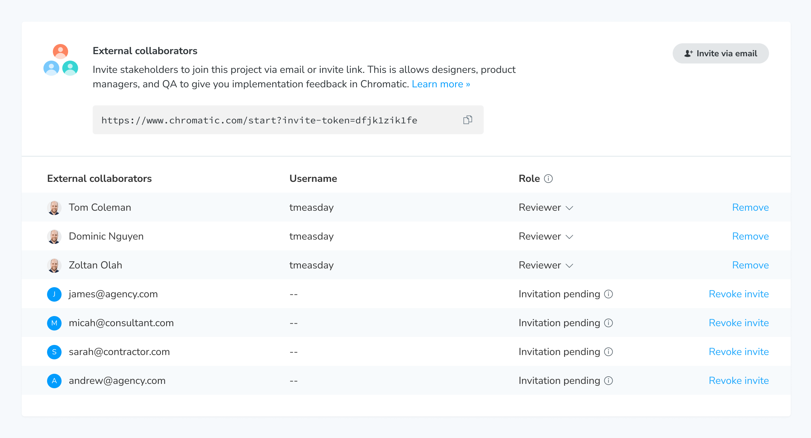
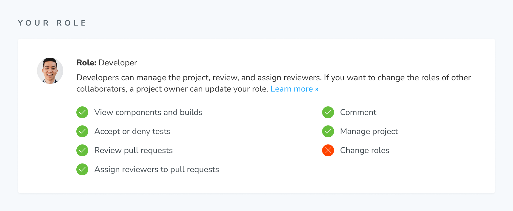
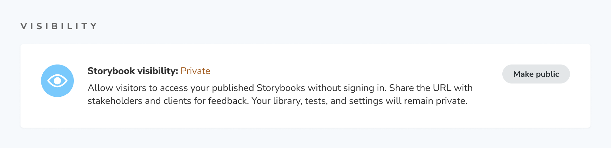

# Collaborators

Chromatic keeps track of UI feedback and tests in one place so that collaborators stays aligned without you having to do extra work.

## Permission layers

Chromatic has two separate permission layers, [organizations](#organization-collaborators) and [projects](#project-collaborators).

**Organization** roles govern account settings such as billing, and adding projects. Unless your organization uses [Teams](/docs/access/teams) on the Enterprise plan, `member` is the only organization role there is.

**Project** roles govern what you can do inside a given project — reviewing, approving, managing settings, and deleting. Project roles are Owner, Developer, Reviewer, and Viewer, and they're set per project, so you may hold different roles on different projects.

If you're looking for a permission you don't have, it's almost always a project role you need, not an organization one. See [Roles](#roles) for what each role covers.

## Organization collaborators

Manage organization collaborators via OAuth, email, or [SSO](/docs/access/sso).

#### OAuth

Chromatic mirrors access permissions with your GitHub Organization, Bitbucket Group, or GitLab Team. Users who have access to your organization will also have access to your Chromatic organization.

| Permission level       | What collaborators can do                    |
| ---------------------- | -------------------------------------------- |
| Organization: `member` | View / change account settings, add projects |

Unless your organization uses [Teams](/docs/access/teams) on the Enterprise plan, `member` is the only organization role — see [Roles](#roles) for how it sits alongside the project roles.

Organization collaborators can manage billing and account status but may not have access to projects. You need to be a [project collaborator](#project-collaborators) to view and manage projects.

Go to your organization's Settings page to view collaborators.

> Not seeing your organization when you try to add it? See [Why doesn't my organization appear when I try to add it or link a project?](/docs/faq/org-not-appearing)

#### Email

Email and password accounts don't have the concept of organization-level collaborators. If you want other teammates to access an account, you'll need to sync the account with a [Git provider](#organization-collaborators) or share login credentials (for example, via a password manager).

However, projects _within_ an organization do support [project-level collaborators](#project-collaborators).

#### Single Sign-On (SSO) for organizations

Single Sign-On (SSO) is available to enterprise customers. Learn more [here](/docs/access/sso).

### Billing and usage

Collaborate on billing, usage, and permissions by syncing your organization with GitHub, Bitbucket, or GitLab.

For email and password accounts, the user who created the account is the only one who can sign in to manage billing. To give a teammate billing access, see below. For SSO accounts, contact your company's SSO administrator to manage billing.

How can I give someone billing access?

If you have an unlinked organization account and need access to billing, please email us at **support@chromatic.com** with your email address.

**Note:**

- Billing users cannot be added to Git-linked accounts. Linked accounts rely on the connected Git provider to manage permissions. Users would need org-level permissions granted within the git provider to access billing.
- Git-linked users cannot be set as Billing users for unlinked accounts. Git-linked user permissions depend on git providers.

## Project collaborators

#### OAuth

Chromatic syncs access permissions with your GitHub, Bitbucket, or GitLab repository. Users who have access to your code will also have access to your project.

| Permission level | What collaborators can do                                             |
| ---------------- | --------------------------------------------------------------------- |
| Repo: `read`     | View project, auto-assigned the [Viewer](#roles) role                 |
| Repo: `write`    | Review and manage project, auto-assigned the [Developer](#roles) role |

If your project is hosted in Bitbucket, ensure that you and your team members have the <code>contributor</code> role.

Project collaborators can view and manage the project based on their [role](#roles). Go to your project's Manage page to view collaborators and assign roles.

You can add or remove a collaborator by adjusting their access in your Git repository. The permission changes in your upstream repository are mirrored downstream in Chromatic.

Manually override the mirrored permissions by adjusting collaborator [roles](#roles) or [inviting external collaborators](#external-collaborators) on an ad hoc basis.

#### Email

If you signed up via email and password, Chromatic won't have a Git repo to sync with. You'll need to manage project collaborators manually via external collaborators [below](#external-collaborators).

#### Single Sign-On (SSO) for projects

Chromatic syncs access permissions with your SSO provider. Learn more [here](/docs/access/sso).

### External collaborators

Projects can also have external collaborators. These are stakeholders like PMs, designers, and consultants who don't commit code but contribute to the sign off process. They can also be fellow developers who don't have repo access or use a different Git provider.

External collaborators are added and removed manually. Once they create an account, they'll get access to your project. There are two ways to add collaborators:

- Invite link: Share a URL with stakeholders. They are auto-assigned a `developer` role.
- Invite email: Send individual invites via email. You can fine tune roles before sending.

#### Limitations of external collaborator accounts

External collaborator accounts cannot link the project to a repository on GitHub, Bitbucket, or GitLab.

### Roles

Roles give you fine-grained control over who can do what. They belong to one of the two [permission layers](#permission-layers): the organization role and the four project roles.

Each project has a unique set of roles that are managed by the project owner. For example, you can be a "developer" in one project and a "viewer" in another.

| Role                | Layer        | What you can do                                                                                                |
| ------------------- | ------------ | -------------------------------------------------------------------------------------------------------------- |
| Member              | Organization | View / change account settings and add projects. Doesn't grant access to any project's contents.               |
| Owner               | Project      | Can manage, delete the project, and manage/assign roles to collaborators.                                      |
| Developer (default) | Project      | Can manage the project, review tests, approve PRs, and assign reviewers. Cannot assign roles to collaborators. |
| Reviewer            | Project      | Can leave comments, review tests, and approve PRs they're assigned to. Cannot assign others or self-approve.   |
| Viewer              | Project      | Read-only access to the project.                                                                               |

On the Enterprise plan with SSO and directory sync (SCIM), additional organization roles are available. See [Teams](/docs/access/teams#organization-roles) for the full list and what each one covers.

#### Project ownership

Projects must have at least one owner. The `owner` role is automatically assigned to the first user in a Chromatic project.

Transfer ownership by assigning another collaborator as an owner and then reassigning yourself another role.

This transfers a single project. Chromatic accounts have no owner role — see [how do I transfer account ownership to another user?](/docs/faq/transfer-ownership/)

#### View your role

Go to your project's Manage page to view your role and it's capabilities.

#### Roles for open source projects

Open source projects are viewable to all users even if they're not listed as a collaborator or have a Chromatic account. But in order to manage or review the open source project, collaborators must have explicit access and the corresponding role.

### Visibility

By default, published Storybooks on Chromatic are private. They can only be accessed by collaborators who are signed in to Chromatic and have permission to view components and builds.

However, published Storybooks for [linked projects](/docs/access#linked-projects) with public repositories will be set to public.

When you set Storybook visibility to public, it will be accessible to visitors without signing in. Anyone with a link can access. Your private information like Chromatic library, tests, settings, Git provider, and any associated metadata will remain private. A public Storybook only shares information that is contained in that Storybook.

---

### Troubleshooting

Why does my role say Member?

Member is your **organization** role, not your project role. Outside the Enterprise plan it's the only organization role there is, so seeing it doesn't mean you've been downgraded or assigned the wrong thing.

What you can do inside a project — reviewing, approving, changing settings, deleting the project — comes from your **project** role instead: Owner, Developer, Reviewer, or Viewer. Go to the project's Manage page to see which one you hold. If you need a permission you don't have, ask a project Owner to change your project role.

See [Permission layers](#permission-layers) for how the two fit together.

Why can't my teammates access a project?

Chromatic syncs permissions at the account _and_ repo level. Check that your teammates are listed as collaborators in your GitHub, GitLab, or Bitbucket repository.

If they aren't listed, please add them and try accessing the Chromatic project again (you may have to sign in again). Learn more about [access control](/docs/access).

