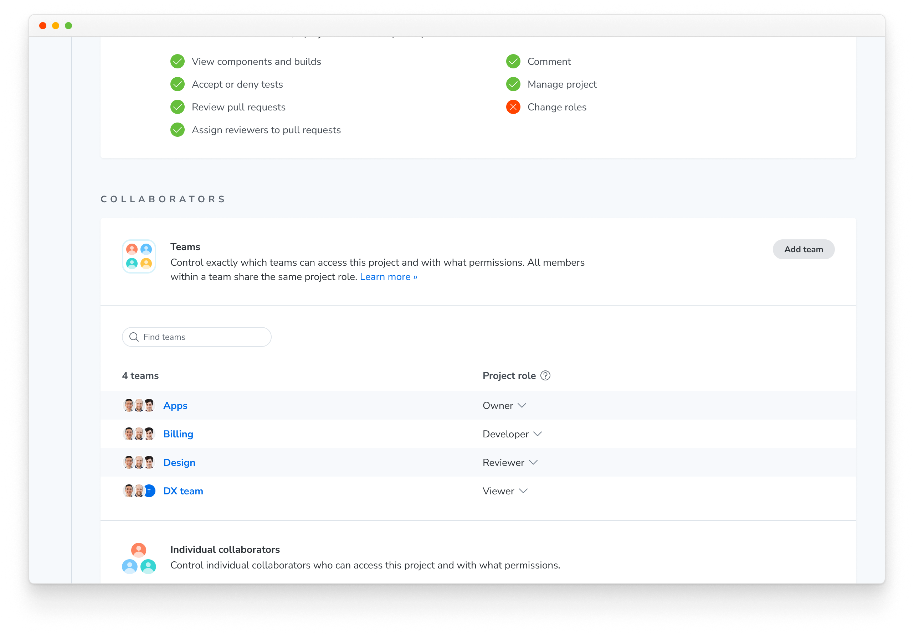
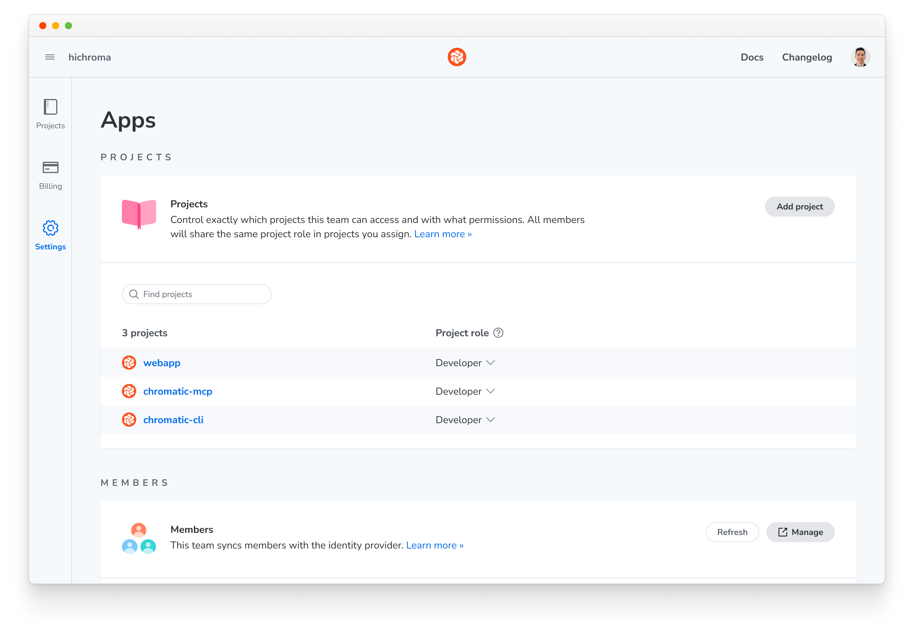

# Teams

Teams are available to organizations on the [Enterprise plan](/pricing). They let you control which users can access which projects in your Chromatic organization. Instead of assigning individuals to projects one by one, you assign groups synced from your identity provider (e.g., "Engineering" or "QA") to projects, while membership is managed centrally in your identity provider.

ℹ️ Teams are enabled by Chromatic as part of your SSO and directory sync setup. If you already use directory sync and want to add Teams, contact us via in-app chat or email [support@chromatic.com](mailto:support@chromatic.com?Subject=Enable%20Teams) **before pushing any new groups**, see [setup order](#set-up-teams).

## How it works

An **organization** is the top-level container in Chromatic that holds:

- **Member:** user who belongs to the organization, each with an organization-level role.
- **Project:** app being tested.
- **Team:** group of users synced from a directory group in your identity provider (IdP). Teams are the primary mechanism for granting groups of users access to groups of projects.

Two separate things sync from your directory, and they need separate groups:

- **Organization roles** control account-level access (settings, billing, creating projects). Directory groups map to the [organization roles](#organization-roles) below.
- **Teams** control project-level access. Every other directory group you push becomes a team, which you then assign to projects with a [project role](#project-roles).

Keeping the two sets of groups separate keeps the mapping clean, for example, `chromatic-admin` for roles, then `design` and `platform` for teams.

## Set up teams

Teams require [SSO with directory sync (SCIM)](/docs/access/sso). Each team in Chromatic corresponds to a directory group in your IdP, such as Okta. Teams are provisioned automatically from the groups your IdP pushes via SCIM; they cannot be created or edited manually in Chromatic.

### 1. Complete SSO and directory sync

Set up [SAML SSO and SCIM directory sync](/docs/access/sso) with your IdP. Chromatic enables Teams for your organization as part of this process.

Before going further, confirm the `userName` attribute your IdP sends over SCIM is each user's email address. If it's set to an internal ID, every sync creates duplicate users. In Okta this is **Sign On » Application username format: Email** and **Provisioning » To App » userName → user.email**.

Check for Terraform or other IaC that may override these settings.

### 2. Create organization role groups

Create one directory group per [organization role](#organization-roles) you need (e.g., `chromatic-admin`, `chromatic-billing`). Push them to Chromatic.

Dedicated role groups are recommended, but not required. A group used for an organization role can also be assigned to projects as a team. Dedicated groups mean you can add new teams without changing the role mapping.

At least one group must map to **Admin**. Only Admins can assign teams to projects.

### 3. Tell Chromatic your defaults

Send us three things via in-app chat or [support@chromatic.com](mailto:support@chromatic.com?Subject=Teams%20configuration). We configure them for you and confirm before they take effect.

1. **Group-to-role mapping:** which directory group maps to which organization role.
2. **Default organization role:** the role for anyone not in a mapped group. See [default roles](#default-roles).
3. **Default project role:** the minimum role every member has on every project. See [default roles](#default-roles).

### 4. Push your team groups

Push the directory groups you want to use as teams. Each one appears as a team in Chromatic within moments.

When a directory group is synced via SCIM:

- The team and its name are defined by the group in your IdP.
- Membership is controlled by the IdP and is read-only in Chromatic. When a user is added to or removed from the group in your IdP, they are automatically added to or removed from the team in Chromatic.
- A directory group maps to a single team, and a team maps to a single directory group.

### 5. Assign teams to projects

Team-to-project assignments are managed in Chromatic. Admins can assign a team to one or more projects and choose a [project role](#project-roles) for each assignment.

1. Go to the project's **Manage page » Collaborate tab**.
2. Under **Teams**, click **Add team**, select the team, and choose a role.

### 6. Verify and clean up

Confirm teams appear in the project's Collaborate tab and that members see the projects they expect. Then remove any individual collaborator grants that teams now cover.

## Roles and permissions

A team is assigned to one or more projects with a specific [project role](#project-roles). Any user who is a member of that team automatically gets that role on those projects.

### How a user's effective project role is resolved

A user can receive project access from multiple sources. The **highest role** always wins.

1. **Organization Admin:** Admins have implicit Owner access on all projects.
2. **Direct project assignment:** A role assigned to the user on the specific project.
3. **Team membership:** The role granted by any team the user belongs to that is assigned to the project. If the user is in multiple teams with different roles on the same project, the highest applies.
4. **Base project role:** The minimum role every organization member has on every project. Because it participates in highest-wins resolution, it can raise a user above what their teams grant.

Roles can only be elevated through this process, never reduced. For example, if a user's direct assignment grants `developer` and a team assignment grants `owner`, the user receives `owner`.

### Organization roles

Organization roles control what a member can do at the org level. A user in more than one mapped group receives the highest role.

| Role        | What they can do                                                                                                                                                                                                                                                          |
| ----------- | ------------------------------------------------------------------------------------------------------------------------------------------------------------------------------------------------------------------------------------------------------------------------- |
| **Admin**   | Full access to all settings, billing, SSO/SCIM configuration, team-to-project assignments, and all projects (implicit Owner on every project). Can manage members. Every organization must have at least one member with the Admin role. Keep this group small.           |
| **Billing** | Full access to billing management (invoices, payment methods, subscription). Intended for finance team members who manage payments but do not need full administrative access. Can create projects. Project access is determined by team membership or direct assignment. |
| **Member**  | Standard membership. Can view organization details and member list. Can create projects. Project access is determined by team membership or direct assignment.                                                                                                            |
| **Viewer**  | Read-only at the organization level. Can view organization details and the member list, but cannot change account settings, manage billing, or add projects. Project access is determined by team membership or direct assignment.                                        |

### Project roles

Project roles determine what a member can do within a specific project.

| Role          | What they can do                                                                       |
| ------------- | -------------------------------------------------------------------------------------- |
| **Owner**     | Full project access: settings, token management, collaborator management, Git linking. |
| **Developer** | Run builds, approve/reject changes in UI Review, manage baselines.                     |
| **Reviewer**  | Approve/reject changes in UI Review. Cannot run builds.                                |
| **Viewer**    | Read-only access to builds, stories, and review status.                                |
| **None**      | No access. The project is not visible to the user.                                     |

### Default roles

Two defaults cover users and projects that mappings don't explicitly address. Both are configured by Chromatic on request (see [step 3](#3-tell-chromatic-your-defaults)).

**Default organization role** applies only to users who aren't in any mapped organization role group. It never overrides a mapped role. If it isn't set, unmapped users become **Members**, which allows them to create projects. Most organizations choose **Viewer** so that only users in mapped groups can create projects.

**Default project role** is the minimum role every organization member has on every project. It's required for team-based access to take effect. Options are Viewer, Reviewer, Developer, or None.

## What SCIM manages vs. what you manage manually

There is a clear boundary between what your IdP automates via SCIM and what you set manually in Chromatic.

| Managed via SCIM                            | Configured by Chromatic on request | Managed manually in Chromatic         |
| ------------------------------------------- | ---------------------------------- | ------------------------------------- |
| Organization membership (who is in the org) | Group-to-organization-role mapping | Team-to-project assignments and roles |
| Organization roles (Admin, Member, etc.)    | Default organization role          | Direct project member assignments     |
| Team creation and naming                    | Default project role               |                                       |
| Team membership                             |                                    |                                       |

Synced roles and memberships overwrite manual edits in Chromatic. Make role and team changes in your IdP.

## Migrating from group-to-project-role mapping

If you set up directory sync before Teams was available, your directory groups may map directly to project roles. Teams replaces that mapping.

- Setting a default project role opts your organization into Teams. Project memberships created by the old mapping are removed, and old group-to-project-role mappings stop having any effect.
- **Migrate fully or not at all.** Your IdP sends one role per user. A user who is in both an organization role group and a legacy project role group will not receive their organization role. Don't run both models at once.
- Staying on the old mapping is supported, just don't set a default project role.

To migrate, contact us and follow the [setup steps](#set-up-teams) from step 2. We remove the legacy project memberships once your teams are confirmed.

## Troubleshooting

**Teams don't appear after pushing groups.** Contact us. If groups were pushed before Teams was enabled, we can import them from your directory, you don't need to re-push.

**A team is assigned to a project but nobody's access changed.** The default project role hasn't been set yet. Contact us.

**Duplicate users, or someone in the Admin group isn't an Admin.** The `userName` your IdP sends over SCIM isn't the user's email (see [step 1](#1-complete-sso-and-directory-sync)). Fix the mapping in your IdP, re-push profiles, and contact us to clean up duplicates.
