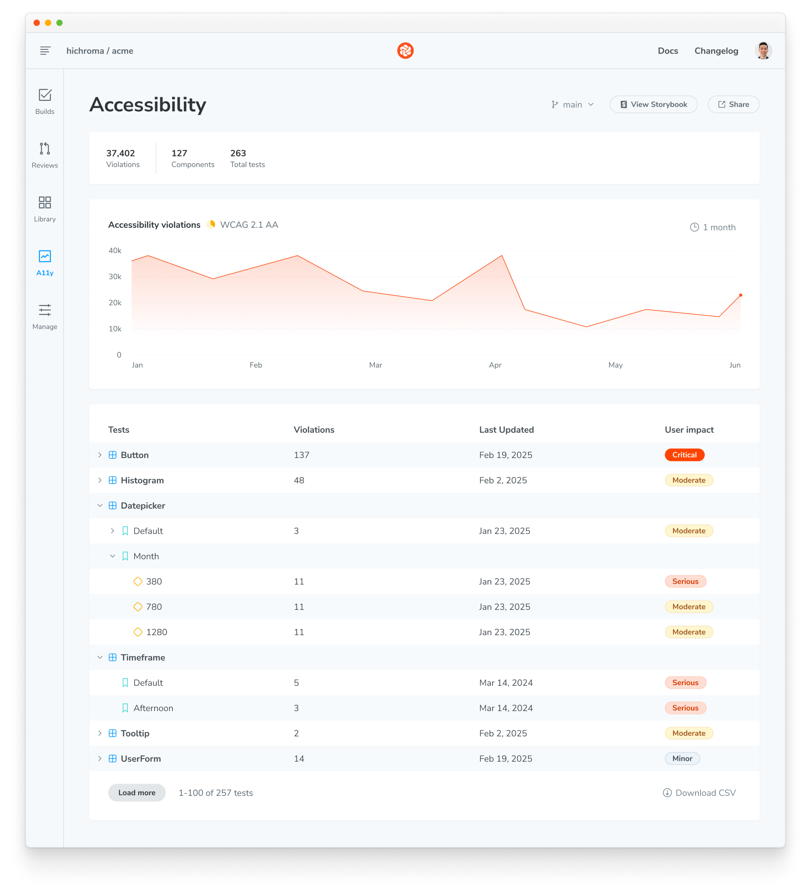

import A11yBeta from "../../components/A11yBeta.astro";

# Accessibility dashboard

<A11yBeta />

The Accessibility dashboard offers a comprehensive overview of accessibility issues in your components. Chromatic continuously monitors accessibility violations, enabling you to track compliance trends and prioritize remediation efforts effectively.

## Real-time tracking and historical insights

Chromatic samples accessibility violations daily and reports on key metrics including total violations, components tested, and total test count. The trend visualization shows how your project's accessibility compliance evolves over time, helping you measure the impact of remediation efforts and identify patterns in violation occurrences.

## Component-level analysis

The data table ranks components by violation count in descending order, immediately highlighting areas requiring urgent attention. Each component displays its violation count with severity classification and last update timestamp. This systematic approach enables teams to address accessibility debt by focusing resources on components with the highest user impact first.

## Export reports

Download a CSV file containing all accessibility violations, associated components, and story details. This report streamlines compliance documentation and supports regulatory requirements such as Voluntary Product Accessibility Template (VPAT) submissions.

## Plan-based limits

Chromatic provides seven days of data history with access limited to the default branch.

Default branch is set as the `main` branch of your project. If there is no `main` branch, Chromatic will fall back to one of `master`, `develop`, `dev` or `rc`.

Enterprise plans can upgrade to the _accessibility package_ for volume pricing, and full historical data, and multi-branch tracking in the dashboard. Contact our [sales team](https://www.chromatic.com/sales) to learn more.
