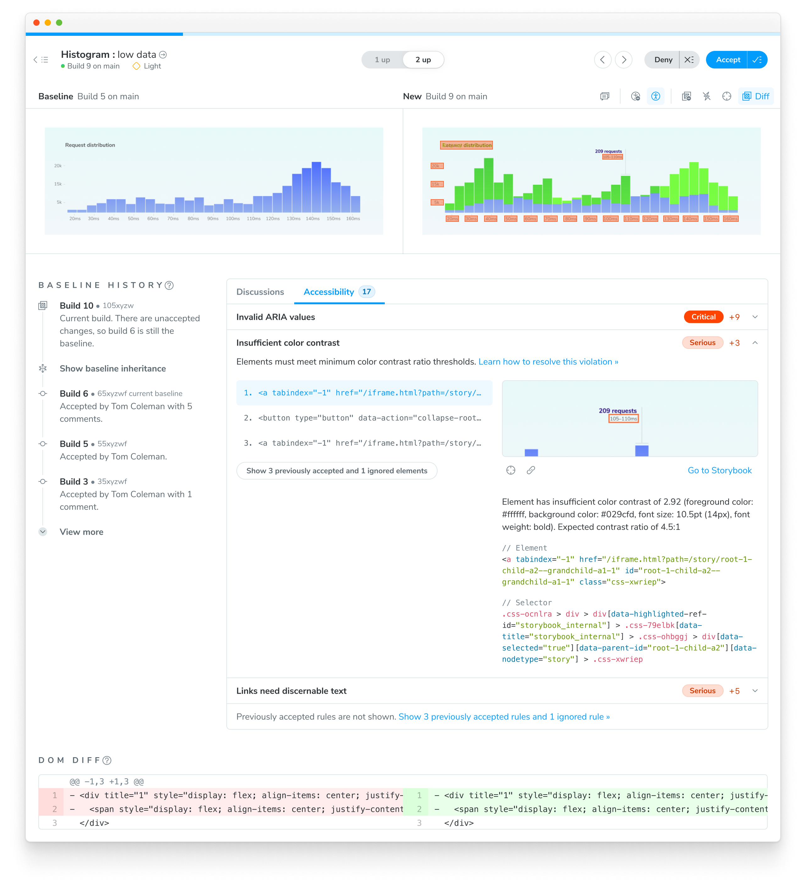

import InstallSnippets from "../../components/InstallSnippets.astro";

# Set up and run accessibility tests

This guide will walk you through setting up and using Chromatic's accessibility testing in your workflow. To get started, you need to have Chromatic set up for your Storybook project. If you haven't done this yet, follow the [quickstart guide](/docs/quickstart) to get started. And ensure that you are using Storybook version 6.5+ and have [Accessibility addon](https://storybook.js.org/docs/writing-tests/accessibility-testing) installed and enabled.

## 1. Enable Accessibility Tests

Enable Accessibility Tests from your project’s manage page.


## 2. Run a build to establish baselines

Once enabled, run a build on your branch of choice to establish accessibility [baselines](/docs/accessibility#what-is-an-accessibility-baseline). Use either the CLI or your existing [CI setup](/docs/ci) to run the build.

{/* prettier-ignore-start */}

<InstallSnippets>
  <Fragment slot="npm">
  ```shell
  $ npx chromatic --project-token <YOUR_PROJECT_TOKEN>
  ```
  </Fragment>
  <Fragment slot="yarn">
  ```shell
  $ yarn dlx chromatic --project-token <YOUR_PROJECT_TOKEN>
  ```
  </Fragment>
  <Fragment slot="pnpm">
  ```shell
  $ pnpm dlx chromatic --project-token <YOUR_PROJECT_TOKEN>
  ```
  </Fragment>
</InstallSnippets>

{/* prettier-ignore-end */}

During the initial run, any accessibility violations detected are automatically added to the baseline. This is the starting point, you'll address issues and catch new regressions in future builds.


## 3. View changes between builds

On subsequent builds, Chromatic compares new snapshots to existing baselines from previous builds. Try modifying the code to introduce new accessibility violations or fix an existing one and running another build.

The list of changes is shown on the build page in the Chromatic web app. The build will be marked “unreviewed” and the changes will be listed in the “Tests” table.


## 4. Debug accessibility issues

With each build, Chromatic identifies any changes in accessibility violations related to a story. However, it's up to you to verify if those changes are intentional or if they represent regressions that need to be fixed. Click on a test to view the details.



Problematic DOM nodes are highlighted directly in the component snapshot. Click them to open a tooltip with additional context.


You can also scroll down to the accessibility tab for more information on each specific violation. From there, you can **inspect violations with detailed descriptions** and suggested fixes.


### Collaborate with teammates

Click on **Go to Storybook** to navigate to the published Storybook in your own browser to debug with devtools. Share **permalinks** to specific violations to collaborate on a fix.

## 5. Verify changes

Go through each snapshot to review the diff and approve or reject the change.

**Unexpected violations** must be fixed before merging. These are regressions you didn't intend to introduce.

**Expected violations** might seem counterintuitive, but they are common during incremental improvements. For example, you might restructure a component in a way that temporarily introduces new violations as part of a larger accessibility or feature overhaul. In these cases, you can accept these violations into your baseline because they represent an intermediate step toward a complete fix.

By accepting expected violations into the baseline, you establish a new reference point for future comparisons.

### Fixes are automatically accepted

Only new or changed violations need to be reviewed. If a build has no new accessibility violations but you resolve several existing issues, that build will pass, baselines will update, and no review will be required.

### Accessibility-only changes

Some commits may add accessibility violations that have no associated visual changes. For example, _"missing a label on an input field"_ or _"missing an alt tag for an image"_. In such cases, you'll just see the latest snapshot with the problematic DOM nodes highlighted.


### Non-visual violations

Some accessibility violations do not have a visible DOM node associated with them. For example, _"Ensure every HTML document has a lang attribute"_ or _"Ensure `<meta name="viewport">` does not disable text scaling and zooming"_. In such cases, there will be no visual preview of the violation.


## 6. PR check for interaction tests


If you have already integrated Chromatic in your CI setup, no changes are needed for accessibility tests to work. Otherwise, [integrate Chromatic into your CI pipeline](/docs/ci) to automatically run accessibility tests on every pull request. If new violations are detected, the PR will be marked as "unreviewed" until you review, accept, or fix them.
