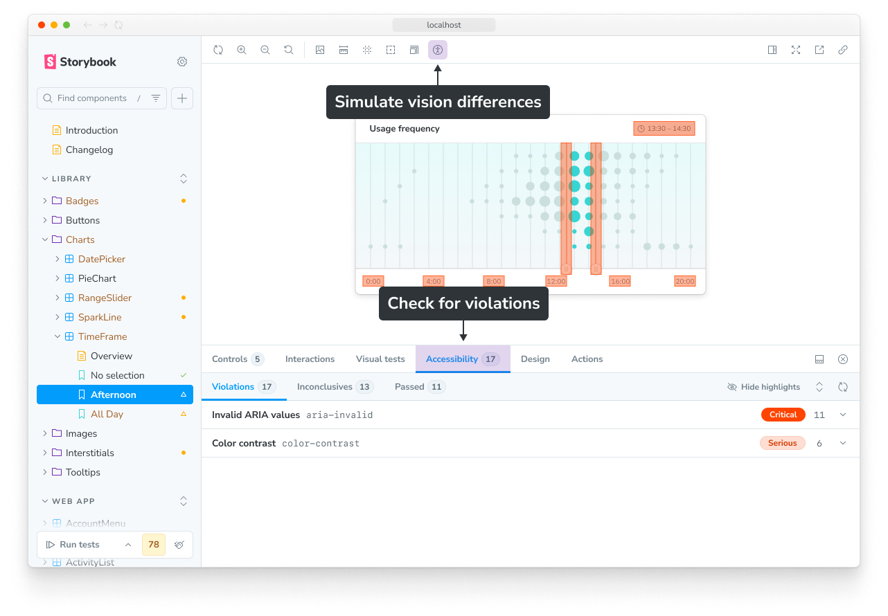
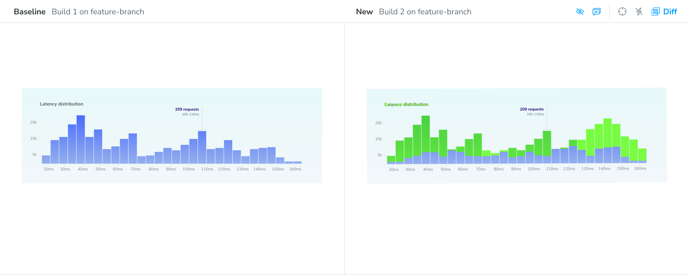
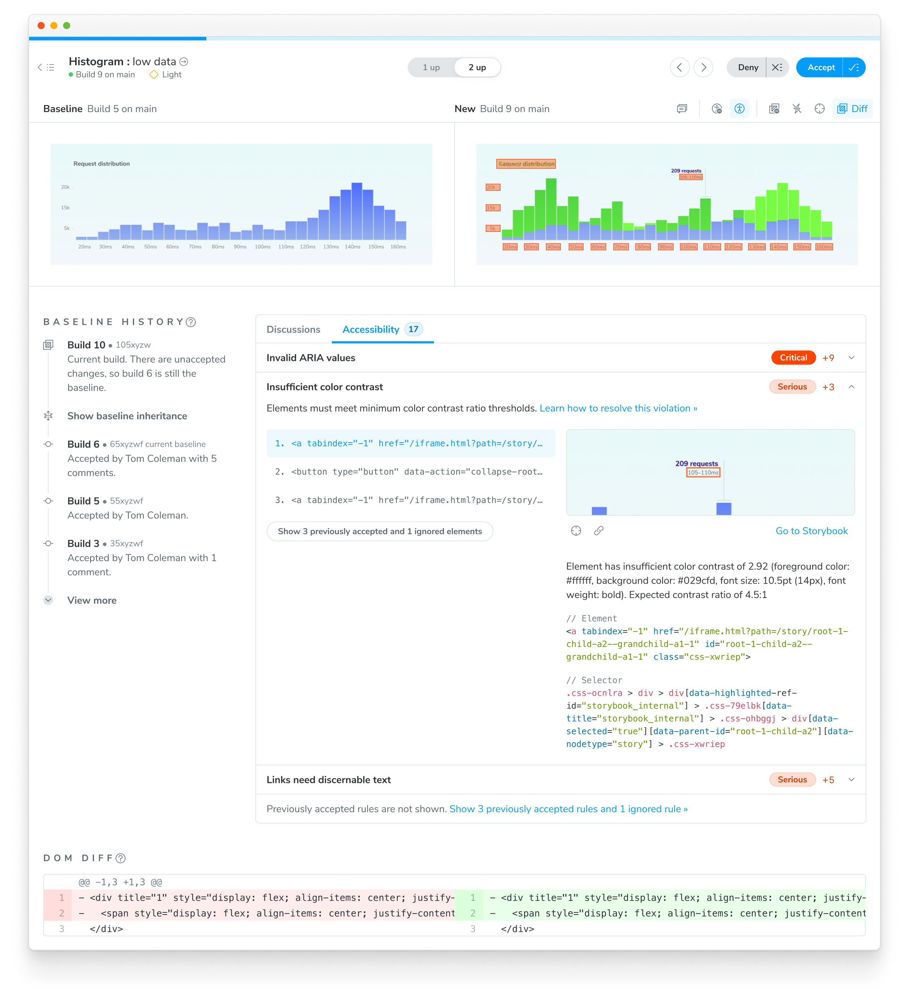

# Accessibility testing with Chromatic

Chromatic builds on Storybook and [axe](https://github.com/dequelabs/axe-core) to seamlessly integrate accessibility testing into your development workflow. You write stories to create test cases for your components and run accessibility checks locally within Storybook.

Then when you're ready to merge, Chromatic automatically runs accessibility regression tests on all your stories through CI. It also provides a dashboard that offers a bird's-eye view of [WCAG](#what-are-web-content-accessibility-guidelines-wcag) issues across all your components.

## Why component-level accessibility tests?

Traditional page-level tests fail to address accessibility at its source. For decades, the best practice was to navigate page by page and run accessibility scans along the way to compile an audit report. This method is too noisy. When issues are identified at the page level, the root cause often lies deep within a component. You have to sift through thousands of violations to determine which component caused the problem.


What’s more, page-level tests occur too late in the development cycle. Developers first build components and then assemble them into pages. One flawed component can spread issues throughout your app, making problems harder to identify and more time-consuming to fix.

Chromatic runs accessibility tests at the component-level, where issues are easier to identify and fix. By integrating accessibility testing into your development workflow, Chromatic helps you catch violations early, before they multiply across pages.

## Why use regression-based accessibility testing?

Axe has long been the industry standard for running automated accessibility tests on HTML-based interfaces. These tests audit the rendered DOM against a set of heuristics based on [WCAG](https://www.w3.org/WAI/standards-guidelines/wcag/) rules and widely accepted best practices. They act as the first line of QA to catch blatant accessibility violations.

When you run axe, it gives you a list of *all* violations detected across the UI being tested. While this is incredibly helpful, it's unlikely you'll address all issues immediately. Teams often inherit accessibility debt that can't be resolved overnight. They want to address these issues incrementally while releasing new features without adding more debt.

By tracking violations against a story's baseline, Chromatic helps prevent regressions in pull requests while tracking debt so you can fix it separately at your own pace.

## Accessibility testing workflow

By combining Chromatic and Storybook you get instant accessibility feedback at every phase of development from development through to running checks on CI. Here’s how it works:

### During development: Fast feedback in Storybook

Storybook’s [Accessibility addon](https://storybook.js.org/docs/writing-tests/accessibility-testing#accessibility-checks-with-a11y-addon) simplifies running axe on individual components. You can run accessibility tests for all your stories in the background. If there are any violations, the test will fail, and you will see a summary in the sidebar. Violating elements are highlighted in Storybook’s canvas, allowing you to pinpoint the exact problem areas. You also get detailed error descriptions and guidance to help resolve issues quickly.



### In CI: Regression-checks with Chromatic

When you run Chromatic, it creates a static build of your Storybook and uploads it to our Capture Cloud. From there, Chromatic spins up a fleet of standardized browsers to load all your stories in parallel and run accessibility tests.

Chromatic tracks accessibility violations over time, establishing a baseline for each story. This helps separate pre-existing issues from new ones.

<details>
<summary>What is an accessibility baseline?</summary>

In [Visual testing](/docs/visual), a baseline is the last known “good” state of the story. Subsequent snapshots are compared to this baseline to identify visual changes.



In Accessibility testing, a baseline is a set of [accessibility violations](#what-is-an-accessibility-violation) detected for a story. Subsequent snapshots are compared to this baseline to identify new violations or to confirm resolved issues. Here's an example:

Build #1 identifies several violations for this story. By accepting the baseline, 17 violations (across 3 rules) are added to the story's baseline.


After making code changes, you run Build #2. Chromatic finds 10 additional violations across 2 rules. This difference is shown on the test page. You can also view violations from previous builds by expanding the table.

If you accept this snapshot, these 10 new violations will be added to the baseline.


</details>

In subsequent builds, Chromatic takes a new snapshot of accessibility violations for each story and compares them against the baselines. If there are new or altered violations, Chromatic flags them for your review.



## Why run accessibility tests in both Storybook and Chromatic?

### Complementary testing approaches

**Storybook** provides developers with a fast feedback loop. You can test components—that you're working on—during development and receive instant feedback on accessibility issues. This enables you to fix problems locally before committing code and to identify and address violations in real time as you work.

**Chromatic** provides ultimate coverage for teams by testing across all viewports, modes, and user preferences. It runs tests consistently in CI environments, tracks violations over time, and ensures no regressions slip through the cracks. This comprehensive approach safeguards your entire project's accessibility standards.

### Single run vs Regression tracking

**Single run (Storybook)** shows all violations at a specific point in time, offering a comprehensive view of your components' current state  of your components. However, these results can be overwhelming to review, especially in large codebases with accessibility debt.

**Regression tracking (Chromatic)** tracks violations from commit to commit and only flags [new or changed violations](/docs/accessibility/usage#how-does-chromatic-track-each-unique-violation). This makes it easier to fix issues incrementally and visualizes progress over time.

For example, Build #1 identifies several violations for a story. By accepting the baseline, 17 violations across 3 rules are added to the story's baseline.


After making code changes, you run Build #2. Chromatic will only highlight the 10 new violations (across 2 rules) introduced in your latest changes, allowing you to focus on what's most relevant to your current work.


However, if you run accessibility checks within Storybook, you'll see 27 violations across 5 rules.

### Accountability and team workflow

The regression approach allows teams to distinguish between legacy accessibility debt and new issues, making the work more manageable. Progress becomes visible and measurable, which helps maintain momentum in your accessibility improvement efforts.

With regression tracking, you can easily identify which violations were introduced in a specific pull request. Much like adding tests to meet coverage thresholds, this ensures developers address accessibility issues in their pull requests to avoid adding to the accessibility debt.

---

## Frequently asked questions

<details>
<summary>What are Web Content Accessibility Guidelines (WCAG)?</summary>

The [Web Content Accessibility Guidelines](https://www.w3.org/WAI/standards-guidelines/wcag/) are a set of internationally recognized standards developed by the World Wide Web Consortium (W3C) through their Web Accessibility Initiative (WAI). These guidelines provide a comprehensive framework for making web content more accessible to people with disabilities.

</details>

<details>
<summary>What is an accessibility violation?</summary>

Accessibility violation refers to an issue detected within a story where an element fails to meet accessibility standards or guidelines (such as WCAG). These violations indicate barriers that might prevent people with disabilities from using the website or application effectively.

</details>

<details>
<summary>Why might you want to accept accessibility violations?</summary>

TL;DR: You’ll want to accept violations if they're part of necessary structural changes leading to an eventual fix.

When you run axe, it lists all accessibility violations found in the story. However in some cases, addressing all issues immediately may not be feasible. In that case, you’d accept the violations and fix them incrementally.

Baselines help track accessibility issues from commit to commit as you make code changes, showing what was fixed and identifying any new issues introduced.
</details>

<details>
<summary>How does Chromatic track each unique violation?</summary>

Chromatic identifies unique violations using three characteristics:

1. Type of violation (see [full classification](https://github.com/dequelabs/axe-core/blob/develop/doc/rule-descriptions.md))
2. Specific DOM node (e.g., `<a>`, `<button>`, `<div>`)
3. Bounding box of this DOM node (e.g., x/y coordinates plus width and height)

This approach prevents false positives caused by inconsequential DOM structure changes.
</details>

<details>
<summary>What happens when I fix an accessibility issue?</summary>

Fixes are auto-accepted to the baseline, [learn more »](/docs/accessibility/usage#fixes-are-automatically-accepted)

</details>

<details>
<summary>Can I run Accessibility Tests with Playwright or Cypress?</summary>

No, Chromatic only offers Accessibility Testing for Storybook.

</details>

<details>
<summary>Can I choose to only run accessibility tests?</summary>

Not yet. `parameters.chromatic.disableSnapshot` will disable both visual and accessibility tests. We're working on allowing you to disable them accessibility and visual tests individually.

</details>

<details>
<summary>How do I configure Chromatic in CI for Accessibility Tests?</summary>

If you have already integrated Chromatic in your CI setup, no changes are needed for accessibility tests to work.

If you haven’t integrated Chromatic in your CI setup, please follow [this guide](/docs/ci).

</details>

<details>
<summary>Does Chromatic report "Needs Review" or "Incomplete" checks?</summary>

No, Chromatic does not report these checks. There are instances where axe-core is unable to accurately determine a violation. For example, it can't accurately assess color contrast when text is rendered over a gradient or background image. You will see these issues reported in Storybook’s Accessibility panel under the "Incomplete" tab. However, Chromatic only reports on violations it can be certain about.

</details>

<details>
<summary>Does TurboSnap support accessibility tests?</summary>

Yes. TurboSnap analyzes your project’s Git history and [dependency graph](https://webpack.js.org/concepts/dependency-graph/) to identify which components and their dependencies have changed. It then only snapshots and runs visual and accessibility tests for stories associated with those changes. For the rest, it copies over the snapshots from baselines that didn’t change.

</details>

<details>
<summary>Do accessibility tests support modes?</summary>

Yes. If you’ve configured modes for a Story. Chromatic will run accessibility tests on each mode too.

</details>

<details>
<summary>Do accessibility tests support different browsers?</summary>

No, accessibility tests are only executed in Chrome.

</details>

<details>
<summary>Do accessibility tests support viewports?</summary>

Yes. Similar to how it works for visual tests, if you've set up viewports for a story, accessibility tests will run for each viewport.

</details>

<details>
<summary>Does Chromatic check for `prefers-reduced-motion` violations?</summary>

Not yet

</details>

---

## Troubleshooting

<details>
<summary>Why are ignored regions not working with Accessibility Tests?</summary>

Ignored regions are a feature specific to visual tests and aren't supported for accessibility and interaction tests.

</details>

<details>
<summary>I expected certain accessibility violation to be flagged—such as missing form input labels, tables without proper headers—but I'm not seeing them?</summary>

Ensure that the rule is enabled in your Storybook [A11y addon configuration](https://storybook.js.org/docs/writing-tests/accessibility-testing#configure). If it is enabled, verify whether the check is running in Storybook.

While you might expect a violation, the check could actually be passing. For example, consider:

```html
<input type="text" placeholder="something"/>
```

You might expect a "missing form input labels" violation, but the [placeholder attribute can provide text inputs with an accessible name](https://dequeuniversity.com/rules/axe/4.10/label?application=RuleDescription#:~:text=Lastly%20a%20placeholder%20attribute%20may%20be%20used%20to%20give%20text%20inputs%20an%20accessible%20name.%20This%20is%20not%20a%20recommended%20solution%20as%20the%20visual%20label%20(the%20placeholder%20text)%20will%20be%20removed%20once%20the%20user%20enters%20text%20into%20the%20input%2C%20causing%20them%20to%20not%20know%20what%20the%20input%20is%20for.). Similarly, table header rules only apply if the table has more than three rows or columns.

</details>

<details>
<summary>Why am I seeing different accessibility test results in Storybook vs Chromatic?</summary>

Storybook shows all violations at a specific point in time. Where are as, Chromatic tracks violations from commit to commit and only flags [new or changed violations](/docs/accessibility#why-use-regression-based-accessibility-testing).

For more on how to combine the two into an effective workflow, refer to [this section](/docs/accessibility#why-run-accessibility-tests-in-both-storybook-and-chromatic).

</details>

<details>
<summary>Why is Chromatic not reporting accessibility in the iFrame nested within my story?</summary>

Currently Chromatic does not support checking accessibility violations within iframes (nested within a story). That's because axe is only loaded at the story level and not within the nested iFrames.

</details>